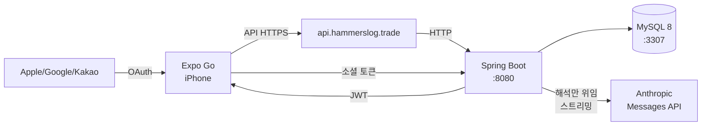

# GymTracker


-D97757?logo=anthropic&logoColor=white)


**Strong 앱을 더 편하게 대체하기 위한, AI 애널리스트가 달린 개인 맞춤형 헬스 트래킹 앱.**
Expo(React Native) + Spring Boot 풀스택. 운동을 기록하면 **AI가 "내가 잘하고 있나"에 답하는 주간/월간 브리핑**을 만들어 준다.

> 디자인 코드네임 **CARBON** — 블랙 배경 + 레드 액센트의 다크 전용 테마.

---

## 📱 화면 구성

> 스크린샷은 추후 추가 예정입니다.

하단 탭은 **브리핑 · 기록 · 통계 · 리포트** 4개. 운동은 어디서나 **슬라이드업 모달**로 열리고(브리핑의 "운동 시작" 또는 진행 중 배너), 설정은 브리핑 우측 상단 톱니로 진입한다.

| 브리핑(홈) | 기록 | 통계 | 리포트 | 운동(모달) |
|:--:|:--:|:--:|:--:|:--:|
| AI 브리핑 + 운동 시작 | 타임라인·캘린더 | 차트 & 분석 | 기간별 AI 리포트 | 세션 기록 |

---

## ✨ 주요 기능

### 🧠 AI 애널리스트 — 이 앱의 핵심
"코치(루틴 생성)"가 아니라 **애널리스트**. 쌓인 데이터를 해석해 *내가 잘하고 있나*에 답한다.
원칙: **계산은 코드, 해석만 LLM** — 수치는 백엔드가 전부 확정해 사실로 넘기고, LLM은 재계산 없이 의미만 해석한다(환각 방지).

- **온보딩 인테이크**: 채팅형 9문항(목표·경력·분할·세션시간·집중부위·통증 등)으로 분석 렌즈 설정
- **브리핑 홈**: 최근 주간 리포트 요약(큰 헤드라인 + 처방 1개 + 핵심 지표 3) + 바로 운동 시작
- **통합 리포트 6종**: 세션 · 주 · 월 · 분기 · 반기 · 연간을 **하나의 2층 컴포넌트**(요약 → 펼치기)로. 기간이 길수록 비교·마일스톤·목표 진척이 등장
- **기간 스코프 채팅**: 보고 있는 리포트의 데이터에만 한정해 대화(스코프 밖 질문은 정직하게 거절)
- **아카이브**: 과거 리포트(주/월/분기…)를 시간 역순으로 다시 보기
- **비동기 생성 + 실시간 진행률**: 리포트 생성을 백그라운드로 돌리고, **Anthropic 스트리밍 토큰 비례 진짜 진행률**을 오비탈 로딩 화면에 표시
- **알림 인박스**: 리포트 완료 · PR 달성 · 정체 경고를 모아 보는 피드(안읽음 배지)

### 💪 운동 — 세션 기록 (슬라이드업 모달)
- **종목 선택**: 부위 → 장비 → 브랜드 → 종목 4단계 필터 + 전체 검색
- **세트 입력**: 전용 숫자패드, 세트 타입 순환(일반/워밍업 W/드롭 D/실패 F)
- **1RM 자동 계산 + PR 감지**: 세트 완료 시 Epley 추정, 역대 최고 초과 시 PR
- **스트롱식 인라인 휴식 타이머**: 세트 사이에 휴식 라인(완료=그린/예정=뮤트), 휴식 중엔 카운트다운 막대 → 탭하면 ±15·리셋·건너뛰기 패널, 라인 탭으로 시간 변경
- **이전 기록 자동 채움**, **워밍업 세트 자동 생성**(기준 무게 %)
- 진행 중 운동은 다른 탭에서 **하단 배너**로 떠 있고 탭하면 다시 펼쳐짐

### 📖 기록
- **타임라인**(기본): 시간순 + 이번 주/지난주/월 버킷 + 휴식 갭("N일 휴식")
- **월별 캘린더** 토글, 연속 스트릭, 세션 미리보기 시트

### 📊 통계
- 1RM 성장 차트 · 볼륨 추이 · 근육군 빈도 · 체중 그래프 · 기간 비교

### 📥 가져오기 · 기타
- **Strong CSV 임포트**(세션/세트/종목 매핑, 워밍업·드롭·실패 보존)
- 헬스장 관리, 단위 토글(kg↔lb), 커스텀 종목, 종목별 휴식, CSV 내보내기
- 소셜 로그인(Apple / Google / Kakao)

---

## 🎨 디자인 — CARBON

다크 전용. 브랜드 액센트는 **레드**로 통일하되, 증가 ▲(그린)·감소/경고(레드) 같은 **의미색은 분리**해 유지. 토큰은 `constants/colors.ts` 한 곳에서 관리(`ACCENT`, `AI.*`).

---

## 🛠️ 기술 스택

| 분류 | 사용 기술 |
|------|-----------|
| **프레임워크** | Expo SDK 54, React Native 0.81 |
| **라우팅** | expo-router (파일 기반, 탭 + 모달) |
| **상태 관리** | Zustand + AsyncStorage 영구 저장 |
| **애니메이션** | React Native `Animated` (오비탈 로딩·휴식 타이머) |
| **인증** | JWT (자동 갱신), 소셜 로그인(Apple/Google/Kakao) |
| **차트** | react-native-chart-kit |
| **AI** | Anthropic Messages API (스트리밍) — 백엔드 경유 |
| **백엔드** | Spring Boot 3.4, Java 21, JPA/Hibernate |
| **DB** | MySQL 8 |
| **인프라** | Cloudflare Tunnel (고정 도메인) |

---

## 🏗️ 아키텍처



**AI 리포트 흐름** — 계산은 코드, 해석만 LLM
```
운동 데이터 → 백엔드 집계(StatsService, 수치 확정)
            → LLM(헤드라인·처방·서술만, 재계산 금지) [스트리밍]
            → 구조화 detail은 코드로 매핑 → 통합 리포트 JSON → 앱 2층 렌더
비동기: 캐시 미스 시 GENERATING 즉시 반환 + 백그라운드 생성, 앱은 진행률 폴링
```

---

## 🚀 시작하기

### 요구사항

| 도구 | 버전 |
|------|------|
| Node.js | 20+ |
| Java | 21 |
| MySQL | 8.x |
| Expo Go | 최신 (App Store) |

### 1. 클론 & 프론트엔드

```bash
git clone https://github.com/seunghw2/gymtracker.git
cd gymtracker
npm install
```

`.env` 생성:

```env
EXPO_PUBLIC_API_URL=https://api.hammerslog.trade
EXPO_PUBLIC_KAKAO_REST_API_KEY=your_kakao_rest_api_key
```

실행(터널 필수 — Expo Go 원격 접속):

```bash
npx expo start --tunnel
```

### 2. 백엔드

[백엔드 README →](../gymtracker-backend/README.md) (AI 리포트·알림 엔드포인트 포함)

---

## 📁 프로젝트 구조

```
gymtracker/
├── app/
│   ├── _layout.tsx            # 루트 스택 (인증 부트스트랩 + 모달 라우트)
│   ├── workout.tsx            # 운동 세션 (슬라이드업 모달)
│   ├── (auth)/                # 로그인 / 회원가입
│   ├── (tabs)/                # 브리핑(index)·기록(calendar)·통계(stats)·설정(settings)
│   │   └── index.tsx          # 브리핑 홈 (AI 요약 + 운동 시작)
│   └── ai/                    # AI 애널리스트
│       ├── intake.tsx         # 온보딩 인테이크(채팅 9문항)
│       ├── reports.tsx        # 기간별 통합 리포트
│       ├── chat.tsx           # 기간 스코프 채팅
│       ├── archive.tsx        # 과거 리포트 목록
│       └── inbox.tsx          # 알림 인박스
├── components/
│   ├── ReportView.tsx         # 리포트 2층 렌더(period.type 분기)
│   ├── BriefingLoading.tsx    # 비동기 생성 오비탈 로딩(실시간 진행률)
│   ├── WorkoutCoachBanner.tsx # 운동 중 처방 배너(브리핑 연동)
│   ├── CustomTabBar.tsx       # CARBON 탭바
│   ├── ActiveWorkoutBanner.tsx# 전역 "운동 중" 배너
│   ├── RestTimerEngine.tsx    # 휴식 타이머 엔진(사운드·알림)
│   └── ...
├── db/api/                    # REST 호출 (sessions, sets, stats, ai, notifications …)
├── lib/                       # api.ts(JWT 자동갱신), format, units …
├── store/                     # Zustand (운동 세션·설정·인증)
└── constants/
    ├── colors.ts              # CARBON 색 토큰
    └── exercises.ts           # 종목 메타(부위·장비·브랜드)
```

> 현황·로드맵은 [`docs/ROADMAP.md`](docs/ROADMAP.md) 참고.

---

## 📄 라이선스

[MIT License](LICENSE)
