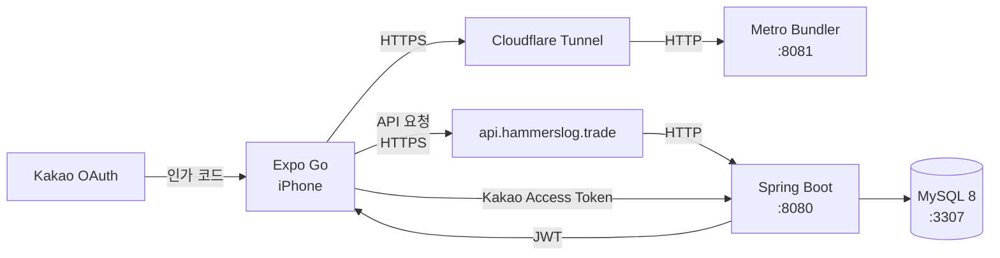

# GymTracker


**Strong 앱을 더 편하게 대체하기 위한 개인 맞춤형 헬스 트래킹 앱.**  
Expo(React Native) + Spring Boot 풀스택, 클라우드 동기화, 강력한 통계.

---

## 📱 화면 구성

> 스크린샷은 추후 추가 예정입니다.

| 홈 | 운동 | 통계 | 캘린더 | 설정 |
|:--:|:----:|:----:|:------:|:----:|
| 대시보드 | 세션 기록 | 차트 & 분석 | 운동 달력 | 개인화 |

---

## ✨ 주요 기능

### 🏠 홈 — 대시보드
- 이번 주 운동 스트릭 (요일별 도트)
- 목표 체중까지 진행도 바
- 눈금자 UI 체중 입력 다이얼
- 이번 달 / 이번 주 운동 횟수 요약

### 💪 운동 — 세션 기록
- **종목 선택**: 부위 → 장비 → 브랜드 → 종목 (4단계 필터) + 전체 검색
- **세트 입력**: 전용 숫자패드, ± 버튼 빠른 조정
- **세트 타입**: 일반 / 워밍업(W) / 드롭셋(D) / 실패셋(F) 순환
- **1RM 자동 계산**: 세트 완료 시 Epley 공식으로 추정, PR 자동 감지
- **휴식 타이머**: 세트 완료 후 자동 시작, 전체 탭에서 표시, 드래그 이동
- **이전 기록 자동 채움**: 직전 세션의 무게·횟수를 가이드로 표시
- **워밍업 세트 자동 생성**: 기준 무게 % 기반 (40/60/80%)
- **히스토리 편집**: 과거 세션의 날짜, 무게, 반복수, 메모 수정

### 📊 통계 — 데이터 시각화
- **1RM 성장 차트**: 종목별 추정 1RM 추이 (선/면적 그래프)
- **볼륨 추이**: 기간별(최근/1주/1달/3달) 총 볼륨 그래프
- **근육군 빈도**: 부위별 주당 세트 수 바 차트
- **체중 그래프**: 최근 30일 체중 변화
- **기간 비교**: 현주/전주, 현달/전달 세트 수 · 운동 시간 비교

### 📅 캘린더
- 월별 / 주별 보기 전환
- 운동한 날짜에 녹색 점 표시
- 현재 연속 운동 스트릭 표시
- 날짜 선택 시 해당 날의 세션 카드 표시

### ⚙️ 설정
- 목표 체중 · 목표 체지방 설정
- 단위 토글 (kg ↔ lb)
- 헬스장 등록 / 수정 / 삭제
- 커스텀 운동 종목 관리
- 종목별 휴식 시간 커스터마이징
- 운동 데이터 CSV 내보내기
- 카카오 / 이메일 로그아웃

---

## 🛠️ 기술 스택

| 분류 | 사용 기술 |
|------|-----------|
| **프레임워크** | Expo SDK 54, React Native 0.81 |
| **라우팅** | expo-router (파일 기반, 탭 네비게이션) |
| **상태 관리** | Zustand + AsyncStorage 영구 저장 |
| **인증** | JWT (자동 갱신), Kakao OAuth |
| **데이터** | REST API (Spring Boot 백엔드) |
| **차트** | react-native-chart-kit |
| **알림** | expo-notifications, expo-audio |
| **백엔드** | Spring Boot 3.4, Java 21 |
| **DB** | MySQL 8, JPA/Hibernate |
| **보안** | Spring Security 6, BCrypt, JWT |
| **인프라** | Cloudflare Tunnel (고정 도메인) |

---

## 🏗️ 아키텍처



**데이터 흐름**
```
사용자 입력 → Zustand Store → REST API (db/api/) → Spring Boot → MySQL
                    ↑
              낙관적 업데이트 (UI 즉시 반영)
```

---

## 🚀 시작하기

### 요구사항

| 도구 | 버전 |
|------|------|
| Node.js | 20+ |
| Java | 21 |
| MySQL | 8.x |
| Expo Go | 최신 (App Store) |

### 1. 프로젝트 클론

```bash
git clone https://github.com/seunghw2/gymtracker.git
cd gymtracker
```

### 2. 프론트엔드 설정

```bash
npm install
```

`.env` 파일 생성:

```env
EXPO_PUBLIC_API_URL=https://api.hammerslog.trade
EXPO_PUBLIC_KAKAO_REST_API_KEY=your_kakao_rest_api_key
```

앱 실행:

```bash
npx expo start --tunnel
```

Expo Go 앱에서 QR 코드를 스캔하거나 `exp://expo.hammerslog.trade` 입력.

### 3. 백엔드 설정

[백엔드 README →](../gymtracker-backend/README.md)

---

## 📁 프로젝트 구조

```
gymtracker/
├── app/
│   ├── _layout.tsx          # 루트 레이아웃 (인증 부트스트랩)
│   ├── (auth)/              # 로그인 / 회원가입
│   └── (tabs)/              # 메인 탭 (홈, 운동, 통계, 캘린더, 설정)
│       ├── index.tsx        # 홈 대시보드
│       ├── workout.tsx      # 운동 기록 (메인)
│       ├── stats.tsx        # 통계 & 차트
│       ├── calendar.tsx     # 캘린더
│       └── settings.tsx     # 설정
├── components/              # 재사용 UI 컴포넌트
│   ├── RestTimer.tsx        # 전역 휴식 타이머
│   ├── NumPad.tsx           # 커스텀 숫자패드
│   ├── SessionCard.tsx      # 운동 기록 카드
│   └── ...
├── db/api/                  # REST API 호출 함수 (도메인별)
│   ├── sessions.ts
│   ├── sets.ts
│   ├── stats.ts
│   └── ...
├── lib/                     # 유틸리티
│   ├── api.ts               # HTTP 클라이언트 (JWT 자동 갱신)
│   ├── format.ts            # Epley 1RM 계산, 시간 포맷
│   └── ...
├── store/                   # Zustand 스토어
│   ├── workoutStore.ts      # 진행 중 세션 상태
│   ├── settingsStore.ts     # 사용자 설정
│   └── authStore.ts         # 인증 상태
└── constants/
    └── exercises.ts         # 운동 종목 데이터 (부위, 장비, 브랜드)
```

---

## 📄 라이선스

[MIT License](LICENSE)
