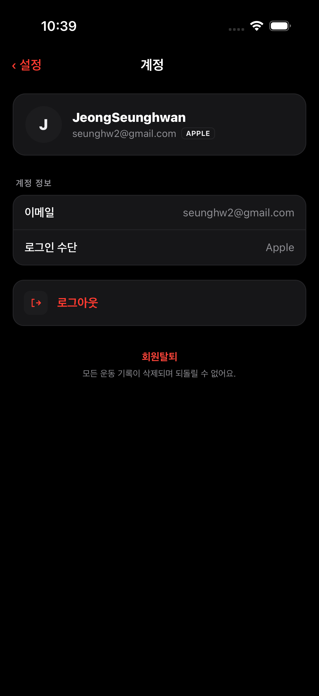
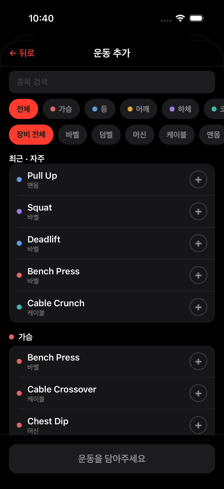
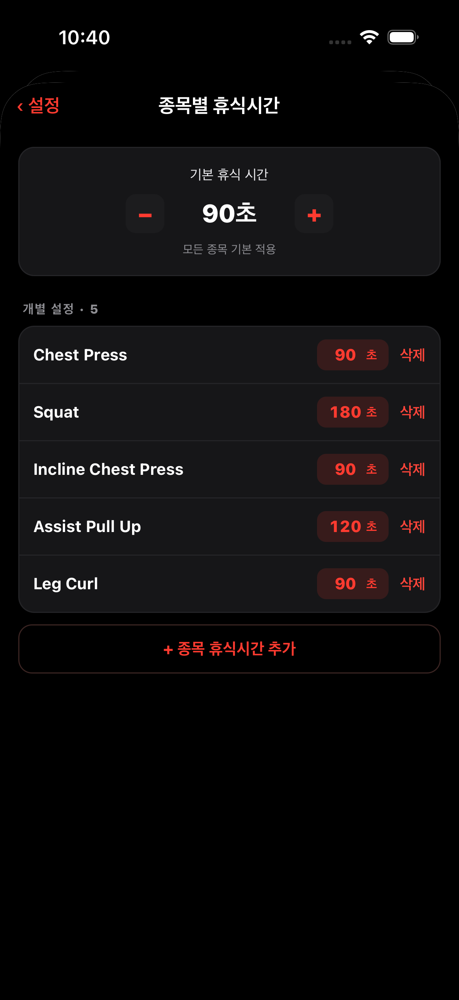
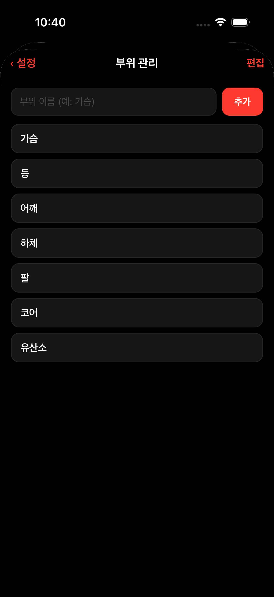
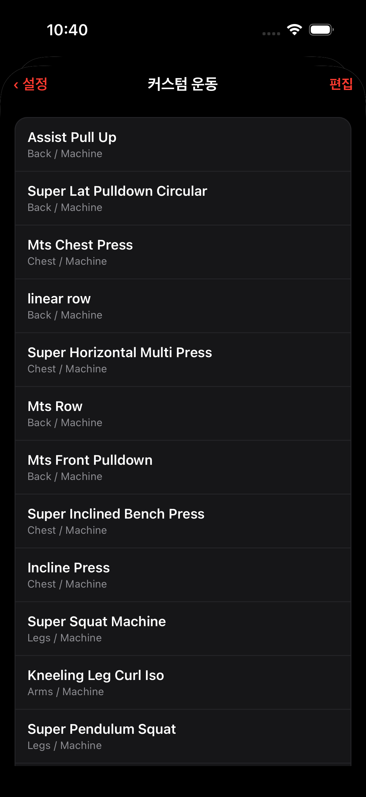
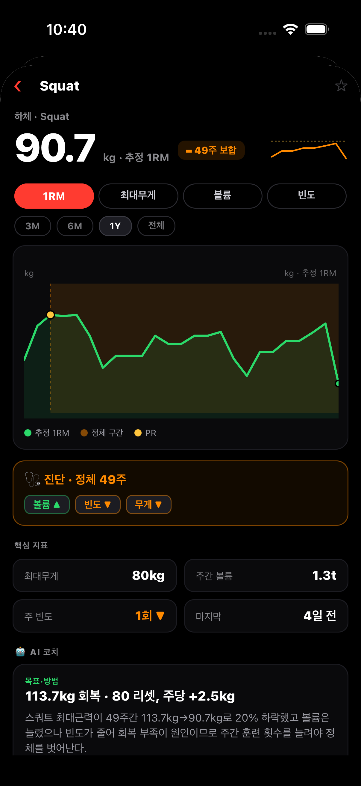
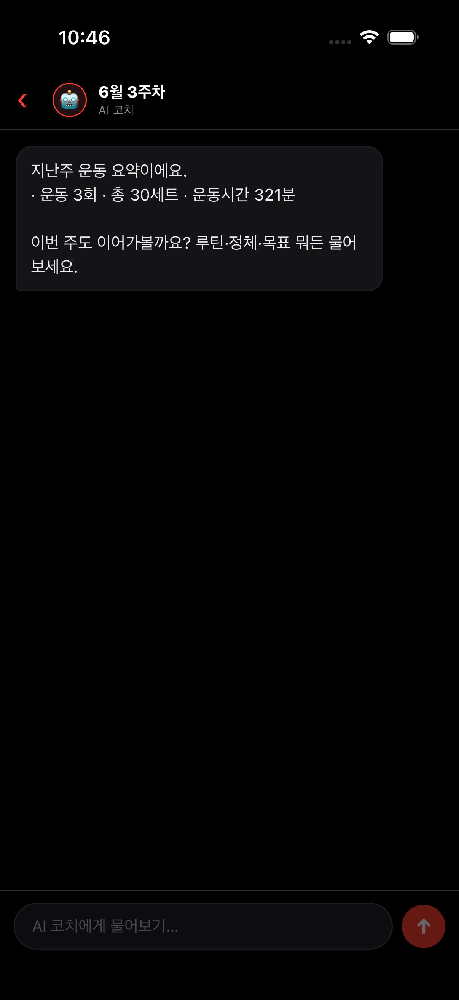

# GymTracker · 화면별 상세 플로우

각 화면이 **무엇을 보여주고**, **무엇을 누르면 어떻게 되는지**를 자세히 서술한다.
캡처는 [screenshots/README.md](screenshots/README.md), 한눈 흐름도는 [SCREEN_FLOW.md](SCREEN_FLOW.md).

## 공통 규칙
- **하단 탭바(5)**: 브리핑 · 기록 · 종목 · 리포트 · Chat. 탭 = 즉시 전환(활성 = 레드).
- **설정**은 탭바에 없음 → 브리핑 우상단 ⚙️로 진입.
- **운동 세션**은 풀스크린(모달), 종목 상세/추가 등은 푸시(뒤로가기 있음).
- **색**: 레드 = 액션·네비(버튼·활성·링크) / 초록 = 양호(↑증가·PR) / 주황 = 주의(부족·정체). 파랑(info) 미사용.
- **데이터**: 백엔드 REST(`api.hammerslog.trade`). 대부분 화면은 디스크 캐시로 즉시 표시 후 백그라운드 갱신(SWR).

---

## 01. 브리핑 (홈) — `(tabs)/index`

주간 "애널리스트" 브리핑 홈.
- **헤드라인**: 그 주를 한 줄로 요약(예: "어깨·등 집중, 잘 밀어붙였어").
- **처방 카드(레드 보더)**: "이번 주 딱 하나" 행동 처방. **탭 → 리포트 상세**.
- **부위별 볼륨**: 하드세트·주당 빈도(예: 어깨 13세트 주2회, 가슴 3세트 부족=주황).
- **KPI 3종**: 이번 주 운동수 / 스트릭 / 체중 입력.
- **운동 시작(레드 버튼)** → 운동 세션(모달) 진입.
- 우상단 **⚙️** → 설정.

## 02. 종목 — `(tabs)/exercises`

그룹별 **2열 카드 그리드**(작업세트 기반, 1RM 미사용).
- **그룹 pill**: `기본` · `이번주🔒` · `지난주🔒` · (커스텀) · `+그룹추가`. 탭 = 그룹 전환. 🔒 = 자동 그룹(추가·편집 불가).
- **컨트롤바**: `그룹 · 정렬라벨` + `정렬 ⌄` + `편집`.
- **카드**: 부위 색점 + 종목명 + `부위·장비`(예: 하체·Barbell). 메인 = 최근 작업세트 무게(맨몸은 횟수), 우측 = **↑델타(초록)** 또는 **PR🔥**. 아래 `최근 W×R` / `최고 W×R`, 최근 수행일. **카드 탭 → 종목 상세**.
- **＋종목 추가(대시 카드)** → 운동 추가 피커.

### 인터랙션 상태
- **정렬 ⌄ → 시트**: 담은 순서 / 최근순 / 무게순 / 이름순 / 부위순. 선택 시 ✓ 표시 + 그리드 재정렬. (담은 순서가 아니면 드래그 잠김)
- **편집 → 모드 전환**: 1열 리스트로 바뀌며 카드에 **≡(드래그)·✕(삭제)** 노출. `완료`로 종료. (담은 순서일 때만 ≡ 드래그, 아니면 ✕만)
- **+그룹추가**: 새 그룹 이름 입력 → 생성·선택. 커스텀 pill **롱프레스 → 관리 시트**(이름변경/순서변경/삭제).

## 03. 기록 — `(tabs)/calendar`

운동 히스토리.
- 상단 **🔥 N일 연속** 배지.
- **타임라인 ↔ 월별** 세그먼트 토글.
- **타임라인**: 이번 주/지난주/N월 버킷 + 세션 카드(날짜·태그·제목·세트·시간·종목수) + 휴식 갭 표시. **세션 탭 → 미리보기 시트**.
- **월별**: 달력 그리드(운동일 강조·오늘·선택) + 월 요약(횟수·시간) + 선택일 세션 카드.

## 04. 리포트 — `(tabs)/reports`

기간별 AI 리포트(상세). 종목 탭과 별개로 브리핑 카드/배너에서 푸시 진입 가능(뒤로가기 있음). 탭바에선 즉시 전환.
- **기간 세그먼트**: 주별/월별/분기/반기. **📅** + 가로 스크롤 **주차 칩**(예: 6월 3주 진행중).
- **↻ 다시 받기**: 해당 기간 리포트 재생성.
- **서브탭(텍스트)**: 브리핑 / 데이터 / 코치.
  - 브리핑: 헤드라인 + KPI(흰 숫자 + 상태점) + 처방.
  - 데이터: 일관성·추세·구성·강도·몸 등 카드(13블록). 편집모드로 카드 숨김·순서변경.
  - 코치: 톤(담백/응원/직설) + 대화로 질문.

## 05. AI 코치 — `(tabs)/chat`

주간 코치 대화 허브.
- **바로 물어보기 칩**: 이번 주 어땠어 / 정체 풀기 / 루틴 짜줘. **탭 → 새 대화 생성·진입**(질문 시드).
- **최근 대화** 목록(주간 코치·리포트·알림 태그). **탭 → 대화 상세**. 스와이프 → 삭제.
- **✎ FAB** → 새 빈 대화.
- 진입 시 알림 배지 비움.

## 06. 설정 — `(tabs)/settings`

- **계정** 행 → 계정 페이지.
- **트레이닝**: 목표 설정 / 종목별 휴식시간 / 부위 관리 / 커스텀 운동 (각 페이지로).
- **알림**: 휴식 알림 토글(무음에서도 완료음) / 운동 리마인더(페이지).
- **표시·동작**: 세션 메모 칸 / 체중 자동 팝업 / 시작 시 부위 선택 (토글).
- **AI 코치 톤**: 담백·응원·직설 세그먼트.
- **정보**: 버전 / 운동 기록 내보내기(CSV 공유) / 개인정보 / 개발자도구(온보딩 초기화).

## 07. 목표 설정 — `goals`

목표 체중·체지방률·기본 휴식시간 입력 + **kg/lb 단위 토글**. 저장 시 백엔드 반영. (체중 진행도는 브리핑/리포트에서)

## 08. 계정 — `account`

프로필(이름·이메일·로그인 제공자) + 로그아웃 / 회원탈퇴(데이터 영구 삭제).

## 09. 운동 세션 — `workout`

운동 진행 화면(풀스크린).
- 미시작: **운동 시작** + 과거 세션 카드(이대로 시작/루틴 저장/이름변경/삭제).
- 진행 중: 경과 타이머, **운동 추가**(부위→장비→브랜드→종목 + 검색), 세트 입력(무게/횟수/완료 체크), 1RM 뱃지·PR, 세트 완료 시 **휴식 타이머**(하단 바·사운드·알림·±조정), 세트 스와이프 삭제, 종목 ✕ 삭제, 이전 기록 자동 채움, 메모·부위 태그.

## 10. 운동 추가(피커) — `exercise-add`

부위 필터 + 종목 검색·선택(다중) 피커. 빈 그룹의 `＋종목 추가하기` 및 세션 `운동 추가`가 공유. 선택 → 그룹/세션에 담김.

## 11. 종목별 휴식시간 — `exercise-rest`

종목마다 개별 휴식시간 오버라이드(없으면 기본값). 종목 추가·검색.

## 12. 부위 관리 — `body-parts`

운동 시작 시 선택하는 부위 태그(가슴/등/하체…) 관리.

## 13. 커스텀 운동 — `custom-exercises`

사용자가 등록한 커스텀 종목 목록·관리(시스템 시드 외).

## 14. 운동 리마인더 — `workout-reminder`

쉬는 날 로컬 알림(마지막 운동 + N일째 HH시). 활성·간격·시각 설정. 탭하면 운동 세션으로.

## 15. 종목 상세 — `exercise/[name]`

종목 1RM 성장 차트(추정/실제) + 히스토리 + RM basis + ×체중 등 심화 지표. 종목 카드 탭으로 진입.

## 16. AI 인테이크(온보딩) — `ai/intake`

애널리스트 첫 설정(9단계): 목표 체형(린매스/근력/체지방감소/체형유지)·우선 부위 등. 완료 시 리포트 분석 시작.

## 17. 코치 대화 상세 — `chat/[id]`

주간 코치 대화. 월요일 06시 생성되는 "N월 N주차" 채팅으로 지난주 요약 도착 + 자유 질문(스트리밍 답변). 하단 입력창.

---

## 주요 흐름 요약
- **운동하기**: 브리핑/기록 "운동 시작" → 세션(세트 입력·휴식) → 완료 → 기록·리포트 반영.
- **종목 관리**: 종목 탭 → 그룹 pill / 정렬·편집 / 카드 탭 → 상세. 빈 그룹 → ＋종목 추가(피커).
- **코칭**: 매주 코치 대화 자동 생성 → 알림 → Chat에서 확인·질문. 리포트 처방 → 코치로 연결.
- **설정**: 브리핑 ⚙️ → 목표·휴식·부위·커스텀·리마인더·계정.
