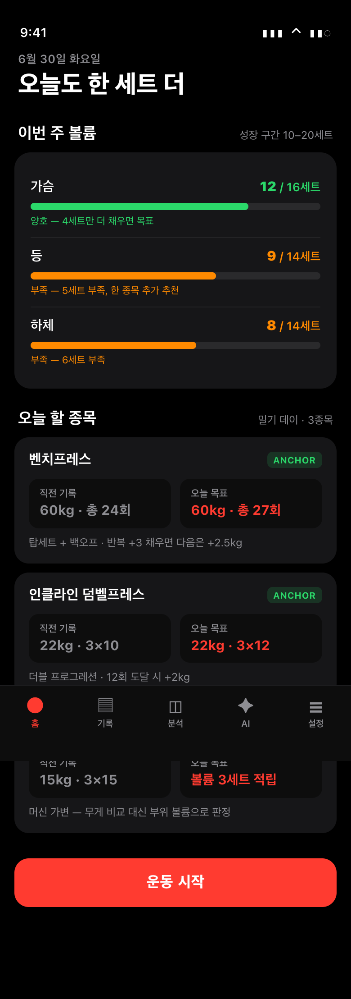
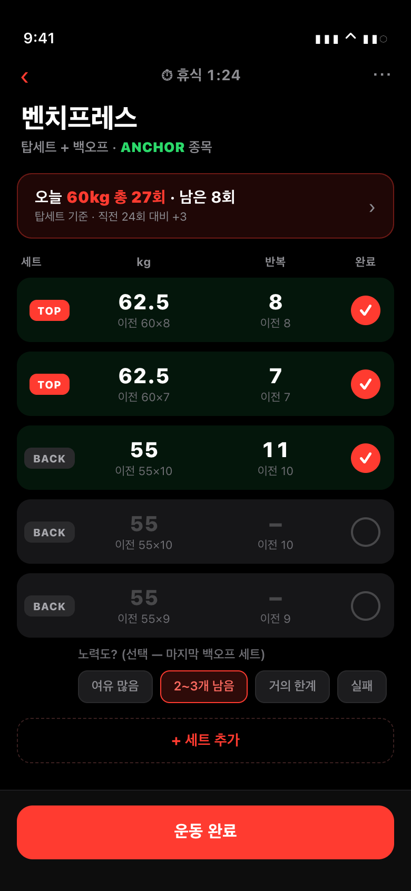
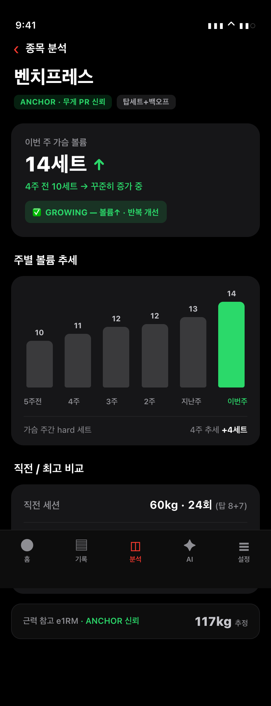
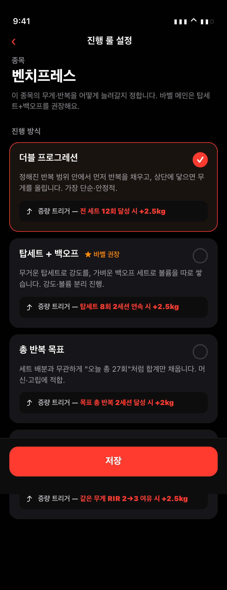
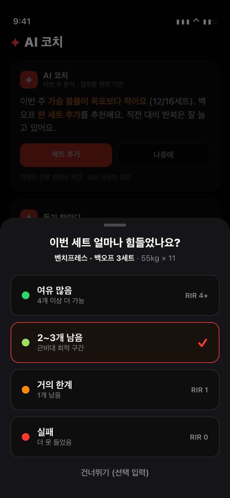

# PRD — 점진적 과부하 (GymTracker)

> 점진적 과부하 핵심 기능 포괄 제품명세. 결정론 엔진이 모든 처방 숫자의 단일 소스이며, AI는 그 결과를 설명·동기로 통역만 한다.
> 디자인: CARBON 다크(배경 #000/#0D0D0D, 카드 #161618, 액센트 빨강 #FF3B30, 텍스트 #FFF, 보조 회색 #8E8E93, 양호·PR 초록 #2BD96A, 부족 주황 #FF8A00), 모바일 세로 390px.

---

## 1. 개요

**한 줄 컨셉**: "오늘 뭘 올릴지"를 직전 기록 + 작은 bump로 자동 처방하고, "이 부위가 진짜 자라나"를 주간 볼륨으로 확인시키는 근비대 점진적 과부하 앱.

**대상**: 자연인 · 중급 · 근비대 목적 · 상업 헬스장(머신이 매번 바뀌는 환경) 사용자. 1차 타겟은 Strong 헤비유저 본인 — Strong을 더 편하게 대체.

**확정 방향 4가지**
1. **진행 기준 = 직전 기록 + 주간 볼륨**(근비대 1차). 최고 기록은 처방에 안 쓰고 맥락·동기용으로만.
2. **종목별 진행 룰 선택** — 더블 프로그레션 / 탑세트+백오프 / 총 반복 등. 사용자는 탑세트+백오프 선호.
3. **RIR 선택형(기본 OFF)** — 핵심 종목 마지막 세트만 1탭. 미입력해도 무게·반복으로 판정(폴백 1급 시민).
4. **AI는 결정론 엔진의 보조** — 처방 숫자 생성 금지, "왜"만 설명·요약·동기.

**핵심 가치**: ① 헬스장 3초 룰(한 화면당 0.5초 안에 다음 행동) ② 입력 0개로 시작(룰·범위·증량폭 자동) ③ 톤수 거품에 안 속는 양·질 2축 판정 ④ 머신이 바뀌어도 안 변하는 유일한 신호 = 주간 부위 볼륨.

---

## 2. 기능 요구사항 (FR)

> 우선순위: **P0**=MVP 필수, **P1**=빠른 후속, **P2**=확장.

| ID | 이름 | 설명(사용자 가치) | 우선순위 | 근거 |
|---|---|---|---|---|
| **FR-1** | 종목별 진행 룰 설정 | 종목마다 진행 방식(이중진행/탑세트+백오프/총반복)을 한 줄로 선택. 입력 0으로 시작, 원할 때만 변경 | P1 (TOP_SET_BACKOFF 핵심)·DOUBLE은 P0 동작 중 | PLAN Q3·Q9 룰 카탈로그, ENCYCLOPEDIA Madcow·FSL |
| **FR-2** | 양·질 2축 진행 판정 | 톤수 하나로 안 속고 4상태(성장/볼륨거품/강도만/정체)로 알려줌 | P0(라벨)·진단카드 P1 | HYPERTROPHY 1부 2×2, PLAN Q1-2 |
| **FR-3** | 증량 제안(무게vs반복)+가드 | 평소 반복 +1~2, 상단 채우면 무게 +1단·반복 하단 리셋을 구체 숫자로. 급증량·폼붕괴 경고 | P0 | PLAN Q2-3, AUDIT 심각4·6 |
| **FR-4** | 주간 부위 볼륨 게이지 | 부위별 주간 유효 세트(MEV~성장구간)를 홈 최상단 게이지로. 머신 변동 면역 신호 | P0 | RESEARCH §0·§1 López 2021, AUDIT 심각2 |
| **FR-5** | 탑세트+백오프 2축 분리 판정 | 강도축(탑 무게)과 볼륨축(백오프 반복)을 따로 추적·증량. 사용자 선호 | P1 | PLAN Q6, ENCYCLOPEDIA |
| **FR-6** | 선택형 RIR 수집+양방향 보정 | 핵심 종목 마지막 세트만 1탭으로 노력도 수집, 같은 무게가 쉬워졌는지 보정 | P0(수집)·P1(폴백·양방향) | PLAN Q5, AUDIT 심각5 |
| **FR-7** | 종목 무게 신뢰 등급 | 가변 머신 "최고 82kg" 오도 방지. ANCHOR/MAIN_MACHINE/VARIABLE로 PR 화폐 ON/OFF | P2 | HYPERTROPHY 5부, PLAN Q2-1 |
| **FR-8** | 종목 분석(양·질 헤드라인) | 종목 상세 얼굴을 1RM→주간 볼륨+직전 비교로 교체 | P0(헤드라인)·진단 P1 | AUDIT 심각2, PLAN Q8 |
| **FR-9** | 홈 3블록 | "오늘 뭐부터" + "이번 주 부위 잘 채우나"만 답. 운동 중 세트행 직전값 회색 표시 | P0 | PLAN Q4, FINAL_SPEC §11·§13 |
| **FR-10** | AI 설명·동기 보조 | 처방 숫자 생성 금지, 엔진 처방의 "왜"만 통역. 3중 방어(계약·fact주입·검증) | P1·검증 P2 | PLAN Q7, FINAL_SPEC §16 |

---

## 3. 데이터 모델 & 핵심 로직

### 3-1. enum

**`progressionRule`** (종목별 최상위 진행 다이얼, 장비·부위로 자동 기본값)

| 값 | 의미 | 1차로 올리는 것 | 게이트 | 적합 종목 |
|---|---|---|---|---|
| `DOUBLE_PROGRESSION` | 반복 상단 채우면 증량·리셋 (기본) | 반복→무게 | 모든 본세트 repMax 도달 | 대부분·고립·머신 |
| `TOP_SET_BACKOFF` | 탑(무게축)+백오프(반복축) 분리 추적 (사용자 선호) | 백오프 반복 / 탑 무게 따로 | 탑 reps 충족 OR 백오프 상단 | 스쿼트·벤치·데드 |
| `TOTAL_REP_TARGET` | 목표 무게서 총 반복 목표만 채우면 증량 | 총반복→무게 | 총 반복 ≥ 목표 | 맨몸·펌프 |
| `RIR_AUTOREG` | 무게 비교 포기, 같은 RIR서 반복 개선만 | 같은 RIR서 반복 | (무게 게이트 없음) | VARIABLE 머신 |

**`SetType`**: `NORMAL`(본세트) / `WARMUP`(집계 제외) / `DROP`(집계 제외) / `TOP_SET`(강도축) / `BACKOFF`(볼륨축). 태그 미지정 시 현 동작 그대로 하위호환.

**`anchorTier`** (progressionRule과 직교, 무게 신뢰도): `ANCHOR`(프리웨이트·체중, PR 신뢰) / `MAIN_MACHINE`(세팅 동일 시만 비교) / `VARIABLE`(무게 PR 무의미, 볼륨+RIR만).

**`effort`** (선택형 RIR): `EASY`(~3+ 증량가속) / `MODERATE`(~2) / `HARD`(0~1 증량보류) / `FAILURE`(0) / `null`(미입력→무게·반복만 판정).

### 3-2. 핵심 필드

- **세트**: `weight`(필수), `reps`(필수), `setType`(기본 NORMAL), `effort`(선택 null).
- **ExerciseGoal**: `rule`, `anchorTier`, `repRange{min,max}`, `targetSets`, `increment`, `trigger`(single/two_sessions/rpe), `effortTracking`(기본 false).
- **TOP_SET_BACKOFF 추가 3개**: `topSets·topReps·backoffPct`(나머지 첫 기록서 자동 추론).

### 3-3. 자동 기본값 (입력 부담 0)

```
종목 등록 시:
  anchorTier = (프리웨이트 OR 체중) ? ANCHOR : MAIN_MACHINE
  rule       = barbell_main → DOUBLE_PROGRESSION (켜면 TOP_SET_BACKOFF)
               machine/isolation → DOUBLE_PROGRESSION
               bodyweight → TOTAL_REP_TARGET
               anchorTier=VARIABLE → RIR_AUTOREG
  trigger = two_sessions ;  effortTracking = false
  is_overridden: 한 번 손대면 자동 재분류가 안 덮어씀
```

### 3-4. 판정 의사코드

**양·질 2축 매트릭스**
```
질개선 = evaluate(prev,cur).result==IMPROVED
         OR (같은무게·같은반복 && cur.effort가 EASY 쪽 이동)   // effort null이면 무게·반복만
양추세 = 부위주간_hard세트 4주 이동평균 방향                    // UP/FLAT/DOWN

(UP|FLAT) & 질개선      → GROWING        // 확실한 성장
(UP|FLAT) & !질개선     → VOLUME_BUBBLE  // "세트 늘었는데 안 쉬워짐, RIR 확인"
DOWN & 질개선          → STRENGTH_ONLY  // "강해짐, 세트 더 채울 여지"
DOWN & !질개선         → STALL_REVIEW   // 정체 게이트(2~3주 추세로만)
```

**탑세트/백오프 분리 게이트** (둘을 같은 날 동시 증량 금지, 2주 내 한쪽씩)
```
탑 게이트(강도축):  탑 effort EASY/MODERATE && reps≥topReps → 탑 무게↑·리셋
                   elif e1RM 추세↑ && 반복↑ → 유지
                   elif 3세션 탑 반복 비증가 → 탑 정체(백오프 보강 먼저)
백오프 게이트(볼륨축): 전 세트 reps≥backoffRepMax → 백오프 무게↑(마이크로)·리셋
                     else → 같은 무게 총반복 +1~2  (가드: ≤ prevTotal+2)
백오프 무게 = 탑×backoffPct 자동 고정 (즉흥 인하 금지)
세트수 ±2 OR 즉흥 무게변경 → COMPARISON_DEFERRED ("하락" 표현 금지)
```

**증량 처방**
```
metTop(모든 본세트 repMax) && 트리거충족 → INCREASE_LOAD
    newW = w + effectiveIncrement   "{newW}kg · 반복 하단 {repMin}부터 재시작"
else → BUILD_REPS  "{w}kg · 총 {progressionReps+1~2}회"
가드: 입력 newW > w×1.1 → 도약경고 ; 무게↑인데 총반복 30%↓ → 폼붕괴 경고
effectiveIncrement: 상체바벨 +1.25~2.5 / 하체바벨 +2.5~5 / 머신·고립 절반(최소 0.5kg)
```

**주간 부위 볼륨**: `setType in {WARMUP,DROP}` 제외, 복합운동은 관여 부위 전부 카운트. 구간색 0~MEV(~5) 회색 / MEV~10 노랑 / 10~20 초록. 부족 = 목표−현재를 "남은 세트 수"로.

---

## 4. 사용자 흐름

**공통 원칙**: 3초 룰 · 오늘 목표=직전+작은 bump · 기준 부족/조건 다름→보류("하락" 단정 금지).

### 흐름 1 — 최초 설정 (입력 0 시작)
```
온보딩(목적·주간횟수·증량폭 3개) ─► 홈 ─► [종목 추가] ─► 종목 선택
                                            │
                                자동: ruleType/anchorTier/rule/repRange
                                            │
                          바로 운동 가능 ◄──┴──► (선택) 룰 수정
                                                  탑세트+백오프 → topSets·topReps·backoffPct 3개
                                                  → is_overridden=true
```

### 흐름 2 — 운동 세션
```
홈 ─[시작 1탭]─► 운동 중 ─► 종목 선택
                            │ 배너: "오늘 82.5kg 총 24회 · 남은 8회 (탑세트 기준)"
                            ▼
                     세트 입력 ◄─ 직전값 회색 "지난 80×7" + [탑]/[백오프] 라벨
                            ▼
                 (핵심·마지막세트) RIR 4버튼 ─(스킵가능)─► effort 저장
                            ▼
                  [운동 종료] ─► 요약(세션1줄+평가칩+다음목표) ─► 홈
```

### 흐름 3 — 진행 확인
```
종목 상세: ①직전→오늘  ②양(주간볼륨 4주)+질(같은무게 RIR)→2×2 판정
          (가변머신: 무게차트 숨김 → "부위 볼륨 보기")
   ▼
홈 부위 게이지 (최상단, MEV/10/20 구간색, 부족=남은세트)
   ▼
증량 준비 → "80→82.5kg, 6회부터" + 급증량/폼붕괴 가드
정체     → ①세트추가 ②보조종목 ③5~10%↓ ④디로드 (첫 정체=재기록)
          AI는 "왜"만 설명 (엔진 숫자 인용)
```

### 흐름 4 — 탑세트+백오프 진행 (한 사이클 예시)
```
1) 탑 100×5 + 백오프 85×8/8/8       → 다음: 백오프 85 총 25~26회 (반복 쌓기)
2) 탑 100×5 + 백오프 85×10/10/10(상단) → 다음: 백오프 87.5×8/8/8 (리셋), 탑 유지
3) 탑 100×6/5 + 백오프 92.5×8/8/8   → 다음: 탑 100×6/6 채우면 102.5kg
4) 탑 100×6/6(상단)                  → 다음: 탑 102.5×5부터
```

---

## 5. 스토리보드

### 5-1. 홈


상단 "이번 주 볼륨" 게이지 3행(가슴 12/16 초록=양호, 등 9/14·하체 8/14 주황=부족, 진행바 색+부족 세트 안내). "오늘 할 종목" 카드 3개(직전 기록 회색 vs 오늘 목표 빨강, ANCHOR/가변 머신 신뢰등급 배지, 진행룰·증량 트리거 한 줄). 빨강 "운동 시작" 버튼 + 하단 5탭.
**흐름**: 흐름 3 진입점 — 부위 게이지 최상단으로 "이번 주 잘 채우나"를 먼저, "오늘 확인 필요"로 다음 행동.
**근거**: 부위 주간 볼륨을 1차로 띄우는 비중 재배치 PLAN Q1-3·Q4-A3, FINAL_SPEC §11.

### 5-2. 운동 중


벤치프레스 목표 배너 "오늘 60kg 총 27회 · 남은 8회 (탑세트 기준)". 세트 5행: TOP 2행(빨강 라벨)+BACK 3행(회색 라벨), 각 행 회색 "이전 60×8" 직전값, 완료 동그라미(빨강 체크). 마지막 백오프 세트에 RIR 칩("노력도? (선택)", 2~3개 남음 선택됨).
**흐름**: 흐름 2 — 직전값 보고 +1만 채우는 입력, 탑/백오프 데이터 구분, RIR은 백오프 마지막 세트만.
**근거**: 세트행 직전값=진행 결정 90% PLAN Q4-B2, RIR 선택 노출 Q5.

### 5-3. 종목 분석


헤드라인 "이번 주 가슴 볼륨 14세트 ↑" + GROWING 상태 칩. 주별 볼륨 막대차트(5주전 10→이번주 14, 이번주만 초록). 직전/오늘/역대 최고 탑세트 비교 3행(PR 초록). 하단 작게 "근력 참고 e1RM 117kg · ANCHOR 신뢰".
**흐름**: 흐름 3 — 1RM 헤드라인 강등, 볼륨+직전 비교를 얼굴로, 양·질 2×2 판정.
**근거**: 1RM 표시 편향 해소 AUDIT 심각2, 헤드라인 교체 PLAN Q8-3, 매트릭스 Q1-2.

### 5-4. 목표·룰 설정


벤치프레스 진행방식 4옵션: 더블 프로그레션(선택됨·빨강 체크·트리거 "전 세트 12회 달성 시 +2.5kg"), 탑세트+백오프(★바벨 권장), 총 반복 목표, RIR 자가조절. 각 한 줄 설명 + 증량 트리거 박스.
**흐름**: 흐름 1 (선택) 룰 수정 — ruleType별 기본 추천, 탑세트+백오프 지정 시 3개만 추가.
**근거**: 결정 1/2 룰 선택 메뉴 PLAN Q3, ruleType별 자동 기본 추천.

### 5-5. AI · RIR


흐려진 배경에 AI 카드("이번 주 가슴 볼륨이 목표보다 적어요 — 백오프 한 세트 추가 추천" + 푸터 "처방은 엔진, AI는 이유만 설명") + 위로 RIR 바텀시트 4버튼(여유 많음/2~3개 남음(선택)/거의 한계/실패, 색 점+RIR 값+건너뛰기).
**흐름**: 흐름 2 RIR 수집 + 흐름 3 AI 보조 — AI는 엔진 처방을 통역만.
**근거**: AI=보조(설명·동기) PLAN Q7, Effort enum 해상도(EASY/MODERATE/HARD/FAILURE), 선택형 입력 Q5.

---

## 6. 근거 매핑

| 기능 | 근거 문서 · 위치 | 핵심 |
|---|---|---|
| FR-1 룰 설정 | APP_HYPERTROPHY_PROGRESSION_PLAN Q3·Q9 / ENCYCLOPEDIA | 룰 6개=이중진행 엔진 3파라미터 분기, Madcow·FSL 탑세트+백오프 |
| FR-2 2축 판정 | HYPERTROPHY 1부·2부 사례 B / PLAN Q1-2 | 두 축 동시 판정, 톤수 단독은 거품에 속음 |
| FR-3 증량 제안 | PLAN Q2-3 / AUDIT 심각4·6 / RESEARCH §2·§3 Helms | 반복 먼저·무게는 게이트 후·작은 증가, 반복 하단 리셋 누락 |
| FR-4 주간 볼륨 | RESEARCH §0·§1 López 2021 / Schoenfeld 2017 / AUDIT 심각2 | 근비대 1차 동인=유효 볼륨, 12~20세트, 워밍업 포함 과대집계 교정 |
| FR-5 탑/백오프 | PLAN Q6 / HYPERTROPHY 사례 B / ENCYCLOPEDIA | progressionReps가 대표 무게만 합산→백오프 진행 못 봄 |
| FR-6 RIR | PLAN Q5-1·Q5-3 / Refalo 2023·Zourdos 2016 / AUDIT 심각5 | 90%는 무게·반복·세트, RIR은 한 비트, null 폴백 single→two_sessions |
| FR-7 신뢰 등급 | HYPERTROPHY 5부 / PLAN Q2-1·Q2-2 | 3계층 추적, allTimePrOf가 가변 머신서 오도, e1RM은 앵커만 |
| FR-8 분석 | AUDIT 심각2 / PLAN Q8 / RESEARCH §2 보강6 | 1RM 헤드라인 편향, Epley 고반복 과대추정, 머신 질문 전환 |
| FR-9 홈 | PLAN Q4 / FINAL_SPEC §11·§13 / CRITIC 6-1·7-2 | 홈 3초·부위 게이지 최상단, 세트행 직전값, 증량 단독 영웅화 금지 |
| FR-10 AI | PLAN Q7 / FINAL_SPEC §16 | 처방 단일 소스, AI 숫자 생성=환각·일관성 붕괴 |

**근거 문서 절대경로**
- `/Users/shstl/Claude Code/gymtracker/docs/APP_HYPERTROPHY_PROGRESSION_PLAN.md` (Q1~Q9, 가장 중요)
- `/Users/shstl/Claude Code/gymtracker/docs/HYPERTROPHY_PROGRESS_AND_TRACKING.md` (2축 프레임·사례 A/B·5부 머신)
- `/Users/shstl/Claude Code/gymtracker/docs/PROGRESSIVE_OVERLOAD_RESEARCH.md` (연구 인용·디폴트)
- `/Users/shstl/Claude Code/gymtracker/docs/APP_VS_GUIDE_AUDIT.md` (심각1~6 갭)
- `/Users/shstl/Claude Code/gymtracker/docs/FINAL_PRODUCT_SPEC.md` (MVP 범위·확정 오버라이드)
- `/Users/shstl/Claude Code/gymtracker/docs/TRAINING_PROGRAMS_ENCYCLOPEDIA.md` (Madcow·5/3/1 FSL)
- `/Users/shstl/Claude Code/gymtracker/docs/PROGRESSIVE_OVERLOAD_GUIDE.md` (의사결정 순서·정체 돌파)

---

## 7. 구현 우선순위 (MVP) + 현재 앱 대비 갭

| # | 우선순위 | FR | 한 줄 | 현재 앱 갭 (AUDIT) |
|---|---|---|---|---|
| 1 | **P0** | FR-8·FR-9·FR-4 | 종목상세·홈 헤드라인 1RM→주간 볼륨+직전 비교, 부위 게이지 최상단+워밍업 제외 카운트 | 심각2: 1RM 표시 편향, weeklySetsByMuscle 워밍업 포함 과대집계 |
| 2 | **P0** | FR-9 | 운동 중 세트행 직전 같은 세트값 회색 표시 | 직전값 미표시 — 진행 결정 90% UX 누락 |
| 3 | **P0** | FR-3 | 증량 처방에 새 무게·반복 하단 리셋 직접 산출 + 급증량/폼붕괴 경고 + 세트 추가 반영 | 심각4: READY_TO_INCREASE가 "소폭 가능"만, 심각6: 가드 부재 |
| 4 | **P1** | FR-5·FR-1 | TOP_SET/BACKOFF + TOP_SET_BACKOFF 룰 + 2축 분리 판정(사용자 선호) | SetType에 TOP_SET/BACKOFF 부재, progressionRule enum 부재 |
| 5 | **P1** | FR-6·FR-2 | RIR null 폴백 single→two_sessions 교정, 양방향 보정, 2축 판정 카드 부활 | 심각5: 폴백 역설(null→single 헐거움), RIR 단방향 |
| 6 | **P2** | FR-7·FR-10 | anchorTier 분기·머신 가변 대응·AI 환각 방어 확장 | allTimePrOf ruleType 무관, 종합 갭표 #8 |

**불변 철칙(전부 유지)**: 오늘 목표=직전+작은 bump(맨몸 +1/무게 +1~2) · 최고=위치/PR=동기로 역할 분리 · 비교 조건 다르면 보류("하락" 표현 금지) · 비현실적 목표 금지 · 결정론 엔진이 처방·AI는 설명만.

**구현 지점(절대경로)**
- `/Users/shstl/Claude Code/gymtracker-backend/src/main/java/com/gymtracker/overload/ProgressionEngine.java` (compute/evaluate/metTop/readyToIncrease)
- `.../overload/OverloadService.java` (classifyRuleType — 기본값 추가)
- `.../overload/ExerciseGoal.java` (rule·anchorTier 추가)
- `.../workout/SetType.java` (TOP_SET/BACKOFF 추가), `Effort.java` (이미 존재)
