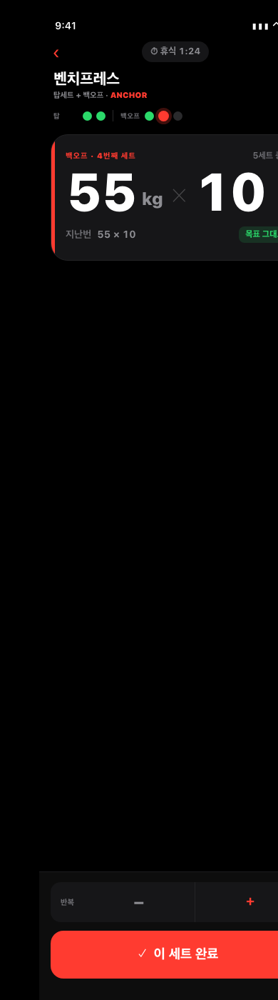
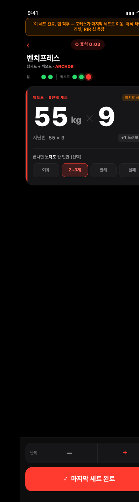
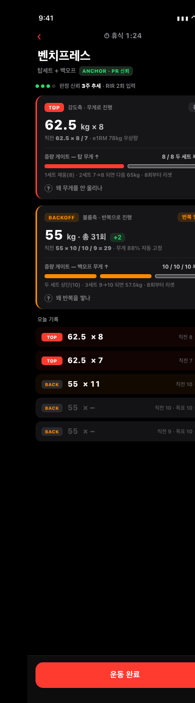
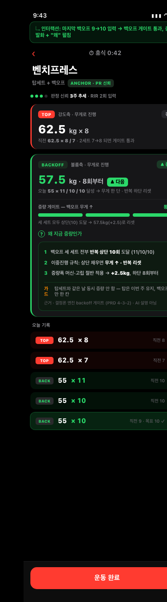
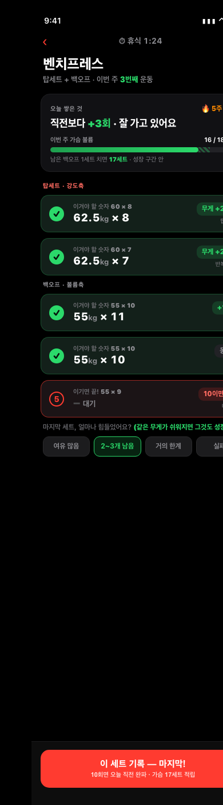
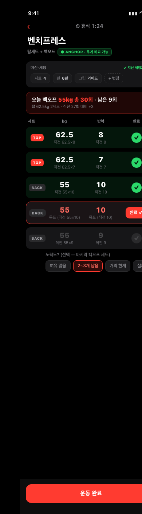
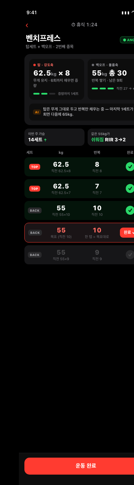
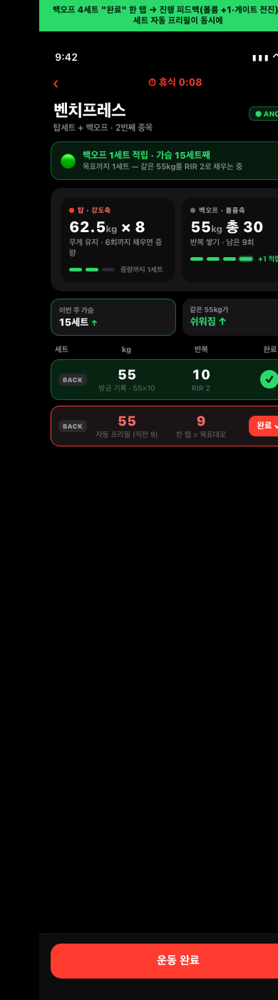

# 프로그램(엔진) 화면 — 5관점 디자인 목업

## 개요

이 문서의 목적은 하나다. **운동 중 처방·판정을 보여주는 "같은 핵심 화면"을, 서로 다른 다섯 관점의 디자인으로 만들어 나란히 놓고 비교해 고르는 것.** 통째로 다른 화면 다섯 개가 아니라, 같은 장면을 다섯 개의 시선으로 다시 설계한 것이다.

작성일: 2026-06-30.

모든 목업은 **완전히 같은 데이터·같은 장면**을 쓴다. 운동 중, 벤치프레스(탑세트+백오프 구성). 직전 탑세트 62.5kg 8회/7회, 백오프 55kg 10회/10회/9회. 같은 숫자를 관점별로 다르게 배치하고, 다르게 강조하고, 다르게 해석해 보여준다. 그래서 "무엇을 화면 위쪽 큰 자리에 두느냐"의 차이가 곧 각 관점의 정체성이다.

다섯 관점과 그 한 줄 컨셉은 이렇다.

- **UI/UX** — 표를 버리고 "지금 칠 한 세트"만 거대하게. 단일 초점 + 한 손 조작.
- **프로그램 완성도** — 탑(강도축)·백오프(볼륨축)를 두 카드로 분리하고, 증량까지 남은 게이트를 점으로.
- **목표 달성** — 직전 숫자를 "이긴/진/비긴" 판정으로 돌려주고, 정체 주간에도 보여줄 승리를 만든다.
- **로깅·추적** — 머신 세팅을 잡아 "같은 조건일 때만 비교"하고, 목표대로면 한 탭으로 끝낸다.
- **종합 균형** — 네 관점을 위계로 절충. 큰 건 상단 2축 히어로, 동기·로깅은 작게 뒤로.

아래 각 장에서 그 관점의 핵심 질문, 현 설계 평가, 목업 두 장(기본 + 인터랙션 후), 그리고 이 디자인의 이점을 본다.

---

## 1장. UI/UX — 3초 룰 · 시각 위계 · 한 손 조작

### 핵심 질문
운동 중 화면이 "지금 칠 한 값"을 0.5초 시선 안에 단번에 보여주고, 한 손 엄지만으로 입력이 끝나며, 탑/백오프가 과밀하지 않게 분리되는가? 한마디로 **"이 화면에 시선이 멈출 단일 초점이 있는가."**

### 현 설계 평가
잘된 점부터. 직전값을 모든 세트 행에 회색으로 깔아둔 건 정답이다. 진행 결정의 90%가 "지난번 숫자"인데 대부분 앱엔 없고 여기엔 있다. TOP/BACK 라벨 색 분리, 완료 동그라미, RIR을 마지막 백오프 세트에만 둔 위치 선정도 PRD 의도에 충실하다.

부족한 점은 UI/UX 시선에서 분명하다. 첫째, **시각 위계가 평평하다.** 다섯 개 세트 행이 거의 같은 크기·톤이라 "지금 칠 다음 빈 세트"가 안 튄다. 팔 뻗은 거리에서 0.5초에 멈출 초점이 없다. 둘째, **한 손 입력 동선이 화면에 없다.** 숫자가 표시만 돼 있고 +1을 어떻게 넣는지(키패드? 탭? +버튼?)가 안 보인다. 입력의 종착점이 불분명하다. 셋째, **정보 밀도가 과밀하다.** 한 행에 kg·반복·직전kg·직전반복·라벨·완료 여섯 요소가 균등 배치라 "오늘 칠 값"이 묻힌다. 균등 배치는 곧 위계 없음이다. 넷째, 탑+백오프 정체성이 라벨 배지로만 전달되어 표 안에 섞이고, "지금 백오프 4/5번째"라는 위치감이 약하다.

### 목업

### 무엇을 어떻게 개선하나
표를 버리고 **단일 초점 카드**로 간다. 화면의 거의 전부를 "지금 칠 한 세트"가 차지한다. 무게·반복을 74px 거대 숫자로 띄워 팔 뻗은 거리에서도 읽히게 하고, 직전값은 그 아래 회색 작은 줄로 깔아 "이겨야 할 숫자"로만 남긴다. 이전값 옆엔 "목표 그대로 / +1 노려보기" 같은 한 단어 델타로 판단까지 끝낸다.

전체 세트는 상단 **미니맵(점)** 으로 압축한다. 탑 2점 + 백오프 3점, 완료는 초록, 지금은 빨강 큰 점(글로우), 남음은 회색. 한 줄로 "어디까지 왔나"가 끝나서, 거대 카드가 전체 조망을 가린다는 단점을 보완한다.

입력은 **엄지 동선 한 곳**으로 모은다. 큰 숫자가 곧 목표값(프리필)이라 대부분은 하단 빨강 "이 세트 완료" 한 번이면 끝난다. 어긋날 때만 그 위 ±버튼으로 미세보정. 모든 조작 타깃이 화면 하단, 엄지 닿는 반경에 있다. 휴식 타이머·뒤로가기 같은 보조 정보는 얇게 눌러 시선을 안 뺏는다.

인터랙션(react)은 활성 백오프 세트에서 하단 빨강 「이 세트 완료」를 탭한 직후다. 미니맵의 방금 친 4번째 점이 초록으로 바뀌고 포커스 글로우가 마지막 5번째 점으로 이동한다. 거대 포커스 카드가 마지막 세트(55×9, "+1 노려보기")로 교체되며 "마지막 세트" 주황 핀이 붙는다. 휴식 타이머가 0:03으로 리셋되어 빨강으로 강조되며 완료를 피드백한다. 마지막 백오프 세트이므로 RIR 노력도 칩이 같은 포커스 카드 안에 떠올라 시선 이동 0으로 한 손 입력이 이어지고, 하단 버튼 문구도 "마지막 세트 완료"로 바뀐다.

### 이점·차별성
다섯 중 시선 비용이 가장 낮다. 운동하느라 집중력이 흩어진 상태, 땀·펌프로 화면을 오래 볼 수 없는 상황에서 "다음에 칠 한 값 + 한 번의 탭"으로 압축된다. 대신 전체 조망과 처방 근거를 의도적으로 작게 미뤘으므로, 처방의 "왜"를 깊게 보고 싶은 사용자에겐 정보가 부족하게 느껴질 수 있다.

---

## 2장. 프로그램 완성도 — 판정·처방의 정확·투명

### 핵심 질문
엔진이 내린 판정과 다음 처방을, 사용자가 **"왜 이 처방인지 · 얼마나 믿을지 · 정확히 뭘 할지"** 를 탑/백오프 2축으로 분리해 한눈에 알 수 있는가? 특히 선호 룰인 탑세트+백오프에서 강도축(탑=무게)과 볼륨축(백오프=반복)을 따로 처방하면서, 증량까지 남은 게이트 진행이 보이는가?

### 현 설계 평가
엔진 로직 자체는 거의 완비됐다. 양·질 2축 매트릭스, 탑/백오프 분리 게이트, RIR 양방향 보정, 급증량·폼붕괴 가드, 비교 보류(COMPARISON_DEFERRED), 백오프 무게 자동 고정까지 처방 근거가 탄탄하다. "처방은 엔진, AI는 이유만"이라는 단일 소스 원칙도 명확하다.

문제는 엔진은 있는데 화면이 그걸 못 보여준다는 것이다. 두 축 처방이 한 줄로 뭉개진다. 현 배너가 "오늘 60kg 총 27회 · 남은 8회(탑세트 기준)"인데, 탑은 무게를 유지하는지 / 백오프는 반복을 쌓는지가 안 보인다. 탑=무게축 / 백오프=반복축이라는 핵심이 UI에서 합쳐진다. 또 "왜"가 없다. 어떤 게이트를 통과했고 무엇이 부족해 증량이 안 떴는지를 안 보여준다. 신뢰도도 없다. 단일 세션으로도 칩이 즉시 떠, 근거 문서가 강조한 "2~3주 추세로만 판정"이 화면에 없다. 게이트 진행도도 없어 "증량까지 얼마나 남았나"가 안 보이니 다음 행동 동기가 약하다.

### 목업

### 무엇을 어떻게 개선하나
한 화면을 **탑(강도축)·백오프(볼륨축) 두 카드로 분리**하고, 각 카드를 같은 네 요소 골격으로 통일했다. 상단에 판정 칩(유지/반복쌓기/증량), 그 아래 "다음 한 칸" 거대 숫자(탑=62.5kg×8 유지 / 백오프=55kg 총 31회 +2), 그 아래 직전값과 무게 자동고정 비율, 그리고 **게이트 진행 막대** — 백오프 3세트가 상단 10회에 각각 몇 칸 찼는지를 점으로 보여, "두 세트 상단·세 번째 9→10이면 57.5kg 리셋"처럼 증량까지 정확히 무엇이 남았는지 읽힌다. 카드마다 "왜 무게를 안 올리나 / 왜 반복을 쌓나" 접힌 줄을 둬 정보 밀도와 3초 룰을 동시에 잡았다. 상단의 **판정 신뢰 게이지("3주 추세 · RIR 2회")** 로 단일 세션이 판정을 못 뒤집게 했고, 세트 로그는 보조로 작게 내렸다.

인터랙션(react)은 **마지막 백오프 세트를 9→10으로 채워 백오프 볼륨 게이트를 통과시키는 순간**이다. 게이트 점 세 개가 전부 초록으로 차고, 판정이 "반복 쌓기"에서 "▲ 증량"으로 뒤집히며, 다음 처방이 57.5kg·8회부터로 발화한다. 동시에 "왜 지금 증량인가" 패널이 펼쳐져 3단계 근거(세 세트 상단 도달 / 이중진행=무게↑·반복 리셋 / 머신 절반 증량폭 +2.5kg)와 가드("탑과 같은 날 동시 증량 안 함")를 보여준다. 탑 카드는 "유지"로 남아 2축이 따로 움직인다는 점이 분명히 드러난다.

### 이점·차별성
처방을 "신뢰하고 따를 이유"를 가장 강하게 준다. 엔진이 이미 가진 로직(2축 게이트, 가드, 신뢰도)을 화면에 그대로 투명하게 펼쳐, 똑똑한 사용자가 "왜 이 숫자인지" 납득하고 장기적으로 엔진을 신뢰하게 만든다. 대신 운동 중 한순간의 시선 비용은 UI/UX 목업보다 높다 — 정보가 많은 만큼, 빠른 한 손 조작보다는 "처방을 읽고 이해하는" 화면에 가깝다.

---

## 3장. 목표 달성 — 동기 · 진행 피드백 · 지속

### 핵심 질문
진행이 느려지는 중급자가, 매 세트와 매 세션에서 "이겼다 / 쌓였다 / 잘 가고 있다"는 작은 승리를 체감하게 만들어 좌절 없이 계속 나오게 하는가? 특히 무게가 몇 주씩 안 오르는 정체 주간에도 **"보여줄 승리(RIR이 쉬워짐·볼륨 적립)"** 를 만들어 주는가.

### 현 설계 평가
잘된 점. 직전값을 모든 세트 행에 회색으로 깔아둔 건 동기 관점에서도 정답이다. "이겨야 할 숫자"가 화면에 있다는 건 매 세트를 작은 목표 게임으로 바꿀 토대가 이미 있다는 뜻이다. 철학도 좌절을 유발하지 않게 짜였다 — "하락 단정 금지", 비교 보류, 최고=동기/처방=엔진 역할 분리. RIR을 마지막 백오프 세트에만 1탭으로 받는 위치도 좋다. 정체 주간의 숨은 승리(같은 무게가 쉬워짐)를 잡을 데이터 입구가 열려 있다.

부족한 점. 직전값이 **그냥 표시만** 되고 "이겼는지"를 판정해 주지 않는다. 62.5×8 옆에 이전 60×8이 회색으로 있을 뿐, "무게 +2.5 갱신"이라는 승리 라벨이 없다. 데이터는 있는데 감정으로 번역이 안 된다. **오늘 누적한 승리가 어디에도 안 보인다.** 세트를 칠수록 "직전보다 +N회 쌓임", "이번 주 가슴 볼륨 16→17세트 적립" 같은 진행 피드백이 없어 세션이 그냥 표 채우기로 끝난다. **정체 주간에 보여줄 승리가 0이다.** RIR을 받기만 하고 "같은 55kg가 3→2 RIR로 쉬워졌어요 = 강해지는 중"이라는 서사로 돌려주지 않아, 무게가 안 오른 주엔 화면 전체가 "변화 없음"으로 읽혀 이탈을 부른다. 끝으로 **세션 완료가 무덤덤하다.** 가장 보상감을 줘야 할 마지막 세트 완료 순간에 축하·적립 피드백이 없다.

### 목업

### 무엇을 어떻게 개선하나
같은 벤치 장면을 **"이겨야 할 숫자 게임"으로 재배치**했다. 화면 최상단에 표 대신 **오늘 쌓은 것 카드**를 둔다 — "직전보다 +3회 · 잘 가고 있어요" 헤드라인 + 5주 연속 출석 + 이번 주 가슴 볼륨 진행바(16/18, 남은 세트 치면 17 적립 예고 빗금). 세트를 칠 때마다 적립이 보인다. 각 세트 행은 **"이겨야 할 숫자 60×8" 라벨 + 오늘 수행 + 우측 델타 알약**(무게 +2.5 / +1회 이김 / 동률 / 마지막 세트는 "10이면 승")으로 바꿔, 직전값을 표시가 아니라 이긴/진/비긴 판정으로 돌려준다. RIR 칩 라벨을 "같은 무게가 쉬워지면 그것도 성장"으로 바꿔 정체 주간의 숨은 승리를 명시적 보상으로 프레이밍한다. 푸터 버튼은 "이 세트 기록 — 마지막!"에 보조 힌트 "10회면 직전 완파 · 가슴 17세트 적립"을 깔아 다음 1탭의 보상을 미리 보여준다.

인터랙션(react)은 마지막 백오프 세트 55×10 완료 탭이다. 배경이 딤 처리되고 **승리 피드백 카드가 팝업**한다 — "오늘 직전 완파!" 헤드라인과 함께 승리 3종(탑 무게 갱신 / 백오프 +2회 / 같은 무게 RIR 3→2로 쉬워짐)을 보여주며, 주간 가슴 볼륨이 16→17세트로 적립되는 미니바가 차오른다. 무게 정체여도 RIR 승리가 항상 한 줄 잡히도록 설계해 "보여줄 승리 0" 상황을 구조적으로 없앴다.

### 이점·차별성
"계속 나오게 만드는" 힘이 가장 세다. 본인(헤비유저)이 타겟이지만, 진행이 느려지는 중급자 구간에서 이탈을 막는 건 결국 감정이다 — 이 목업은 데이터를 감정(승리)으로 번역하는 데 화면을 쓴다. 정체 주간에도 항상 한 줄 승리가 잡히는 구조가 핵심 차별점이다. 대신 처방의 정밀한 근거나 2축 분리 투명성은 프로그램 목업만큼 깊지 않다.

---

## 4장. 로깅·추적 — 빠른 입력 · 머신 세팅 · 비교 신뢰

### 핵심 질문
상업 헬스장에서 머신 브랜드·세팅이 매번 바뀌는데, 이 화면이 (1) 목표대로면 입력 0에 가깝게 한 탭으로 끝나고, (2) 세팅 변동을 실제로 잡아 "같은 조건일 때만 무게를 비교"한다는 신뢰등급을 죽은 라벨이 아니라 살아 움직이게 만드는가?

### 현 설계 평가
잘된 점. 세트행마다 직전값을 회색으로 깐 건 정답이다(진행 결정의 90%). TOP/BACK 라벨로 두 축을 데이터 단위에서 분리했고, 신뢰등급 enum(ANCHOR/MAIN_MACHINE/VARIABLE)과 가변 머신 무게 PR 숨김 분기까지 설계는 갖춰져 있다.

부족한 점. 가장 큰 갭은 **머신 세팅 캡처가 통째로 빠진 것**이다. 추적 문서는 MAIN_MACHINE에 "시트·핀·핸들·각도 메모 필수"라고 못 박았는데 현 화면엔 무게·반복 칸뿐이다. 세팅을 못 적으니 "같은 세팅일 때만 비교"라는 정의 자체가 실행 불가가 되고, 등급이 라벨로만 존재하며 추적은 사실상 ANCHOR/VARIABLE 둘로 붕괴한다. 타겟이 바로 머신이 매번 바뀌는 사용자인데 그 핵심 변수 입력 자리가 없다. 또 대부분 세트가 "엔진 목표 그대로"인데도 매번 키패드를 여는 마찰이 남아 3초 룰과 충돌한다.

### 목업

### 무엇을 어떻게 개선하나
세 가지를 한 화면에 합쳤다. 첫째, 제목 옆 신뢰등급 칩을 "ANCHOR · 무게 비교 가능"처럼 **상태 문장**으로 띄워 등급이 지금 무엇을 의미하는지 즉시 읽히게 했다. 둘째, 제목 아래 **머신·세팅 칩 바(시트/핀/그립)** 를 신설해 "지난 세팅과 일치 ✓"를 초록으로 확인시킨다 — MAIN_MACHINE 등급이 비로소 동작한다. 셋째, 활성 세트는 목표값을 빨강으로 프리필하고 큰 "완료 ✓" 버튼 하나로 끝나, 목표대로면 키패드를 안 연다. 다를 때만 보정한다.

인터랙션(react)은 가장 중요한 분기를 보여준다. 세팅을 바꾸면(시트 4→2, 다른 머신) 등급이 자동으로 "비교 보류"로 뒤집히고, 직전값에 취소선이 그어지며 무게 목표가 숨겨지고, 배너가 "부위 볼륨 적립 + RIR로만 추적"으로 전환된다. 결정적으로 "하락"이라 단정하지 않는다 — 조건이 달라졌을 뿐이라는 메시지를 지킨다.

### 이점·차별성
"상업 헬스장에서 머신이 매번 바뀐다"는 타겟의 현실을 정면으로 푸는 유일한 목업이다. 세팅 캡처가 들어와야 비교 신뢰등급이 라벨에서 실제 동작으로 바뀐다는 점에서, 다섯 중 가장 실전적인 데이터 정합성을 확보한다. 대신 세팅 칩 바가 상단을 차지하므로 순수 동기 피드백이나 거대 단일 초점은 약하다 — 정확한 기록을 우선하는 사용자에게 맞는다.

---

## 5장. 종합 균형 — 네 관점의 절충

### 핵심 질문
네 관점(3초 위계 / 처방 투명성 2축 / 동기 피드백 / 빠른 로깅)을 한 화면에서 절충할 때, 무엇을 화면 위쪽 큰 자리에 두고 무엇을 작게 미뤄야 어느 것도 죽지 않으면서 0.5초 시선 초점이 흐트러지지 않는가?

### 현 설계 평가
잘된 점. 직전값 회색 표시, TOP/BACK 색 분리, RIR을 마지막 백오프 세트에만 두는 등 각 요소의 의도는 PRD에 충실하고, 엔진 처방 로직(2축 게이트·가드)도 거의 완비다.

부족한 점. 현 화면은 모든 요소가 평평하게 한 표에 얹혀 있다. 다섯 세트 행이 거의 같은 톤이라 "지금 칠 다음 세트"가 안 튀고(위계 평평), 배너가 "총 27회·남은 8회" 한 줄로 탑(무게축)과 백오프(반복축)를 뭉개며(투명성 손실), 동기 피드백("같은 무게가 쉬워졌다", 주간 볼륨 추세)을 띄울 자리가 운동 중 화면엔 없고(피드백 부재), 입력은 매번 키패드라 마찰이 있다(로깅 느림). **네 요소가 다 있는데 어느 것도 제대로 안 보이는 상태**다.

### 목업

### 무엇을 어떻게 개선하나
위계로 절충했다. 화면에서 유일하게 큰 것은 상단 히어로 — 탑/백오프를 좌우 2축 카드로 분리해 각 축의 "다음 한 칸 + 왜 + 증량까지 남은 게이트 점"을 보여준다(투명성 + 3초 초점). 그 아래 AI 한 줄은 처방 숫자가 아니라 "왜"만 통역한다. 동기 피드백은 작은 2칸 스트립("이번 주 가슴 14세트↑", "같은 55kg가 쉬워짐 RIR 3→2")으로 눌러 담아, 무게가 정체된 주에도 보여줄 승리를 만들되 화면을 점령하지 않는다. 세트 리스트는 활성 세트만 빨강 테두리로 띄우고 목표 프리필 + 한 탭 완료로 빠르게 친다. 즉 처방 투명성은 히어로에, 동기·로깅은 작게 뒤로 미루는 절충이다.

인터랙션(react)은 한 번의 탭이 두 일을 동시에 함을 보여준다. 백오프 세트 "완료"를 누르면 진행 피드백(상단 토스트 + 게이트 점 +1 전진 + 주간 볼륨 14→15 카드 강조)과 다음 세트 자동 프리필·활성화가 같이 일어난다 — 동기와 속도를 한 동작으로.

### 이점·차별성
어느 한 관점에 치우치지 않고 "쓸 만한 화면"의 기본값을 제시한다. 출시 1차 디폴트로 두기 가장 안전하다 — 처방 투명성·동기·속도가 모두 한 화면에 살아 있으면서도 상단 위계로 시선이 흐트러지지 않는다. 대신 각 관점의 극단적 강점(거대 단일 초점, 깊은 근거 패널, 폭발적 승리 연출, 세팅 캡처)은 전용 목업보다 한 단계씩 약하다.

---

## 종합 비교 + 리더 추천

다섯 목업은 같은 데이터를 두고 "무엇을 화면 위쪽 큰 자리에 두느냐"로 갈린다. 그래서 어느 하나가 정답이라기보다, **상황과 사용자에 따라 맞는 게 다르다.**

- **UI/UX 목업**은 운동 중 시선 비용을 최소화한다. 펌프와 땀으로 화면을 오래 못 보는 순간, 한 손으로 빠르게 치고 싶은 헤비 세션에 맞는다. 약점은 조망·근거가 얇다는 것.
- **프로그램 완성도 목업**은 처방을 신뢰하고 따를 이유를 가장 강하게 준다. 엔진이 왜 이 숫자를 줬는지 납득하고 싶은 똑똑한 중급자에게 맞는다. 약점은 운동 중 시선 비용이 높다는 것.
- **목표 달성 목업**은 계속 나오게 만드는 힘이 가장 세다. 진행이 느려진 정체 구간, 동기가 흔들리는 시기에 맞는다. 약점은 처방 근거의 깊이.
- **로깅·추적 목업**은 상업 헬스장에서 머신이 매번 바뀐다는 현실을 정면으로 푼다. 데이터 정합성을 가장 중시하는 기록형 사용자에게 맞는다. 약점은 상단 세팅 바가 다른 강점을 눌러 담는다는 것.
- **종합 균형 목업**은 네 관점을 절충한 안전한 디폴트다. 출시 1차 기본 화면으로 두기 가장 무난하다. 약점은 각 극단의 강점이 한 단계씩 약하다는 것.

### 리더 추천
**출시 1차 본체는 종합 균형 목업을 기준 골격으로 삼되, 각 전용 목업의 한 점씩을 흡수하길 권한다.**

이유는 이렇다. 타겟이 본인을 포함한 중급·근비대·상업 헬스장 사용자이고, 운동 중 화면은 매 세트 반복해서 보는 가장 마찰이 큰 면이다. 따라서 한 관점에 올인하면 나머지가 죽는데, 균형 목업의 "상단 2축 히어로 + 작은 동기 스트립 + 한 탭 완료" 골격이 어느 것도 죽이지 않으면서 시선 위계를 지킨다.

그 골격 위에 다음 네 점을 가져가면 좋다. 첫째, **UI/UX의 단일 초점 크기감과 미니맵 점** — 활성 세트 카드를 더 키우고 전체 세트를 점으로 압축해 "지금 칠 한 값"이 더 튀게. 둘째, **프로그램 완성도의 게이트 진행 점과 "왜" 접힘 줄** — 증량까지 남은 걸 점으로 보여주고 근거는 펼침으로 숨겨, 투명성을 밀도 비용 없이 확보. 셋째, **목표 달성의 정체 주간 RIR 승리 한 줄** — 무게가 안 오른 주에도 항상 승리가 한 줄 잡히게 하는 구조는 이탈 방지에 직접 효과가 있으니 반드시 흡수. 넷째, **로깅·추적의 머신 세팅 칩 바와 "비교 보류" 자동 전환** — 이건 단순 미감이 아니라 비교 신뢰등급을 실제로 동작시키는 데이터 정합성 문제라, 타겟 환경에서 빠지면 엔진 판정 자체가 흔들린다. 우선순위가 높다.

정리하면, **균형 목업을 뼈대로, 로깅의 세팅 캡처와 목표의 정체 주간 승리를 먼저 흡수하고, UI/UX의 초점 크기감과 프로그램의 게이트 점을 뒤이어 입히는 것**이 다섯 목업의 강점을 가장 손실 없이 합치는 길이다.
