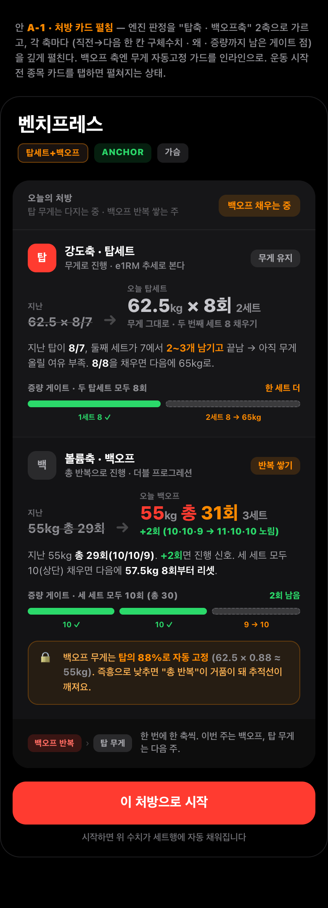
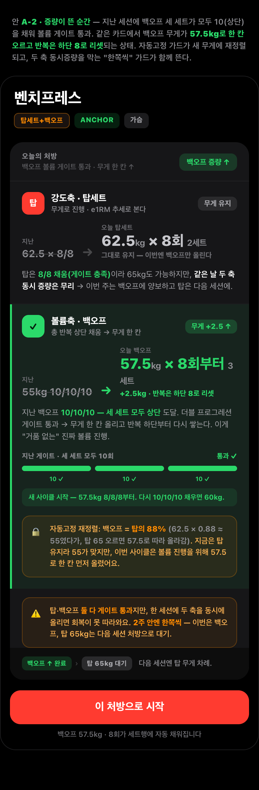
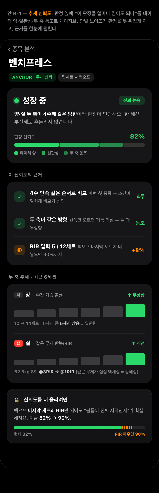
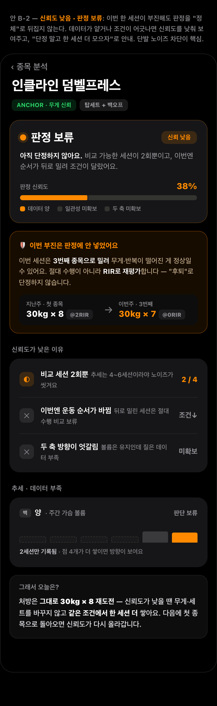
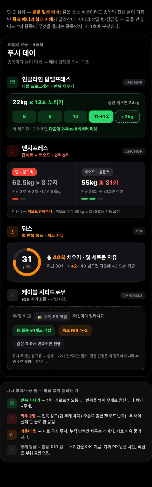
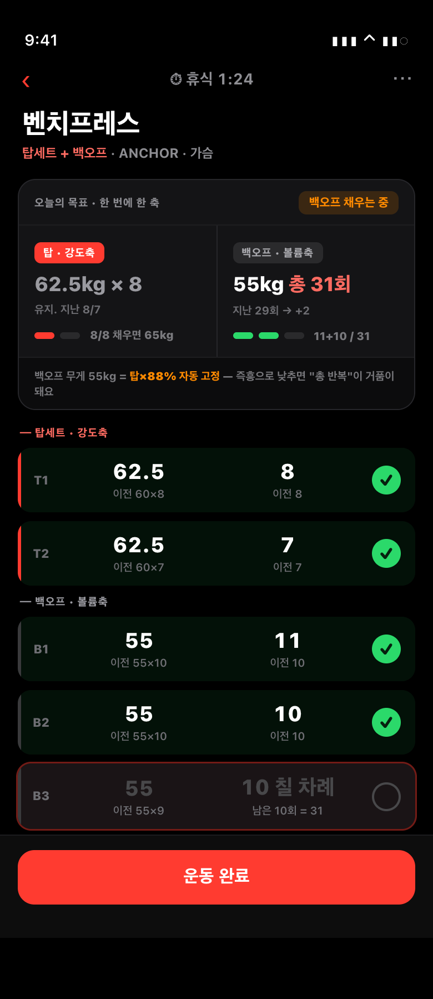

# 1번 프로그램(엔진) 완성도 — 딥다이브

> **작성일** 2026-06-30
> **대상** [PROGRESSION_REVIEW_AND_OPTIONS.md](PROGRESSION_REVIEW_AND_OPTIONS.md) 1장(프로그램 완성도)의 심화
> **계승** `review-mockups/html/program-A·B·C.html`(현 버전) → `program-deep/html/`(더 정밀하게 발전)
> **확정 방향** 직전 기록 + 주간 볼륨(근비대 1차) · 종목별 진행 룰(탑세트+백오프 선호) · RIR 선택형 · AI 보조 · 자연인·중급·근비대·상업 헬스장

---

## 개요 — 이 문서의 목적

1번 관점("과부하 엔진 완성도")은 이미 한 차례 리뷰돼 A·B·C 세 방안과 "A 단독 / A+B / C" 선택지가 나왔다. 이 문서는 그 한 단계를 **더 깊게 판다.** 세 방안을 각각 계승·발전시켜 핵심 화면을 1~2장씩 정밀 목업으로 만들고, 각 안의 **컨셉·이점·근거·차별성을 서술**한 뒤, 가장 중요하게 — **그 안에서 떼올 수 있는 "요소"로 분해**한다.

핵심은 **"안을 통째로 고르지 말자"**는 것이다. 세 안의 좋은 부품은 서로 다른 안에 흩어져 있고, 같은 화면(운동 중 vs 분석)을 놓고 경쟁하기도 한다. 그래서 이 문서는 "A냐 B냐 C냐"를 묻지 않는다. 대신 **"이 요소 + 저 요소를 섞어" 자기만의 조합을 짜라**고 권한다. 맨 끝에 요소별 채택/보류 체크리스트를 둔다.

**핵심 질문(변함없음):** 엔진이 내린 판정(증량/유지/정체)과 다음 처방을, 사용자가 **"왜 그런지 · 얼마나 믿을지 · 정확히 뭘 할지"** 한눈에 알 수 있게 보여주는가 — 특히 선호 룰인 탑세트+백오프에서 강도축·볼륨축 두 축을 따로 처방하면서.

세 안은 이 질문의 서로 다른 조각을 맡는다. **A는 "왜 + 정확히 뭘 할지"**(처방 깊이), **B는 "얼마나 믿을지"**(판정 신뢰도), **C는 "여러 종목을 훑을 때 룰 차이를 1초에"**(형태 스캔). 셋은 경쟁이 아니라 층위가 다르다.

---

## 안 A · 처방 카드 강화 — "왜 + 다음 한 칸"을 2축으로 깊게

> 단독 렌더: `docs/program-deep/html/A-1.html`(핵심 — 처방 카드 펼침) · `A-2.html`(증량이 뜬 순간)

### 컨셉

현 program-A는 "한 카드 안에 탑/백오프 두 줄, 각 줄에 처방·이유·게이트 점"까지였다. 한 줄짜리 처방과 짧은 이유, 점 두세 개가 전부라 "왜·뭘 할지"는 보였지만 "직전과 비교해 정확히 한 칸이 무엇인지", "게이트의 어느 칸에 서 있는지"는 압축돼 있었다.

A-1은 두 축을 각각 **독립된 미니 트랙**으로 승격시켜 네 층으로 펼친다. (1) 직전값을 취소선으로 깔고 화살표로 오늘 한 칸을 잇는 **직전→오늘 수치 블록**, (2) 그 한 칸이 무게 유지인지 반복 +2인지 색으로 가른 **상태 배지**, (3) 엔진 신호(8/7로 끝남, 마지막 2~3개 남김)를 그대로 인용한 **"왜" 문장**, (4) 증량 게이트를 세트 칸마다 채움/대기/잠금으로 그린 **진행 점 + 칸 캡션**. 백오프 축엔 무게 자동고정 가드를 "탑×0.88 ≈ 55kg" 계산식까지 보여주는 **인라인 잠금 박스**로 붙이고, 카드 바닥엔 "백오프 반복 › 탑 무게" **시퀀스 칩**으로 이번 주가 어느 축 차례인지 못박는다.

A-2는 같은 카드의 다른 순간 — 백오프가 10/10/10으로 상단을 채워 게이트가 발화한 상태다. 점이 전부 초록으로 차고 "통과", 무게가 57.5로 한 칸 오르며 반복이 하단 8로 리셋되는 게 화살표 하나로 읽힌다. 동시에 탑도 8/8을 채웠지만 "같은 날 두 축 동시 증량 금지" 가드가 떠 탑은 65kg 대기로 미뤄진다. 증량은 사용자가 가장 좌절을 덜고 가장 동기를 받는 순간인데, 현 A엔 이 순간을 위한 별도 상태가 없었다.

### 이점

가장 큰 이점은 **핵심 질문 세 개 중 "왜"와 "정확히 뭘 할지"를 동시에, 그것도 2축으로 나눠** 해결한다는 점이다. "다음 한 칸"이 "뭘 할지"를, "왜 문장"이 "왜"를, "게이트 점"이 "증량까지 얼마나"를 각각 맡아 한 카드에서 끝난다. 둘째, 탑/백오프가 블록으로 갈려 사용자 선호 룰의 정체성이 학습 없이 읽힌다 — 강도축은 무게를 다지고 볼륨축은 반복을 쌓는다는 게 색·배지·게이트 형태로 즉시 구분된다. 셋째, 가드가 인라인이라 "왜 백오프 무게를 못 내리나", "왜 둘 다 안 올려주나" 같은 의문이 생기는 자리에서 바로 답해 신뢰가 쌓인다.

정보 밀도가 높아지는 단점은 **이 카드가 운동 중 상시 화면이 아니라 "시작 전 탭하면 펼쳐지는 처방 카드"**라는 점으로 완화한다. 3초 룰이 걸리는 운동 중 배너는 한 줄로 압축하고, 깊이는 시작 전 탭 한 번에 둔다.

### 근거

직전값을 회색으로 병기하는 건 HYPERTROPHY 4부 "직전값 = 진행 결정의 90%"가 직접 근거다. 게이트 점과 증량 처방은 같은 문서 6부 백오프 게이트("전 세트 상단 도달 → 무게 한 칸·반복 하단 리셋")와 PRD FR-3("새 무게·반복 하단을 직접 산출")에서 온다. "왜 문장"은 HYPERTROPHY 1부의 "같은 무게 8회 @3RIR→@1RIR이 분명한 진행 신호"라는 이유 언어를 빌리되, PRD FR-10 "처방은 엔진, AI는 이유만"에 따라 엔진 fact만 인용한다. 백오프 자동고정은 HYPERTROPHY 사례 B·6-5 "백오프 무게 = 탑의 일정 비율로 자동 고정, 즉흥 인하 금지"와 PRD 판정코드를, 동시증량 금지(A-2)는 PRD 판정코드 "둘을 같은 날 동시 증량 금지(2주 내 한쪽씩)"를 화면으로 옮긴 것이다.

### 차별성

현 program-A 대비: (1) 축이 한 줄에서 네 층짜리 블록으로 깊어졌다 — 직전→오늘 화살표·상태 배지·왜·게이트가 각 축에 다 붙는다. (2) 게이트 점에 칸 캡션이 붙어 "어느 세트가 무엇을 더"까지 구체화됐다(현 버전은 의미 없는 막대). (3) 자동고정 가드가 계산식(62.5×0.88≈55)까지 노출돼 "왜 이 무게인지"가 검증 가능해졌다. (4) 현 A엔 없던 증량 발화 상태(A-2)를 추가해 게이트 통과·리셋·동시증량 금지·자동고정 재정렬이라는 엔진의 가장 중요한 전이 순간을 화면으로 만들었다. 현 PRD/스토리보드 대비로는, 운동 중 배너가 "오늘 60kg 총 27회·남은 8회"로 두 축을 한 줄에 합쳐 탑이 무게를 다지는지 백오프가 반복을 쌓는지 안 보이던 것을 정면으로 가른다.

### 요소 분해 (떼올 수 있는 부품)

- **[A1] 2축 처방 분리 블록** — 한 카드를 탑·백오프 두 블록으로 물리적으로 가르고, 각 블록이 자기 상태·처방·게이트를 따로 갖는다. *가치*: PRD 4-4·FR-5 "탑=강도축 / 백오프=볼륨축"이 데이터가 아니라 시각 구조로 분리돼, 배너가 한 줄로 뭉개지던 문제를 정면 해소. *결합성*: 가장 독립적이고 재사용성 높은 뼈대 — 안 C의 좌우 2열이나 스텝퍼를 각 축 블록 안에 그대로 끼울 수 있는 컨테이너.

- **[A2] "왜" 이유 문장** — "지난 탑 8/7, 마지막 2~3개 남기고 끝남 → 여유 부족"처럼 판정 근거를 엔진 fact만 인용해 한 문장으로. *가치*: 분석이 칩만 띄우던 "왜 없음"을 메운다. PRD FR-10과 정합 — 이 문장은 AI가 통역할 슬롯이기도 하다. *결합성*: 어느 배너 형태에든 한 줄로 끼울 수 있는 가장 가벼운 조각. B·C에 그대로 이식 가능.

- **[A3] 게이트 진행 점 + 칸 캡션** — 증량 게이트를 세트 칸 단위로 채움(초록)·대기(점선)·통과로 그리고, 각 칸 아래 "10 ✓ / 9→10" 캡션을 단다. *가치*: "증량까지 얼마나 남았나"를 한눈에 줘 다음 행동 동기를 만든다. *결합성*: 안 C의 더블 사다리(8·9·10·11→12)와 거의 같은 메타포라 호환되고, 안 B의 신뢰도 게이지 아래 한 줄로 얹어도 자연스럽다.

- **[A4] 백오프 무게 자동고정 가드** — 백오프 무게를 탑의 일정 비율로 자동 고정하고, 즉흥 인하를 막는 잠금 박스를 계산식까지 인라인으로 노출. *가치*: "즉흥 백오프는 톤수만 부풀려 추적선을 망친다"(사례 B)를 화면에서 강제. PRD `COMPARISON_DEFERRED`가 발동할 상황 자체를 사전 차단. *결합성*: 백오프를 다루는 어떤 UI(C의 백오프 열, 운동 중 볼륨 블록)에도 붙는 독립 가드.

- **[A5] 다음 한 칸 구체 수치** — 직전값을 취소선으로 깔고 화살표로 오늘 처방을 잇되, kg·반복·세트수·델타(+2회)를 모두 명시. *가치*: PRD FR-3 "새 무게·반복 하단 리셋 직접 산출"(현 앱 갭)을 시각화. "이겨야 할 숫자"를 처방 옆에 직접 붙여 입력 전 목표가 박힌다. *결합성*: 운동 중 세트행 프리필과 직결 — 이 수치가 그대로 세트행에 채워지는 동선.

- **[A6] 동시증량 금지 가드 (A-2)** — 탑·백오프가 둘 다 게이트를 통과한 드문 순간에만 "2주 안엔 한쪽씩"을 띄운다. *가치*: PRD 판정코드 "둘을 같은 날 동시 증량 금지"를 사용자에게 보이게 만든 조각. *결합성*: A1(2축 블록)과 짝일 때만 의미.

---

## 안 B · 추세 신뢰도 — "얼마나 믿을지"를 전담하는 층

> 단독 렌더: `docs/program-deep/html/B-1.html`(성장·신뢰 높음) · `B-2.html`(신뢰 낮음 = 판정 보류)

### 컨셉

현 program-B는 옳은 방향이었지만 약점이 셋 있었다. 신뢰도 82%가 불투명한 숫자 하나라 "왜 82인지"가 안 보였고, 두 축 스파크에 탑/백오프 정체성이 안 붙었으며, 정작 이 방안의 핵심 가치인 "단발 노이즈가 판정을 못 뒤집는다"가 화면에 없었다(높은 상태만 보여줌).

B-1·B-2는 이 셋을 정면으로 메운다. 핵심 한 줄은 **"판정 옆에 신뢰도를 띄우되, 그 신뢰도를 데이터 양·일관성·두 축 동조 셋으로 분해해 보여주고, 신뢰도가 낮으면 판정을 보류해 한 세션이 그림을 못 뒤집게 한다"**이다. B-1은 신뢰 높은 상태에서 82%를 3요소 누적 막대로 갈라 보여주고, 근거 행으로 각 구간이 어디서 왔는지 펼치며, RIR을 채우면 90%까지 오른다는 인센티브를 막대 끝 점선 천장으로 보인다. B-2는 신뢰 낮은 상태 — 30×8→30×7로 부진해도 "후퇴"로 안 찍고 순서가 밀린 조건 차이를 잡아 RIR로 재평가하며, 신뢰도를 38%로 낮춘 뒤 판정을 보류하고 "🛡️ 이번 부진은 판정에 안 넣었어요" 차단 배너를 띄운다.

### 이점

A가 "왜 + 다음 한 칸"을 푼다면 B는 그 위에 "그 판정이 단단한가"를 얹어, 사용자가 처방을 따를 확신을 준다. 하루 컨디션·순서로 판정이 출렁이면 신뢰가 무너지는데, 신뢰도가 낮을 땐 보류해 "한 세션 더 쌓자"로 안내하니 좌절과 오판을 동시에 막는다. 또 선택형 RIR의 가장 큰 적은 "왜 굳이"인데, 인센티브를 신뢰도 상한(82→90%)으로 환산해 받을 이유를 만들어 입력률을 끌어올린다.

### 근거

"정체는 단발 아닌 2~3주 추세로"는 HYPERTROPHY 4부·6부가 못 박는다 — B-2의 보류 상태가 이걸 UI로 강제한다. "단일 세션은 노이즈, 4~6세션은 신호"는 같은 문서 3부 비교 신뢰도 규율이고, 게이지의 "데이터 양" 구간과 B-2의 "세션 2/4" 칩이 그 직역이다. "순서가 뒤로 밀린 세션은 절대 수행 비교 보류, RIR로 재평가"는 3부·6부 응급 규칙으로, B-2 차단 배너의 "@2RIR→@0RIR" 비교가 그 규율 그대로다. "한쪽만 오르면 거품 의심"(양·질 2축)은 "두 축 동조" 구간이 VOLUME_BUBBLE을 신뢰도로 미리 경고하는 근거다.

### 차별성

A는 처방의 깊이, C는 룰별 형태 분기를 판다. **B만이 "판정의 확신도"라는 직교 축을 다룬다** — 그래서 A·C 어느 쪽 위에든 얹힌다(게이지 한 줄 + 근거 칩). 특히 다른 두 안에 없는 것은 **"판정을 안 내리는 상태"(보류)를 1급 화면으로 그린 것**이다. 대부분의 트래킹 앱이 단일 세션에 즉시 칩을 띄워 출렁이는 데 반해, B는 "아직 모른다, 한 세션 더"를 당당히 보여주는 절제가 차별점이다.

### 요소 분해 (떼올 수 있는 부품)

- **[B1] 판정 + 신뢰도 게이지 (3요소 누적 막대)** — 82%를 한 덩어리로 안 그리고 데이터 양 / 일관성 / 두 축 동조 세 구간을 농도로 쌓는다. *가치*: "왜 82인가"가 막대 모양 자체로 설명돼, "% 산식이 임의적"이라는 단점을 구조로 해소. *결합성*: 분석 헤드라인에 단독으로 얹을 수 있고, 안 A의 처방 카드 위에 한 줄로 얹어도 충돌 없음.

- **[B2] 두 축 추세 스파크** — 탑세트(질·강도)와 백오프(양·볼륨)를 빨강 [탑]/회색 [백] 태그를 붙여 각각 6세션 스파크로. *가치*: HYPERTROPHY 6부의 2축 분리를 신뢰도 화면에서 살린다. "5세션 중 5세션 상승 = 일관됨" 같은 수치가 B1 게이지로 환류. *결합성*: 들여다보는 정보라 **분석 전용**(운동 중 배너 금지).

- **[B3] 신뢰도 근거 행 (양·음 양방향)** — "4주 연속 / 두 축 동방향 / RIR 5-12세트"를 아이콘+설명+수치 칩으로. *가치*: 게이지 세 구간이 어느 근거에서 왔는지 글로 펼친 것. B-2에선 같은 틀이 "신뢰도를 깎은 이유"(순서 바뀜, 세션 2회뿐)로 재활용. *결합성*: B1과 의무 동반 — 신뢰도 %만 쓰고 이 행을 빼면 산식이 임의적으로 보인다.

- **[B4] 단발 차단 / 보류 배지 (B-2)** — 이번 세션이 부진해도 "후퇴"로 안 찍고 신뢰도를 낮춘 뒤 판정을 보류하는 "🛡️ 판정에 안 넣었어요" 배너. *가치*: B의 차별성이 가장 진하게 드러나는 요소. 노이즈 거부를 눈에 보이게. *결합성*: 단독으로도 "정체 오판 방지" 가드로 채택 가능.

- **[B5] RIR 입력 인센티브 (B-1)** — "지금 82% → RIR 채우면 90%"를 막대 끝 점선 천장으로. *가치*: 선택형 RIR을 벌점이 아니라 "올릴 수 있는 상한"으로 보여줘 자발적 입력 유도. *결합성*: B1 위에서만 의미가 살지만, 운동 중 RIR 칩 옆 마이크로카피로도 떼어 쓸 수 있다.

---

## 안 C · 룰별 맞춤 배너 — 형태로 룰 차이를 1초에 스캔

> 단독 렌더: `docs/program-deep/html/C-1.html`(4룰 형태별 카탈로그 + 범례) · `C-2.html`(운동 중 적용 단일 배너)

### 컨셉

현 program-C는 "한 화면에 4룰을 나열해 형태가 다름을 보여준다"까지였다. 심화는 두 가지로 발전시켰다. 첫째, **형태를 단순 장식이 아니라 "그 룰이 무엇을 올리는지"의 직접 표현**으로 만들었다 — 더블은 칸이 가로로 차오르는 사다리(반복을 채워 무게로 환산), 탑+백오프는 좌우 2열(강도축·볼륨축이 물리적으로 안 섞임), 총반복은 누적 카운터 링(세트 구성을 버리고 합만 본다), 가변머신은 무게칸을 아예 지운 잠금 칩(비교할 무게가 없다는 사실 자체가 형태). 둘째, C-1을 "데모용 4장 나열"이 아니라 **실제로 일어나는 상황 — 한 푸시 데이 안에 룰이 다른 4종목이 섞여 있는 오늘의 운동**으로 프레이밍했다. 룰이 섞이는 건 예외가 아니라 정상이고, 바로 그 섞임 때문에 "형태로 즉시 구분"의 가치가 생긴다. C-2는 그 중 선호 룰(탑+백오프)을 골라, 카탈로그의 2열 형태가 운동 중 세트 입력 화면 위에서도 그대로 유지되며 세트를 칠 때마다 게이트 점이 채워지는 모습을 보였다.

### 이점

여러 종목을 훑을 때 룰 차이가 글 없이 1초에 구분된다. 운동 중 종목을 넘길 때(스캔)는 형태 키가, 한 종목을 탭해 파고들 때(깊이)는 A의 처방 카드가 빛난다. 또 4룰이 섞인 현실(상업 헬스장에서 앵커·머신·맨몸이 한 세션에 공존)을 정면으로 다루는 유일한 안이다. 가변머신 무게 숨김은 매번 바뀌는 머신의 표시 무게가 무의미하다는 사실을 UI가 무게칸을 지워서 못 속이게 한다 — 가짜 PR의 원천 차단.

### 근거

룰 카탈로그는 PRD 9장·APP_HYPERTROPHY_PROGRESSION_PLAN의 progressionRule 4종(DOUBLE / TOP_SET_BACKOFF / TOTAL_REP_TARGET / RIR_AUTOREG)을 그대로 형태에 매핑한다. 각 룰의 게이트가 다르므로(더블=전 세트 상단, 탑백=탑 reps OR 백오프 상단, 총반복=합 도달, RIR=무게 게이트 없음) 진척을 보여주는 시각도 달라야 정직하다. 탑×백오프 무게 고정은 PRD 판정 의사코드와 HYPERTROPHY 사례 B의 직접 반영이다. 가변머신 무게 PR OFF는 HYPERTROPHY 5부 계층③·PLAN Q2-1("anchorTier=VARIABLE이면 PR 화폐 끔")에서 온다 — 머신은 레버리지 변동이 수십 %라 표시 무게 절대 비교가 구조적으로 깨진다. "진행 판정은 부위 주간 볼륨이 한다"는 5부 질문 전환(이 종목이 늘었나 → 이 부위가 늘었나)을 노트로 옮겼다.

### 차별성

A는 "한 종목을 깊게 펼쳐 왜·다음 한 칸·게이트를 다 보여주는" 수직 깊이의 카드다. C는 반대로 여러 종목을 훑을 때 룰 차이를 1초에 구분시키는 수평 스캔을 노린다 — 둘은 경쟁이 아니라 층위가 다르다. 또 A는 탑+백오프 한 룰에 최적화돼 있지만, C는 4룰이 섞인 현실을 정면으로 다루는 유일한 안이다. 가변머신 무게 숨김은 A·B에 없는 C만의 머신 변동 정직성 장치다.

### 요소 분해 (떼올 수 있는 부품)

- **[C1] 반복 사다리 (더블 프로그레션)** — 8·9·10·11→12·+무게 칸이 가로로 놓여, 채워진 칸·지금 칸·목표 칸으로 "증량까지 한 칸 남았다"가 글 없이 읽힌다. *가치*: 더블 룰의 게이트가 추상 텍스트가 아니라 진척바가 된다. *결합성*: A3(게이트 점)과 결이 같아 A의 처방 카드 안에 끼워 넣기 자연스럽다.

- **[C2] 탑/백오프 좌우 2열** — 강도축과 볼륨축을 한 줄로 절대 안 합치고 세로 구분선으로 가른다. 각 열에 독립 미니 게이트 점(탑=빨강 2점, 백오프=초록 3점). *가치*: 운동 중 "오늘 60kg 총 27회" 한 줄 뭉개짐을 정면 해소. *결합성*: **A1과 사실상 같은 컨셉** — A1이 이 2열의 심화판이다. 운동 중·분석 화면에 그대로 옮겨 쓸 컨테이너.

- **[C3] 총 반복 카운터 링 (세트 자유 룰)** — 31/40 도넛으로 "세트를 몇 개로 쪼개든 합만 채우면 된다"를 표현. *가치*: 맨몸·펌프 종목에서 "왜 이건 세트마다 목표가 안 뜨지?"를 형태가 미리 답한다. *결합성*: 형태가 더블과 비슷해 한 컴포넌트의 변형으로 흡수 가능.

- **[C4] 가변머신 무게 숨김 + 부위볼륨·RIR 칩** — 무게 비교에 취소선·자물쇠("무게 PR 꺼짐"), 그 자리에 "등 볼륨 +1세트 적립"·"목표 RIR 1~2" 칩. *가치*: 머신 표시 무게가 무의미하다는 사실을 UI가 강제 — 가짜 PR 원천 차단. 진행 판정을 "이 종목"이 아니라 "부위 주간 볼륨"으로 넘긴다. *결합성*: 룰과 무관하게 어느 안을 골라도 얹는 가드. 단, 홈 부위 볼륨 게이지로의 링크와 짝지어야 공허하지 않다.

- **[C5] 룰 아이콘·색 키 + 하단 범례** — 종목마다 좌측 아이콘(▤/⫶⫶/◴/⤬)과 룰 색을 고정하고 하단에 "형태↔룰" 범례를 둬 학습 곡선을 한 번에 처리. *가치*: 4종 컴포넌트의 유지·일관성 비용을 토큰 통일로 완화. 범례는 온보딩 1회만 펼치고 접어도 된다.

---

## 요소 조합 — 리더 추천

세 안을 부품으로 분해하면 같은 컨셉이 두 안에 걸치기도 한다(A1≈C2가 둘 다 탑/백오프 2열이고, A3≈C1이 둘 다 게이트 진척바다). 그러니 조합의 출발점은 "안"이 아니라 **"화면 역할"**이다. 운동 중 화면(0.5초 시선, "지금 뭘 칠까")과 분석 화면("이 종목이 진짜 자라나, 손가락으로 들여다봄")은 직무가 다르므로 같은 부품을 섞어 넣으면 안 된다. 이 가름 위에서 추천 조합을 둘 제시한다.

### 추천 1 (균형형) — "운동 중 = A의 2축 처방, 분석 = B의 신뢰도, 종목 탭 = A의 게이트 깊이"

가장 안정적이고 다섯 기둥을 모두 덮는 조합이다.

- **운동 중 배너**(항상 보임, 0.5초): C2/A1의 **탑/백오프 좌우 2열**을 컨테이너로 깔고, 각 열에 [A5] 다음 한 칸 굵은 숫자("탑 62.5×8 유지 / 백오프 55kg 총 31회")와 직전값 회색 1줄, "이번 주 어느 축" 한 단어만. [A4] 백오프 자동고정 가드는 푸터에 한 줄. 가변 종목이면 그 자리에 [C4] 무게 숨김 칩.
- **종목 카드 탭 시**(시트로 펼침, 2차): [A2] 긴 "왜" 텍스트 + [A3] 게이트 진행 점 + 칸 캡션 + [A4] 가드 설명. 운동 중 0.5초를 안 깨면서 깊이를 한 탭 뒤에 둔다.
- **분석 화면**: [B1] 판정 + 신뢰도 게이지 + [B3] 근거 행 + [B2] 두 축 추세 스파크 + [A2]의 긴 버전. 신뢰도가 낮으면 [B4] 보류 배지.

**왜 이 조합인가:** 운동 중엔 "오늘 뭘 칠지"(A), 분석에선 "그게 진짜 효과였나"(B)를 같은 2축(탑/백오프 = 양/질)이 이어받아 한 멘탈 모델을 만든다. 현 PRD가 권장한 "A 처방 + B 신뢰도 보강"의 본질이 이 시너지다. 숫자(처방)는 배너, 서사(왜·가드·게이트)는 탭으로 갈라 3초 룰과 정보 밀도를 동시에 만족한다.

**주의:** [B2] 추세 스파크(6세션 점 그래프)를 운동 중 배너에 넣으면 안 된다 — 들여다보는 정보라 0.5초 룰을 깬다. 분석 전용. 또 [B1] 신뢰도 %를 쓰면 [B3] 근거 행은 반드시 동반해야 한다(빼면 산식이 임의적으로 보임).

### 추천 2 (상업 헬스장 정직형) — 추천 1 + C의 룰별 형태 + 가변 숨김 강화

타겟이 머신이 매번 바뀌는 상업 헬스장이라는 점을 더 무겁게 반영한 조합이다. 추천 1을 베이스로, 한 푸시 데이에 룰 다른 종목이 섞이는 현실을 형태로 처리한다.

- 종목 목록에서 룰별 형태를 다르게: 탑백 종목은 [C2] 2열, 더블 종목은 [C1] 반복 사다리, 가변 머신은 [C4] 무게 숨김. [C5] 룰 색·아이콘 키로 스캔을 돕는다.
- [C4] 가변 무게 숨김은 반드시 **홈 부위 볼륨 게이지로의 링크**와 짝짓는다("등이 자라나" 화면). 무게를 끄면 "그럼 이 종목 진행은 어디서 보나?"가 생기는데, 그 답이 부위 볼륨이다.

**왜 이 조합인가:** 가변 머신에서 "최고 82kg" 가짜 PR을 원천 차단하고, 룰이 섞인 세션을 형태로 1초에 구분시킨다. 다만 4룰 컴포넌트 전부를 한꺼번에 만들지 말고 **"탑백 2열 + 더블 사다리 + 가변 숨김" 3개(2.5순위)로 시작**하고, 형태가 비슷한 총반복은 더블의 변형으로 흡수해 유지비를 낮춘다.

**주의:** 한 종목은 한 룰이다 — [C2] 2열과 [C1] 사다리를 같은 종목에 겹치면 모순. [C1] 4룰을 한 화면에 동시 노출하는 건 카탈로그 데모에서만이고, 실제 앱은 한 번에 한 종목 = 한 룰만 뜬다.

### 두 화면 어휘 통일 (양 조합 공통)

운동 중 "탑(강도축) / 백오프(볼륨축)" ↔ 분석 "질(강도) / 양(볼륨)"의 색·라벨을 통일한다(탑=빨강, 백오프=회색; 양=볼륨바, 질=RIR). 판정 상태명(GROWING / VOLUME_BUBBLE / STRENGTH_ONLY / STALL_REVIEW)도 양쪽에서 같은 단어로. 어휘가 갈리면 같은 엔진인데 다른 앱처럼 느껴진다.

---

## 당신이 고를 요소 체크리스트

아래에서 채택/보류를 직접 표시하라. 기둥(필수 근거)을 깨는 보류는 ⚠로 표시했다.

**안 A — 처방 깊이**
- [ ] **A1** 2축 처방 분리 블록 (탑/백오프 두 슬롯) ⚠ 빼면 "탑/백오프 분리" 기둥이 무너짐
- [ ] **A2** "왜" 이유 문장 (엔진 fact 인용) — 가장 가벼운 이식 조각
- [ ] **A3** 게이트 진행 점 + 칸 캡션 (증량까지 얼마나)
- [ ] **A4** 백오프 무게 자동고정 가드 (탑×88%) — A1과 떼지 말 것
- [ ] **A5** 다음 한 칸 구체 수치 (직전→오늘 취소선 화살표) — 세트행 프리필과 직결
- [ ] **A6** 동시증량 금지 가드 (둘 다 게이트 통과 시만)

**안 B — 판정 신뢰도**
- [ ] **B1** 판정 + 신뢰도 게이지 (3요소 누적) ⚠ 판정 칩 띄우는 곳엔 최소 게이팅이라도 필수
- [ ] **B2** 두 축 추세 스파크 (6세션) — 분석 전용, 운동 중 배너 금지
- [ ] **B3** 신뢰도 근거 행 — B1 쓰면 의무 동반
- [ ] **B4** 단발 차단 / 보류 배지 — B의 차별성 핵심
- [ ] **B5** RIR 입력 인센티브 (82→90%)

**안 C — 룰별 형태 + 머신 정직성**
- [ ] **C1** 반복 사다리 (더블) — A3와 같은 메타포
- [ ] **C2** 탑/백오프 좌우 2열 — A1과 같은 컨셉(택1 또는 통합)
- [ ] **C3** 총 반복 카운터 링 — 더블의 변형으로 흡수 가능
- [ ] **C4** 가변머신 무게 숨김 + 볼륨/RIR 칩 ⚠ 가변 종목 있으면 필수(가짜 PR 차단). 홈 부위 볼륨 링크와 짝
- [ ] **C5** 룰 아이콘·색 키 + 하단 범례

**조립 안전망(다섯 기둥):** 고른 조합이 ①탑/백오프 분리 ②추세 판정(단발 차단) ③룰 차등 ④왜+다음 한 칸 ⑤가변 무게 숨김 을 다 덮는지 확인하라. 빠진 기둥이 있으면 그 기둥의 부품을 최소 형태로라도 끼운다.

---

**참조 문서(절대경로)**
- `/Users/shstl/Claude Code/gymtracker/docs/APP_HYPERTROPHY_PROGRESSION_PLAN.md` (Q2·Q3·Q6·Q7·Q8·Q9 — 2축 분리·가변 PR·룰 카탈로그·AI 경계)
- `/Users/shstl/Claude Code/gymtracker/docs/HYPERTROPHY_PROGRESS_AND_TRACKING.md` (3부 추세·노이즈, 4부 직전값 90%, 사례 B 백오프 고정, 5부 머신 변동)
- `/Users/shstl/Claude Code/gymtracker/docs/PROGRESSIVE_OVERLOAD_GUIDE.md` (3-7 오늘목표 공식, 4-3 종목별 진행, 5-1 정체=추세)
- `/Users/shstl/Claude Code/gymtracker/docs/PRD_PROGRESSION.md` (FR·progressionRule·anchorTier·1장 부족점)
- `/Users/shstl/Claude Code/gymtracker/docs/PROGRESSION_REVIEW_AND_OPTIONS.md` (1장 A/B/C 컨셉·장단점)
- 정밀 목업: `/Users/shstl/Claude Code/gymtracker/docs/program-deep/html/{A-1,A-2,B-1,B-2,C-1,C-2}.html`
