# 점진적 과부하 — 설계 리뷰 & 개선 선택지

> **작성일** 2026-06-30
> **대상 문서** [PRD_PROGRESSION.md](PRD_PROGRESSION.md) + 스토리보드 5화면(home·workout·analysis·goal·ai)
> **확정 방향** 직전 기록 + 주간 볼륨(근비대 1차) · 종목별 진행 룰(탑세트+백오프 선호) · RIR 선택형 · AI 보조
> **대상 사용자** 자연인 · 중급 · 근비대 · 상업 헬스장(머신이 매번 바뀌는 환경) — 1차 타겟은 Strong 헤비유저 본인

---

## 개요

PRD와 스토리보드를 **4개의 서로 다른 관점**에서 비평적으로 검토했다. 각 관점은 "가장 큰 부족점"을 짚는 **핵심 질문 1개**를 던지고, 현 설계가 그 질문에 어떻게 답하는지 평가한 뒤, 서로 다른 접근의 **개선 방안 3개(A·B·C)**를 목업과 함께 제시한다.

| # | 관점 | KEY | 핵심 질문 한 줄 |
|---|---|---|---|
| 1 | **프로그램 완성도** (과부하 엔진) | `program` | 엔진 판정·처방을 "왜·얼마나 믿을지·정확히 뭘 할지"로 보여주나? |
| 2 | **UI/UX** (운동 중 입력) | `uiux` | 운동 중 세트 입력이 "한 손·0.5초 시선"에 최적인가? |
| 3 | **로깅·추적** (머신 변동) | `logging` | 상업 헬스장 머신 변동을 실제로 매끄럽게 추적하나? |
| 4 | **목표 달성** (동기·지속) | `goal` | 진행이 느려지는 중급자가 좌절 없이 계속 나오게 하나? |

**공통 진단**: 엔진의 *처방 로직*은 거의 빠짐이 없다(양·질 2축, 탑/백오프 분리 게이트, RIR 양방향, 가드까지). 부족한 곳은 일관되게 **"엔진은 있는데 화면이 못 보여준다"** 와 **"사용자가 계속 나올 이유·머신 변수 입력 자리가 비었다"** 이다. 네 관점은 같은 골격의 서로 다른 측면을 친다.

> 목업 이미지는 캡처 후 채워진다. 단독 렌더 HTML은 `docs/review-mockups/html/{KEY}-{A|B|C}.html`, 임베드 이미지는 `review-mockups/{KEY}-{A|B|C}.png`.

---

## 1장 · 프로그램 완성도 (과부하 엔진)

### 1.1 핵심 질문
> **엔진이 내린 판정(증량/유지/정체)과 다음 처방을, 사용자가 "왜 그런지 · 얼마나 믿을지 · 정확히 뭘 할지" 한눈에 알 수 있게 보여주는가?** — 특히 선호 룰인 탑세트+백오프에서 강도·볼륨 두 축을 따로 처방하면서.

### 1.2 현 설계 평가

**잘된 점**
- 엔진 설계 자체가 탄탄하다. 양·질 2축 매트릭스, 탑/백오프 분리 게이트, RIR 양방향 보정, 급증량·폼붕괴 가드, 비교 보류(`COMPARISON_DEFERRED`)까지 처방 로직은 거의 완비.
- "처방은 엔진, AI는 이유만"의 단일 소스 원칙이 명확(FR-10).

**부족한 점 — 엔진은 있는데 화면이 못 보여줌**
1. **두 축 처방이 한 줄로 뭉개짐.** 운동 중 배너가 "오늘 60kg 총 27회 · 남은 8회(탑세트 기준)"인데, 탑은 무게를 유지하는지 · 백오프는 반복을 쌓는지가 안 보인다. PRD 4-4 핵심(탑=무게축 / 백오프=반복축)이 UI에서 합쳐진다.
2. **"왜"가 없음.** 분석 화면이 `GROWING` 칩만 띄우고, 어떤 게이트를 통과했고 무엇이 부족해 증량이 안 떴는지를 안 보여준다.
3. **신뢰도가 없음.** 단일 세션 데이터로도 칩이 즉시 떠, 근거 문서가 강조한 "2~3주 추세로만 판정"이 화면에 없다.
4. **게이트 진행도 부재.** "증량까지 얼마나 남았나"(repMax까지 몇 세트)가 안 보여 다음 행동 동기가 약하다.

### 1.3 개선 방안

| | A · 처방 카드 강화 | B · 추세 기반 신뢰도 | C · 룰별 맞춤 처방 UI |
|---|---|---|---|
| **컨셉** | 판정을 "탑/백오프 2축 × (다음 한 칸 + 왜 + 게이트 점)"으로 한 카드에 펼침 | 판정 옆에 "얼마나 믿을지"를 데이터 양·일관성으로 게이지화 | 진행 룰마다 배너 형태 자체가 달라짐 |
| **변경점** | 종목 카드 탭 시 두 축 각각의 처방·이유·증량까지 남은 게이트 점 표시. 백오프 무게 자동 고정(탑×88%) 가드 명시 | 분석 헤드라인에 신뢰도 % + "4주 연속/두 축 동방향/RIR 입력수" 근거 행. 단일 세션이 판정 못 뒤집게 | 더블=반복 사다리, 탑+백오프=좌우 2열, 총반복=카운터 링, 가변머신=무게 숨김+볼륨/RIR 칩 |
| **장점** | "왜+다음 한 칸"을 가장 직접 해소, 2축 분리가 시각적으로 분명 | "추세로만 판정" 철학을 UI로 강제, 노이즈에 안 흔들림, RIR 입력 인센티브 | 4개 룰 차이가 학습 없이 보임, 가변 머신 무게 오도 차단 |
| **단점** | 정보 밀도 ↑ → 3초 룰과 충돌 위험(탭 펼침으로 완화) | 신뢰도 % 산식이 임의적으로 보일 수 있음(근거 행 필수) | 컴포넌트 4종 유지 비용, 룰 바뀌면 UI도 바뀌어 일관성 약화 |
| **근거** | PRD FR-3·FR-5, HYPERTROPHY 4부 "직전값=결정 90%" + 백오프 무게 고정 | HYPERTROPHY 3부·6부 "정체는 2~3주 추세로" | PRD 9장 룰 카탈로그, Q3, 5부 가변 머신 무게 PR OFF |

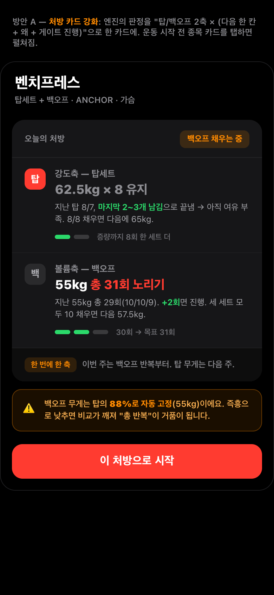
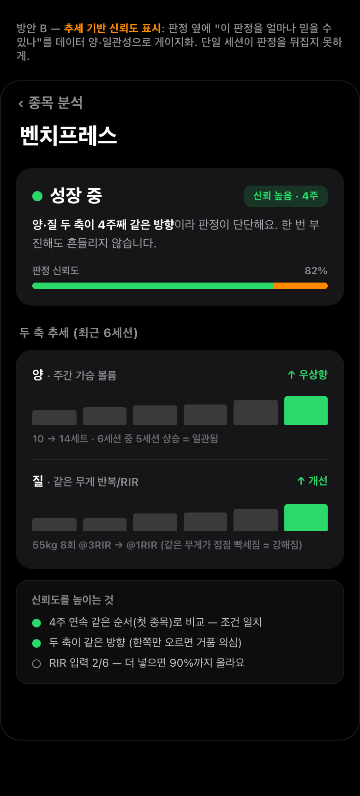
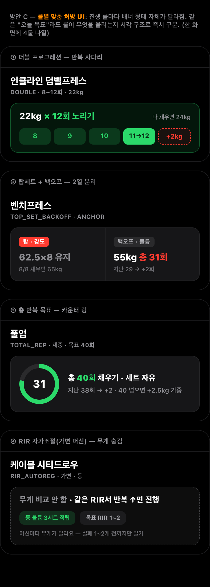

### 1.4 추천
**A(처방 카드 강화)가 1순위.** 핵심 질문의 "왜 + 다음 한 칸"을 가장 직접 해결하고, 선호 룰인 탑세트+백오프의 2축 분리를 화면에서 살린다. **B는 A 위에 얹는 보강**(판정 신뢰도)으로 병행 가치가 크다. C는 룰 4종을 다 쓸 때 빛나지만 유지 비용이 있어 후순위.
**→ 당신의 선택은? (A 단독 / A+B / C)**

---

## 2장 · UI/UX (운동 중 입력)

### 2.1 핵심 질문
> **운동 중 세트 입력 화면이 "한 손 · 0.5초 시선"에 최적인가?** 탑/백오프·직전값·완료·RIR이 한 표에 동시에 얹혀 과밀하고, "지금 뭘 쳐야 하나"의 시각 위계가 약하지 않은가. (홈은 게이지→카드 위계가 이미 명확해 운동 중 화면에 집중)

### 2.2 현 설계 평가

**잘된 점**
- 직전값을 모든 행에 회색으로 깐 건 정답(진행 결정의 90% — PLAN Q4-B2). 대부분 앱에 없는데 여기엔 있다.
- TOP/BACK 라벨 색 분리, 완료 동그라미, RIR 위치(마지막 백오프) 모두 PRD 의도에 충실.

**부족한 점**
1. **시각 위계가 평평하다.** 5개 세트 행이 거의 같은 크기·톤이라 "지금 칠 다음 빈 세트"가 안 튄다. 0.5초 시선이 멈출 단일 초점이 없다.
2. **한 손 입력 동선이 안 보인다.** 숫자가 "표시"만 돼 있고 +1을 어떻게 넣는지(키패드? 탭?)가 화면에 없다.
3. **탑+백오프 룰 정체성이 라벨 배지로만 전달.** "강도축/볼륨축을 따로 쌓는다"는 핵심이 표 안에 섞인다.
4. **정보 밀도 과밀.** 한 행에 kg·반복·직전kg·직전반복·라벨·완료 6요소가 균등 배치라 "오늘 칠 값"이 묻힌다.

### 2.3 개선 방안

| | A · 미니멀 집중형 | B · 축 분리 카드형 | C · 인라인 스텝퍼형 |
|---|---|---|---|
| **컨셉** | "지금 칠 한 세트"만 거대(64px), 나머지는 하단 점 미니맵 | 탑/백오프를 한 표에 안 섞고 강도·볼륨 두 블록으로 분리 | 표 유지하되 활성 세트만 펼쳐 +/− 스텝퍼 인라인 |
| **변경점** | 표 폐기 → 단일 포커스 카드 + 진행 점. 완료=화면 절반 빨강 버튼 | TOP 블록("탑 62.5kg·8회") / BACKOFF 블록("총 30회·남은 9회")으로 분할 + delta 칩 | 활성 세트 그 자리서 엄지 +1 톡 → 큰 빨강 "이 세트 기록". 완료행은 위로 접힘 |
| **장점** | 0.5초·팔 뻗은 거리 가독성 최강, 한 손 동선 명확, 시선 초점 1개 | 탑세트+백오프 정체성이 즉시 읽힘, 선호 룰과 정렬 | 현 구조 최소 변경, 한 손 입력 가장 직접, 직전→오늘 동선 자연 |
| **단점** | 전체 세트를 동시에 못 봐 편집은 한 단계 깊이 | 세로가 길어짐 | 한 번에 한 세트만 활성(임의 세트 동시 수정 불편) |
| **근거** | 3초 룰·"0.5초 안에 다음 행동"(PRD 핵심가치 ①) | FR-5 2축 분리, PLAN Q6 | 입력 0개로 시작·직전+작은 bump, 한 손 조작성 |

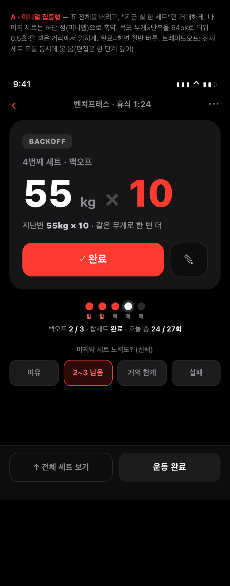
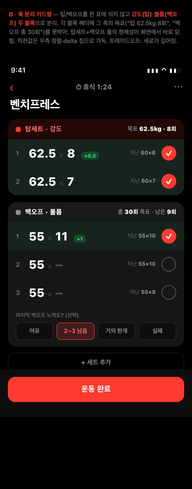
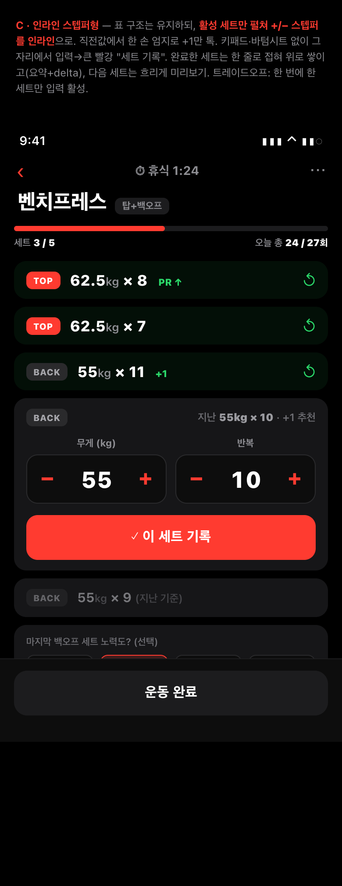

### 2.4 추천
**C(인라인 스텝퍼형)가 현실적 1순위.** 현 표 구조를 최소 변경하면서 한 손 입력과 시각 위계(활성 펼침/완료 접힘)를 동시에 해결해 이행 부담이 가장 낮다. **B는 탑세트+백오프 정체성을 가장 잘 살려** 선호 룰과 정렬되므로, C의 스텝퍼를 B의 2블록 안에 넣는 **C+B 결합**이 이상적. A는 가독성 최강이나 전체 조망 손실이 커 핵심 종목 전용 모드로 검토.
**→ 당신의 선택은? (C 단독 / C+B 결합 / A)**

---

## 3장 · 로깅·추적 (머신 변동)

### 3.1 핵심 질문
> **상업 헬스장 머신 변동(브랜드·세팅이 매번 다름)을 이 설계가 실제로 매끄럽게 추적하나?** — 운동 중 화면에 *머신 세팅을 기록·재현*할 자리가 없어 `MAIN_MACHINE` 신뢰등급("세팅 동일할 때만 비교")이 영원히 동작하지 못하는 게 가장 큰 부족점.

### 3.2 현 설계 평가

**잘된 점**
- 추적 골격이 옳다. 머신 변동에 면역인 신호=주간 부위 볼륨을 홈 최상단에(FR-4), 신뢰등급 3계층(ANCHOR/MAIN_MACHINE/VARIABLE)을 enum으로, 가변 머신 무게 PR 숨김 분기까지 설계됨.
- 세트행 직전값 회색 표시로 "이겨야 할 숫자"를 보여준다(결정의 90%).
- 탑/백오프 라벨로 두 축을 데이터 단위에서 분리.

**부족한 점 — 가장 큰 갭**
- **머신 세팅 캡처가 통째로 빠졌다.** TRACKING 4·5부는 MAIN_MACHINE에 "시트 높이·핀·핸들·각도 메모 *필수*"라고 못 박았는데 workout.html엔 무게·반복 칸만 있다. 세팅을 못 적으니 "같은 세팅일 때만 비교"라는 정의 자체가 실행 불가 → 등급이 라벨로만 존재하고 추적은 ANCHOR/VARIABLE 둘로 붕괴. **타겟이 바로 머신이 매번 바뀌는 상업 헬스장 사용자인데 그 핵심 변수를 입력할 자리가 없다.**
- 신뢰등급이 홈 배지로만 떠, 등급마다 추적이 어떻게 갈리는지가 한 화면에 안 보인다.
- 대부분 세트가 "엔진 목표 그대로"인데도 매번 키패드를 여는 마찰이 남음(3초 룰과 약한 충돌).

### 3.3 개선 방안

| | A · 머신 세팅 프리셋 | B · 신뢰등급별 추적 분리 | C · 한 탭 빠른 로깅 |
|---|---|---|---|
| **컨셉** | 운동 중 상단 "이 머신 세팅" 칩 바 — 지난 세팅과 일치하면 "무게 비교 가능", 다르면 "비교 보류" 자동 전환 | 종목을 앵커/메인머신/가변 3트랙으로 나눠 등급마다 추적 UI 자체를 다르게 | 목표대로면 「완료」 한 탭, 다를 때만 ± 보정. 키패드 거의 안 엶 |
| **변경점** | workout에 세팅 프리셋 바 신설(시트·핀·그립 칩). 처음 머신은 한 번 찍어 저장, 재방문 자동 매칭 | 앵커=무게 목표 / 가변=무게 비교 OFF + 부위 볼륨 적립 + RIR만 노출. 등급을 배지 아닌 구조로 교육 | 세트행 "목표 프리필 + 한 탭 확정". 반복 1개 차이는 ± 버튼, 큰 차이만 키패드. 전 세트 자동 복제 |
| **장점** | MAIN_MACHINE 등급을 *실제로 동작*시킴 — 핵심 갭 정면 해결 | "왜 이 종목은 무게를 안 보나"가 구조로 설명됨, 가짜 PR 원천 차단 | 3초 룰을 가장 직접 만족, 로깅 이탈 방지 |
| **단점** | 입력 한 단계 추가(입력 0 원칙과 긴장) | 종목 분류 틀리면 트랙도 틀림, 화면 전환 한 겹 | 추적 *정확도*(머신 변동)는 안 건드림 — 속도만 |
| **근거** | TRACKING 4·5부 "세팅 기록 필수" | PRD FR-7, TRACKING 5부 "종목→부위" 질문 전환 | PLAN Q4 3초 룰, 4부 "다 적으면 앱을 버린다" |

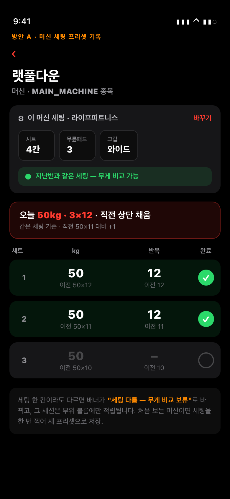
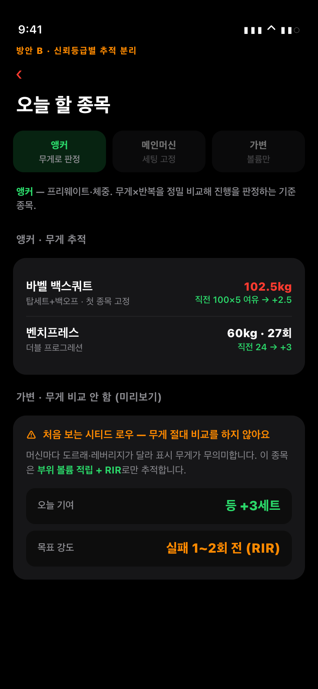
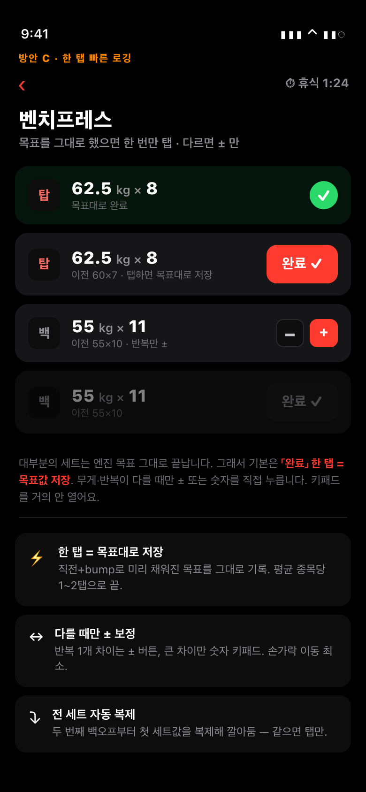

### 3.4 추천
**A(머신 세팅 프리셋)가 1순위 — 가장 큰 갭을 정면으로 메운다.** A 없이는 MAIN_MACHINE 등급이 죽은 채로 남는다. **B는 A 위에 얹는 구조적 설명**(등급별 추적 차이), **C는 직교하는 속도 개선**이라 A 또는 B와 병행 가능. 입력 0 원칙과의 긴장은 "처음 머신만 1회 등록, 이후 자동 매칭"으로 완화한다.
**→ 당신의 선택은? (A 단독 / A+C 병행 / A+B 구조화)**

---

## 4장 · 목표 달성 (동기·지속·피드백)

### 4.1 핵심 질문
> **진행이 느려지는 중급자가 좌절하지 않고 계속 나오게 만드는 동기·피드백 장치가 이 설계에 있는가?** — 이 앱은 "오늘 뭘 올릴지(처방)"는 완벽하나, **"왜 계속 나와야 하는지 · 느린 진행도 진행이라는 안심 · 정체가 왔을 때의 행동"** 은 어디에 있는가?

### 4.2 현 설계 평가

**잘된 점**
- 처방 정확도·신뢰는 최상급("직전+작은 bump", 양·질 2축, 가드).
- 동기를 망치지 않는 철학("하락 단정 금지", "최고=동기 / 처방=엔진 역할 분리"). 좌절을 *유발하지 않는* 설계는 됨.
- 분석의 `GROWING` 칩·볼륨 우상향 차트가 "자라고 있다"는 신호를 일부 줌.

**부족한 점 — 가장 큰 약점**
1. **습관화 장치가 0이다.** 5개 화면 어디에도 "이번 주 몇 번 나왔나 / 연속 몇 주 / 출석"이 없다. 근비대는 *몇 달 누적*이 본질인데 매주 다시 나오게 하는 고리가 없다.
2. **느린 진행을 "보이게" 못 만든다.** 중급자는 무게가 몇 주씩 안 오르는데, 헤드라인이 "이번 주 14세트↑"라 *무게 정체 주간엔 보여줄 승리가 없다.* "같은 60kg가 쉬워졌다(RIR 3→1)"를 *서사로* 띄우는 자리가 없다.
3. **정체→행동의 연결이 없다.** PRD 흐름3의 정체 대응(①세트추가 ②보조종목 ③5~10%↓ ④디로드)이 텍스트로만 있고 **화면에 정체 대응 UI가 아예 없다.** 정체는 이탈이 가장 많은 순간인데 빈칸.

→ 결론: 동기 4요소(동기/지속/피드백/정체대응) 중 **"지속(습관화)"과 "정체 대응"이 가장 약하고 "느린 진행 피드백"이 그다음.** 셋을 각각 공략하는 3방안.

### 4.3 개선 방안

| | A · 주간 미션 + 스트릭 | B · 진행 내러티브 + 코멘트 | C · 정체 대응 액션 카드 |
|---|---|---|---|
| **공략** | 지속(습관화) | 느린 진행 피드백 | 정체 → 행동 |
| **컨셉** | 홈 최상단을 처방 아닌 스트릭(주 연속)+주간 미션 4개로 — 습관을 점수로 | 분석을 숫자 나열 아닌 "성장 일지" 이야기로 — 무게가 안 올라도 보여줄 승리를 만든다 | 정체 감지 시 좌절 대신 고를 수 있는 행동 4카드로 — 이탈 방지 |
| **변경점** | 홈 hero를 🔥스트릭+출석 도트 + "출석 3회/가슴 볼륨/등 볼륨/신기록 1개" 미션 카드(진척 링) | 헤드라인을 "조용하지만 분명히 강해지고 있어요" 서사 카드 + 타임라인(시작→백오프 결정→RIR 쉬워짐→PR)+다음 이야기 예고 | 정체 종목 전용 화면 — "멈춤 감지(정체≠실패)" 안심 배너 + 증거 칩(3주 정체·RIR 유지) + 돌파 카드 4개 + "다음 운동에 적용" 버튼 |
| **장점** | 매주 다시 나올 이유 최강, 볼륨/출석을 행동 목표로 직결 | 무게 정체 주간에도 "쉬워졌다"를 승리로 번역, "느린 진행=진행" 체감 | PRD 흐름3 정체 출구를 *실제 화면으로*, 가장 이탈 많은 순간을 행동으로 전환, "하락 단정 금지"와 정합 |
| **단점** | 게임화가 Strong 헤비유저 취향과 안 맞을 수도(유치함 리스크), 공허한 보상점은 역효과 | 텍스트 많아 3초 룰과 충돌(분석 탭 전용), AI 코멘트 환각 관리 필요 | 정체 판정 잦으면 피로(2~3주 추세 게이팅 필수), 카드 4개 결정 부담(1순위 강조 필요) |
| **근거** | 근비대=누적(HYPERTROPHY 4부), MEV 10~20세트를 미션화 → FR-4 | HYPERTROPHY 1부 "같은 무게 RIR 개선=진행" → FR-8·FR-10 | GUIDE 정체 돌파 순서·PRD 흐름3, 정체는 추세로 판정 |

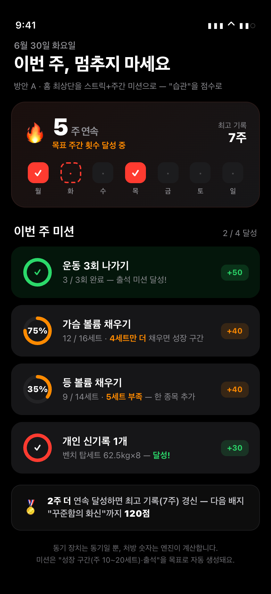
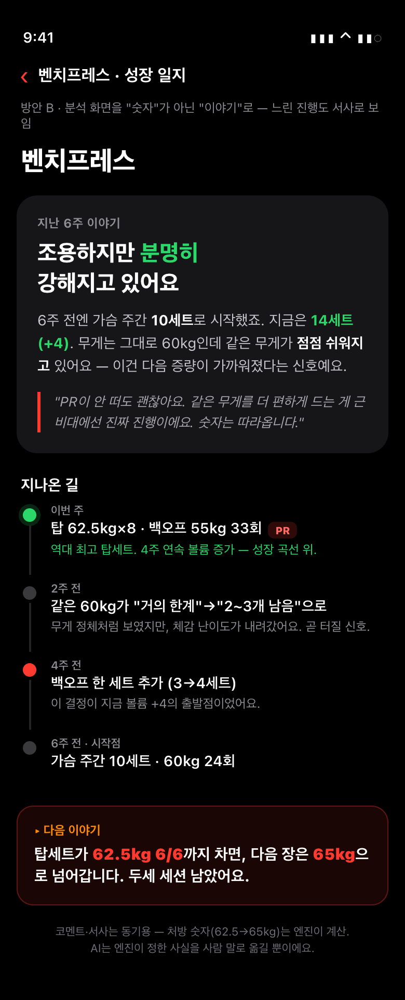
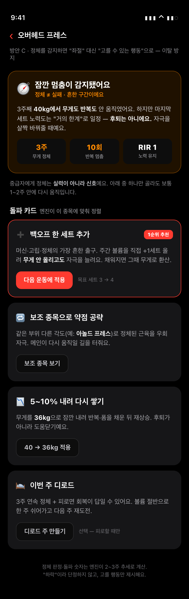

### 4.4 추천
**세 방안은 상호 배타가 아니라 보완적**(A=홈 / B=분석 / C=정체 트리거)이라 동시 채택 가능. **단, 1차 타겟이 Strong 헤비유저 본인**이라는 점에서 게임화(A)의 유치함 리스크가 있어, **C(정체 대응)를 1순위로 권장** — 이탈이 가장 많은 순간을 직접 막고 PRD 흐름3의 빈칸을 채우며 철학과도 정합. **B(내러티브)는 분석 탭에 얹어 "느린 진행=승리"를 보완.** A는 출석/스트릭만 가볍게(미션·보상점은 절제) 도입하는 절충안 검토.
**→ 당신의 선택은? (C 우선 / C+B / A까지 풀세트)**

---

## 선택 요약표

관점별 방안을 한눈에 비교한다. **굵게**=리더 추천.

| 관점 (KEY) | 핵심 질문(짧게) | A | B | C | 리더 추천 |
|---|---|---|---|---|---|
| **1 · 프로그램** (`program`) | 판정·처방을 왜/믿음/뭘 할지로 보여주나 | **처방 카드 강화**(2축×다음칸×게이트 점) | 추세 신뢰도 게이지 | 룰별 맞춤 배너 | **A** (+B 보강) |
| **2 · UI/UX** (`uiux`) | 한 손·0.5초 입력에 최적인가 | 미니멀 집중(거대 단일+점) | 축 분리 2블록 | **인라인 스텝퍼**(현 구조 최소변경) | **C** (+B 결합) |
| **3 · 로깅** (`logging`) | 머신 변동을 실제로 추적하나 | **머신 세팅 프리셋**(MAIN_MACHINE 동작화) | 등급별 3트랙 분리 | 한 탭 빠른 로깅 | **A** (+C 속도) |
| **4 · 목표** (`goal`) | 느린 중급자가 계속 나오나 | 미션+스트릭(게임화) | 진행 내러티브 | **정체 대응 카드**(이탈 방지) | **C** (+B 분석) |

### 리더 종합 의견
- **가장 시급한 단일 갭은 3장-A(머신 세팅 프리셋).** 이게 없으면 MAIN_MACHINE 신뢰등급이 죽은 채로 남고, 타겟 환경(상업 헬스장)의 핵심 변수를 못 잡는다. **최우선 채택 권장.**
- **그다음은 4장-C(정체 대응)** — 이탈이 가장 많은 순간을 막고 PRD 흐름3의 빈칸을 화면으로 구현.
- **1·2장은 같은 운동 중 화면을 다르게 본다.** 1장-A(처방 깊이)와 2장-C(입력 스텝퍼)는 충돌이 아니라 **결합 가능**(스텝퍼가 든 2축 처방 카드). 2장-B의 축 분리 블록을 컨테이너로 쓰면 셋이 한 화면에 모인다.
- **권장 묶음**: `logging-A` + `goal-C` + (`uiux-C` ⊕ `program-A` 결합) + 분석 탭 `goal-B`. 게임화(`goal-A`)는 타겟 취향 리스크로 출석/스트릭만 절제 도입.

**→ 각 장 끝의 "당신의 선택은?"에서 방안을 고르면, 선택안 기준으로 구현 우선순위를 다시 짠다.**
