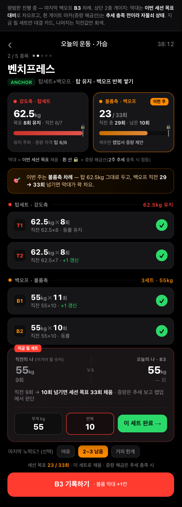
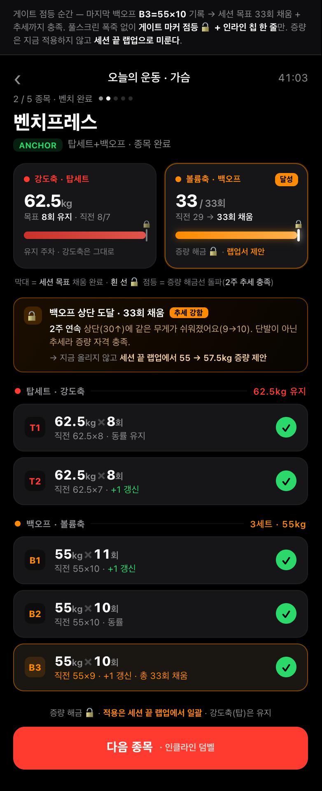
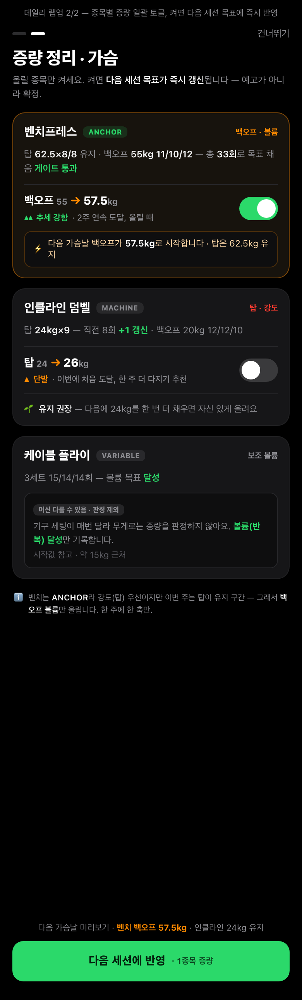
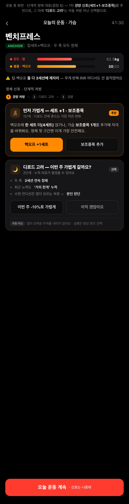

# 화면 1 · 운동 중 — 최종 확정 (스토리보드)

> **작성일** 2026-06-30
> **근거 문서** [PROGRESSION_SCREEN1_FINAL_PLAN.md](PROGRESSION_SCREEN1_FINAL_PLAN.md) · [PROGRESSION_SCREEN1_HYBRID.md](PROGRESSION_SCREEN1_HYBRID.md) · [PRD_PROGRESSION.md](PRD_PROGRESSION.md)
> **목업 소스** `docs/screen1-final/html/*.html` (CARBON 다크, 390px 단독 렌더, 인라인 CSS) · 캡처 `docs/screen1-final/*.png`

## 개요

운동 중 화면의 최종 방향이 확정됐다. 레이아웃 뼈대는 **변형 B(절제 위계)** — "지금 칠 세트" 하나만 대결 카드로 펼치고, 완료·대기 세트는 직전값을 회색으로만 병기하며, 탑세트(강도축)·백오프(볼륨축) 두 섹션으로 나눈다. 상단에는 **변형 A의 듀얼 게이지형**을 그대로 얹는다 — 강도축(탑세트)·볼륨축(백오프)을 좌우 두 카드로 나란히 두고, 각 카드는 2층 구조(막대=이번 세션 채움, 흰 게이트 마커=추세 해금선)를 가지며 이번 주 올릴 축 카드에 "이번 주" 배지가 붙는다. 가장 큰 구조 변경은 **증량 처리 시점의 이동**이다. 종목이 끝날 때마다 그 자리에서 증량 카드를 띄우던 방식을 전부 없애고, 당일 운동 전체가 끝난 뒤 **데일리 랩업**에서 그날 한 종목을 모아 증량을 일괄 처리한다. 운동 중 화면은 입력에만 집중하는 깨끗한 화면이 되고, 축하·증량 결정은 세션 끝 한 번으로 응축된다.

---

## 1. 확정 결정 8개

1. **증량 게이트 — 1세션 해금 + 추세 톤 구분.** 백오프 상단에 도달하면 그 세션에 게이트는 열되, 근거를 "추세 강함(2주 연속 등)"과 "단발(이번에 처음)"으로 톤을 갈라 표기한다. 단발이면 "한 주 더 다지기"를 권한다. **왜** — 즉각 만족과 추세 정직성을 절충하면서, 컨디션 좋은 하루를 증량 자격으로 오인하는 톱니를 톤으로 거른다.

2. **이중 게이지 — 2층 구조.** 막대는 "이번 세션 목표 대비"로 차오르고, 막대 위 흰 게이트 마커(증량 해금선)는 "추세 충족 시에만" 점등·돌파한다. 채움=세션, 해금=추세로 한 막대에 두 시계를 담는다. **왜** — A의 게이트 마커 마크업을 살려 세션 내 즉각 진행감과 2~3주 추세 게이팅을 동시에 만족한다.

3. **증량 반영 — 랩업 즉시 확정.** 데일리 랩업에서 증량 토글을 켜면 다음 세션 목표가 즉시 갱신된다. 예고가 아니라 확정이라 홈·다음 세션에 새 무게가 바로 뜬다(되돌리기는 다음 세션 1탭으로 보완). **왜** — 한곳에서 끝나 마찰이 적고 "오늘 뭐부터"가 바로 답해진다.

4. **데일리 랩업 형식 — 하이브리드.** 게이트 통과·신기록이 있는 날만 첫 화면에 스토리형 축하 1장을 띄우고, 이어서 종목별 카드 리스트로 증량을 일괄 토글한다. 평범한 날은 축하 장을 생략하고 바로 리스트로 간다. **왜** — 핵심 순간의 임팩트와 일괄 처리의 실용을 분리한다.

5. **탑·백오프 증량 순서 — 기본 백오프, ANCHOR는 탑 우선.** 같은 주에 둘 다 자격이면 한 축만 올리되, 기본은 볼륨(백오프) 우선, 자유중량 ANCHOR 종목만 강도(탑) 우선. **왜** — 근비대 1차 동인은 볼륨이라 백오프가 정석이되, 무게 PR이 핵심 화폐인 프리웨이트는 예외로 만족을 챙긴다.

6. **동시 정체 — 자동 디로드 없이 신호만.** 탑·백오프가 둘 다 2~3주 정체면 디로드를 자동 처방하지 않고 "디로드 고려" 신호 카드만 띄운다. 첫 정체엔 세트+1·보조종목 같은 경량 신호부터, 실행은 사용자 선택. **왜** — 디로드는 수면·생활 스트레스 등 앱이 모르는 변수에 좌우돼 거짓 양성 위험이 크다.

7. **VARIABLE(가변머신) 표기 — 참고값, 판정 제외.** 무게는 "시작값 참고"로 회색 작게만 보이고 PR·승리·게이트 판정에선 제외하며 "머신 다를 수 있음·판정 제외" 배지를 단다. 같은 머신 세팅 기록이 있을 때만 비교를 켠다. **왜** — 레버리지 차이로 무의미한 표시 무게의 오도를 막으면서 시작 세팅 편의는 남긴다.

8. **세션 종료 — 버튼 진입 + 자동 마감 폴백.** 평소엔 "운동 종료" 버튼으로 랩업에 들어가고, 마지막 세트 후 장시간 무활동이나 날짜 경계를 넘기면 자동 마감한다. 자동 마감분은 다음 진입 시 "지난 세션 마무리" 사후 배너로 랩업에 들어간다. **왜** — 종료 버튼을 깜빡해도 다음 날 운동이 같은 세션에 붙어 날짜·주간볼륨 집계가 오염되는 걸 막는다.

---

## 2. 최종 스토리보드

사용자 흐름 순서대로 여섯 화면을 잇는다. 운동 중 → 게이트 도달 → 세션 종료 축하 → 증량 일괄 처리 → 다음 세션 반영 → (정체 시) 신호.

### ① 운동 중 — 평범한 진행 (workout-base)



마지막 백오프 B3 차례. 상단 듀얼 게이지가 좌우 두 카드로 놓인다 — 왼쪽 강도축·탑세트(62.5kg, 막대 100% 유지), 오른쪽 볼륨축·백오프(23/33, "이번 주" 배지). 각 카드의 막대는 이번 세션 목표 대비로 차오르고, 흰 게이트 마커는 추세 미충족이라 자물쇠(🔒) 상태로 아직 안 열렸다. 두 카드 아래 한 줄 범례가 "막대=세션 / 흰 선=추세 해금선"을 분리해 명시한다(결정 2). 탑세트(강도축·ANCHOR 배지)와 백오프(볼륨축)를 두 섹션으로 나누고(결정 5·7), "지금 칠 세트" B3만 대결 카드로 펼쳐 직전 55×9를 "이겨야 할 숫자"로 병기한다. 완료 세트는 직전값을 회색으로만 두고 연출은 0. 노력도 칩(선택)·세션 진행률(2/5 종목, 회색 텍스트)·하단 게이트 한 줄과 "기록하기" 버튼이 따라붙는다.

### ② 게이트 도달 순간 (workout-gate)



B3=55×10을 기록해 세션 목표 33회를 채우고 추세까지 충족한 순간. 풀스크린 폭죽 없이 볼륨축 막대 100% + 흰 게이트 마커 점등(🔓, gatepop 애니)으로만 전환한다. 인라인 칩 한 줄이 "백오프 상단 도달·33회 채움 / 추세 강함 배지 / 2주 연속 근거 / → 지금 안 올리고 세션 끝 랩업에서 55→57.5kg 증량 제안"을 담아 결정 1의 추세 강함 톤과 증량 보류를 함께 말한다. 방금 친 B3은 주황 테두리만으로 조용히 강조하고, 하단 버튼은 "다음 종목"으로 바뀐다(결정 8의 종목 매듭).

### ③ 세션 종료 축하 (lapup-celebrate)


세션 종료 직후 스토리형 축하 1장(결정 4의 하이브리드 — 게이트 통과·신기록 있는 날만 노출). "오늘 한 운동 3 · 신기록 2 · 게이트 통과 1" 헤더 스탯과 하이라이트 카드(벤치 백오프 게이트 통과 + 인클라인 +1 갱신)를 보여준다. 게이트 카드엔 결정 1의 추세 톤 구분이 들어가 "추세 강함 · 2주 연속"을 초록 더블 화살표로 표기한다. 하단 흰 "계속 →" 버튼으로 증량 리스트로 넘어간다. 평범한 날엔 이 장을 건너뛰고 바로 ④로 간다.

### ④ 증량 일괄 처리 (lapup-list)



종목별 카드 + 증량 토글. 벤치(ANCHOR)는 백오프 55→57.5 제안에 근거 "추세 강함", 토글 ON 상태로 "다음 가슴날 백오프 57.5kg 즉시 반영" 미리보기를 단다(결정 3 확정). 인클라인(MACHINE)은 단발 도달이라 토글 OFF·"유지 권장 / 한 주 더 다지기"(결정 1 단발 톤). 케이블 플라이(VARIABLE)는 토글 대신 "머신 다를 수 있음·판정 제외" 배지, 무게는 회색 "시작값 참고"로만, 볼륨 달성만 기록한다(결정 7). 하단 "다음 세션에 반영" 확정 버튼과 미리보기 줄, 그리고 결정 5 근거 문구("ANCHOR라 탑 우선이나 이번 주 탑은 유지 구간 → 백오프만, 한 주 한 축만")가 카드 하단에 명시된다.

### ⑤ 다음 세션 반영 (next-home)


다음 운동일 홈. 상단에 "지난 세션 마무리" 사후 진입 배너(결정 8, 자동 마감분 회수). "오늘의 퀘스트" 카드 3종 — 벤치프레스(ANCHOR)는 백오프 55→57.5kg가 이미 즉시 갱신된 상태로 뜨고 "유지로 되돌리기" 1탭을 제공한다(결정 3의 즉시 반영 + 되돌리기). 인클라인 덤벨(MAIN)은 반복 쌓기 주차, 케이블 플라이(VARIABLE)는 "판정 제외" 배지·회색 시작값(결정 7). 하단 고정 "운동 시작" 버튼과 다음 게이트 힌트가 붙는다.

### ⑥ 정체 신호 (signal-deload)



운동 중 화면 맥락(B-base 레이아웃 재사용)에서의 단계적 정체 대응(결정 6). 게이지는 게이트 미점등(정체) + "둘 다 3세션째 제자리" 요약줄로 시작한다. 1→2→3 단계 사다리 아래, 1차 경량 신호 카드("세트+1·보조종목", "추천" 태그·주황 강조)와 그 아래 "디로드 고려" 카드("이번 주 가볍게 갈까요?" 선택형, 근거 리스트, "자동 아님" 배지로 자동 처방이 아님을 명시)를 둔다. 하단은 "오늘 운동 계속" 버튼 — 실행은 항상 사용자 선택이다.

---

## 3. 구현 노트

이 디자인을 실제로 만들 때 필요한 데이터모델·엔진 변경의 핵심(FINAL_PLAN 2장에서 추림).

- **SetType 확장(TOP_SET/BACKOFF).** 프론트 `workout_set`에 `set_type`을 추가(기존 행은 NORMAL 마이그레이션)하고 백엔드 `SetType` enum에 `TOP_SET`·`BACKOFF`를 더한다. `from()` 하위호환 유지, 주간 부위 볼륨 집계에선 TOP_SET·BACKOFF를 NORMAL과 함께 하드셋으로 세고 WARMUP·DROP만 제외한다. 이중 게이지·게이트·2축 판정이 전부 이 구분에 의존한다.
- **노력도(effort) — 미입력이면 게이트 끄고 추세 폴백.** `WorkoutSet.effort`(EASY/MODERATE/HARD/FAILURE)를 백오프 마지막 세트에만 노출한다. 미입력이면 질 판정을 보류도 거짓판정도 아닌 "중립"으로 끄고 무게·반복 추세로만 폴백한다. 입력 편향 차단을 위해 쉬워짐 판정은 단일 세션 RIR이 아니라 같은 무게에서의 RIR 추세 하락으로 건다.
- **anchorTier 단일 정책.** ANCHOR=무게PR·e1RM·무게로 판정 / MAIN_MACHINE=세팅 동일 기록 있을 때만 무게 비교 / VARIABLE=무게PR 숨김·부위볼륨+RIR로만. 운동 중·랩업·종목 상세 모든 화면이 같은 tier 배지와 같은 판정 소스를 쓴다.
- **게이트 추세 판정 — 세션 단위 윈도우 + 총반복 게이트.** 게이트는 "전 세트 정확히 상단"이 아니라 "백오프 3세트 합이 목표 총반복"으로 정의해 정상 드롭오프(10/10/9)를 흡수한다. 추세 윈도우는 달력 "주"가 아닌 "최근 N세션 연속"으로 두고, 14일 초과 간격 세션은 추세에서 할인·제외한다. 게이지·게이트·증량 제안은 모두 저장값에서 derived로 두고 세트 수정·삭제 시 즉시 재계산한다.
- **랩업 묶음 계산 + 세션 종료 트리거.** 세션 종료 시 종목마다 `{exerciseId, axis(TOP|BACKOFF), currentLoad, suggestedLoad, repResetTo, reason, gatePassed, status(SUGGEST|HOLD|DEFER)}` 리스트를 산출하되, 같은 날 같은 종목 두 축 동시 증량은 금지(한쪽 SUGGEST·다른쪽 HOLD)한다. 세션 시작·마지막 세트 시각을 저장해, "운동 종료" 버튼과 함께 마지막 세트 후 4~6시간 경과 또는 날짜 경계 시 자동 마감하고 "지난 세션 마무리" 배너로 사후 랩업에 진입시킨다.

---

## 4. 다음 단계

이 운동 중 화면(화면 1) 확정 후, 남은 세 화면을 ① 홈 → ② 분석 → ③ 목표·규칙 순으로 같은 방식(결정점 정리 → 목업 → 스토리보드)으로 확정한다.

---

## 심화 설계 — 다른 훈련 방식과 케이스 처리

> **작성일** 2026-07-01
> **목적** 화면 1은 사실상 "탑세트+백오프 더블 프로그레션" 한 방식을 전제로 확정됐다. 실제 앱은 종목마다 다른 진행 방식을 담아야 한다. 이 섹션은 (1) 어떤 방식을 어떻게 압축해 담는지, (2) 하나의 화면 골격이 방식을 모른 채 결과만 소비하는 원리, (3) 엔진·데이터 모델, (4) 실사용 케이스 처리, (5) 확정 결정을 못박는다. 기존 8개 화면 결정은 그대로 두고, 이 설계가 그 위에서 모든 방식·케이스로 일반화된다.

핵심 한 줄: **방식을 화면에서 늘리지 않는다.** progressionRule을 4종으로 압축하고 모두가 같은 결과 타입(`ProgressionResult` = 축·게이트·제안)을 내도록 Strategy로 추상화해, 화면·게이지·랩업이 rule을 switch하지 않고 결과만 소비하게 만든다. 그러면 "막대=세션 채움 / 흰선=추세 해금"이라는 8결정이 방식마다 *무엇을 채우는지*만 바뀌고 화면 한 벌은 그대로 유지된다.

---

### 1. 진행 방식 카탈로그

근비대 점진과부하의 진행 방식은 겉보기엔 8~9가지지만 본질은 "하나의 이중진행 엔진 + 세트구조 2종(탑/백오프) + 직교 레버(세트추가·RIR·밀도)"의 조합이다. 그래서 사용자에게 9개를 펼쳐 고르게 하지 않고, **progressionRule enum 4종 + "선형" 프리셋 1개**로 노출한다. 모든 방식의 공통 바닥은 종목 무게가 아니라 **부위 주간 hard 세트(볼륨)**이고, 방식 차이는 그 위에서 종목을 어떻게 진행시키느냐의 표현일 뿐이다.

#### ① DOUBLE_PROGRESSION (더블 프로그레션) — MVP 필수·기본

- **정의 한 줄** — 무게 고정, 목표 반복 범위 상단까지 채우면 다음 세션 무게 한 단 올리고 반복 하단으로 리셋.
- **근비대 적합성** — 중급의 표준이자 상용 코칭앱 골격. 무게가 안 올라도 반복이 쌓이는 것 자체가 볼륨 진행이라 "매주 발전"이 보이고, 무게·반복 동시 도약을 구조적으로 막는다.
- **적합 종목·티어** — 거의 전 종목. 특히 MAIN_MACHINE·고립 종목은 반복수 우선 변형이 정석.
- **이 앱에서의 표현** — 게이지는 **1축(VOLUME)**. 막대 = 이번 세션 목표 반복 대비 채움, 흰 게이트 마커 = 전 본세트가 repMax 도달(추세 충족 시 해금). 데일리 랩업 제안 = "57.5kg 8회부터 재시작"(증량+반복 하단 리셋) 또는 "55kg 총 +1~2회"(같은 무게 반복 쌓기).
- **목표 세팅에서 입력·저장** — repMin·repMax(목표 반복 범위), sets, increment(증량폭), trigger(single/two_sessions/rpe), gate_window(기본 2).

#### ② TOP_SET_BACKOFF (탑세트+백오프) — MVP 필수·사용자 선호

- **정의 한 줄** — 앞 1~2 탑세트로 강도(무게축), 뒤 3~N 백오프세트(탑의 일정%)로 볼륨(반복축)을 한 종목에서 분리 진행.
- **근비대 적합성** — 강도와 볼륨을 동시에 진행해 중상급에 인기(Madcow·5/3/1 FSL 패턴). 탑은 저반복이라 e1RM 신뢰 가능, 백오프는 더블 프로그레션 반복 우선.
- **적합 종목·티어** — ANCHOR 바벨 컴파운드(스쿼트·벤치·데드·OHP·로우)에만 권장. 머신·고립엔 과설계.
- **이 앱에서의 표현** — 게이지는 **2축**. 강도 막대(INTENSITY) = 탑 reps 게이트 충족도(예 6/6, 현재 탑 무게는 refLoad로 병기), 볼륨 막대(VOLUME) = 백오프 총반복(예 29/33). 게이트 두 개 분리 — 탑(effort EASY/MODERATE && reps≥topReps → 탑 무게↑), 백오프(전 세트 합 ≥ 목표 총반복 → 백오프 무게↑·리셋, 아니면 총 +1~2). **핵심 규칙: 같은 날 두 축 동시 증량 금지**(한 축 SUGGEST·다른 축 HOLD), 백오프 무게 = 탑×backoffPct로 자동 고정(즉흥 인하 금지 = 톤수 거품 방지). 증량 순서는 기본 백오프 우선, ANCHOR만 탑 우선(기존 결정 5).
- **목표 세팅에서 입력·저장** — 추가 파라미터 3개만(topSets·topReps·backoffPct). 나머지(topWeight·backoffRepMax)는 첫 기록에서 자동 추론.

#### ③ TOTAL_REP_TARGET (총반복 목표) — 폴백·머신·고립·맨몸

- **정의 한 줄** — 세트별 반복을 고정하지 않고 "세트 합계 목표"만 정함(예 3세트 합 30개, 분배는 12/10/8이든 11/11/8이든 무방).
- **근비대 적합성** — 근비대 기준변수가 볼륨이므로 세트 분배보다 총량이 더 본질적. 자연 드롭오프(10/9/8)를 정상으로 흡수해 "한 세트 부족" 거짓 실패가 안 뜬다.
- **적합 종목·티어** — 맨몸(체중 고정부하라 총반복이 1차 진행), 펌프성 고립·머신.
- **이 앱에서의 표현** — 게이지는 **1축(TOTAL)**, 가장 게이지 친화적. 막대 = 총반복 진척(23/33), 흰 마커 = 총반복 목표 도달+추세. 증량 판정 = done(Σ작업세트 reps) ≥ totalRepTarget → 무게↑·target 유지, 아니면 "총 done+2회". 맨몸은 임계반복(풀업 8~10/딥 10~15) 도달 후 가중(+2.5~5kg)으로 전환. 백오프 게이트의 "총반복 게이트"와 로직을 공유하므로 거의 공짜로 얹힌다.
- **목표 세팅에서 입력·저장** — totalRepTarget, sets, increment.

#### ④ RIR_AUTOREG (RPE/RIR 자동조절) — 폴백·VARIABLE 머신 1차

- **정의 한 줄** — 그날 체감 강도(RIR=남은 반복 여유)로 무게·반복을 실시간 보정. 가변머신처럼 무게 비교가 불가능한 종목은 "같은 RIR에서 반복이 늘면 진행".
- **근비대 적합성** — 고정 %1RM 처방과 최소 동등(Zourdos·Helms), 근비대 품질 게이트는 0~3 RIR이면 충분(Refalo 2023). 컨디션 변동을 흡수해 거짓 정체·과로를 막는다. 단 초보는 RIR을 과소평가하므로 증량 트리거엔 중급+만.
- **적합 종목·티어** — VARIABLE 가변머신(무게 비교 포기, 같은 RIR서 반복↑이면 진행). 또한 다른 모든 룰에 직교 보정으로도 쓰임(EASY면 가속, HARD인데 상단이면 보류).
- **이 앱에서의 표현** — 게이지는 **1축(EFFORT)**, 막대 = 부위 볼륨 적립, 게이트 = "같은 RIR서 반복↑". **무게 게이트 없음**(strength=NONE 고정), refLoad에 참고 무게만 회색, "판정 제외" 배지. 증량 판정 = effort EASY/MODERATE+상단 → 가속(1세션 해금), HARD/FAILURE인데 상단 → 증량 보류("한 번 더 다지기"), 백오프 EASY인데 톤수만↑ → 볼륨 거품 경고.
- **목표 세팅에서 입력·저장** — effortTracking(기본 OFF·옵트인), targetRIR. RIR 미입력 폴백은 single이 아니라 **two_sessions**(안 받으면 헐거워지는 역설 차단).

#### ⑤ "선형(매번 +2.5kg)" 프리셋 — 독립 enum 아님

- **정의 한 줄** — 반복·세트 고정, 매 세션 무게만 일정량 올림. 초보 전용의 "공짜 구간".
- **근비대 적합성** — 초보는 회복·적응이 빨라 세션 단위로 좋아지지만 반드시 수 주~수개월 안에 멈춘다. 너무 오래 끌면 정체·부상 위험.
- **적합 종목·티어** — ANCHOR 바벨 컴파운드의 초보 구간.
- **이 앱에서의 표현** — **별도 progressionRule을 만들지 않는다.** 선형 = "DOUBLE의 좁은 repRange(예 5~5) + single 트리거". 막대가 거의 매 세션 가득 차고 흰 마커가 바로 해금된다. 목표 세팅에선 "선형(매번 +2.5kg)" 한 줄 프리셋으로 보이지만 내부 ruleType은 DOUBLE_PROGRESSION이고 repMin==repMax, trigger=single로 저장된다.

#### 퍼센트·주기화를 왜 흡수했나

**퍼센트(1RM%)**는 독립 enum으로 만들지 않는다. 1RM은 근력 지표라 근비대 진행 대표성이 약하고(근비대는 주간 유효 볼륨이 더 잘 대표), 고반복(>10~12)에서 추정이 부풀려지며, 가변머신 환경에선 1RM 의미가 붕괴한다. 그래서 퍼센트는 "처방 변수"가 아니라 **종목 상세 하단의 e1RM 보조선(참고용)**으로만 둔다. 탑세트의 backoffPct(탑 대비 %)가 사실상 퍼센트 사고를 이미 흡수한다. **주기화(블록·DUP·웨이브)**는 progressionRule이 아니라 "여러 세션에 걸친 메타 스케줄"이라 데이터 모델 층이 다르다. MVP는 단일 룰의 연속 진행만 하고, 주기화는 후속에서 "4~6주 블록+1주 디로드" 프리셋으로 얹는다(후속 주간 스케줄 층). 디로드도 자동 처방하지 않고 신호 카드만 띄운다(기존 결정 6). **밀도(레스트포즈·마이오렙·드롭셋)**는 SetType과 집계 규칙으로 흡수한다(아래 4장). 결과적으로 enum은 4개로 충분하고, 화면엔 종목당 "진행 방식 한 줄"만 노출하고 나머지는 ruleType·anchorTier로 자동 기본값을 깐다.

---

### 2. 방식별 화면·목표세팅 일반화

**원칙: 하나의 화면 골격이 rule을 모른 채 `ProgressionResult`만 소비한다.** 운동 중 화면의 듀얼 게이지·게이트 자물쇠·데일리 랩업 카드는 어느 방식인지 알 필요가 없다. 각 방식의 Strategy가 자기 도메인 숫자를 공통 형태(axes·gate·suggestion)로 환산해 넣어주면, 화면은 그 형태만 그린다. 아래가 방식마다 "막대=세션 채움 / 흰 게이트 마커=추세 해금"을 무엇으로 채우는지의 매핑이다.

| 방식 | 강도축 막대(INTENSITY) | 볼륨축 막대 | 게이트(흰 마커) | 데일리 랩업 제안 |
| --- | --- | --- | --- | --- |
| DOUBLE_PROGRESSION | 없음(1축) | VOLUME = 세트별 상단 진척 | 전 본세트 repMax + 추세 | "무게↑·반복 하단 리셋" or "총 +1~2회" |
| TOP_SET_BACKOFF | 탑 reps 충족도(예 6/6, refLoad=탑 무게) | VOLUME = 백오프 총반복(29/33) | 축별 분리: 탑 reps / 백오프 총반복 + 추세 | 한 축만 SUGGEST(백오프 우선·ANCHOR 탑 우선), 다른 축 HOLD |
| TOTAL_REP_TARGET | 없음(1축) | TOTAL = 총반복/목표(23/33) | 총반복 목표 도달 + 추세 | "총 목표 달성→무게 한 단" or "총 +2회" |
| RIR_AUTOREG | 없음(1축) | EFFORT = 부위 볼륨 적립 | 같은 RIR서 반복↑(무게 게이트 없음·VARIABLE 판정 제외 배지) | DEFER(판정 제외) or "같은 RIR 반복 쌓기" |

공통 규칙은 방식 무관하게 동일하다 — 증량 반영은 전 방식 "랩업 즉시 확정"(기존 결정 3), 게이트는 "1세션 해금 + 추세 톤(강함/단발)"(기존 결정 1), 동시 정체는 디로드 신호만(기존 결정 6). 이 표가 곧 "하나의 화면 골격이 모든 방식을 담는다"의 증명이다.

**목표 세팅 화면(스크린 4)** — 종목 등록 시 사용자는 "진행 방식" 한 줄만 고른다(더블 / 탑세트+백오프 / 총반복 / 자동조절 / 선형 프리셋). 나머지 파라미터는 **ruleType·anchorTier 기반 자동 기본값**으로 채워 "입력 0 시작"을 지킨다:

- **자동 룰 추론** — 장비·부위로 progressionRule·anchorTier 기본값을 분류한다(`classifyProgressionRule`·`classifyAnchorTier`). 바벨 컴파운드 → TOP_SET_BACKOFF + ANCHOR, 머신 컴파운드 → DOUBLE + MAIN_MACHINE, 고립·맨몸 → TOTAL_REP/DOUBLE, 가변머신 → RIR_AUTOREG + VARIABLE.
- **자동 파라미터** — 반복 범위·세트수·증량폭은 티어 기본값(ANCHOR 저반복·작은 증량, 고립 고반복)으로 프리필. topWeight·backoffPct·backoffRepMax·totalRepTarget은 첫 운동 기록에서 자동 추론(가장 무거운 작업세트군=탑, 그 다음=백오프). gate_window 기본 2.
- **사용자 오버라이드 보호** — 사용자가 직접 손댄 룰·파라미터는 `is_overridden` 플래그로 자동 재분류가 덮어쓰지 않는다.
- **선형 프리셋** — 고르면 ruleType=DOUBLE·repMin==repMax·trigger=single로 저장. 사용자에겐 "매번 +2.5kg"로 보이고 내부는 더블 한 끝값.

---

### 3. 엔진·데이터 모델

현재 엔진(`ProgressionEngine.compute/evaluate`)은 더블 프로그레션 한 방식을 if-분기로 하드코딩한 단일 함수다. 여기에 세 방식을 끼우면 분기 폭발이 난다. 해법은 **enum + Strategy + rule_params JSON**이다.

#### progressionRule enum (4종) + 직교 축 2개

- `DOUBLE_PROGRESSION` / `TOP_SET_BACKOFF` / `TOTAL_REP_TARGET` / `RIR_AUTOREG`.
- 직교 축: **anchorTier**(ANCHOR/MAIN_MACHINE/VARIABLE = 무게 신뢰도), **trigger**(single/two_sessions/rpe). SetType(NORMAL/WARMUP/DROP/TOP_SET/BACKOFF)·effort(EASY/MODERATE/HARD/FAILURE/null)는 enum과 직교로 전 룰에서 재사용.

#### Strategy 인터페이스 — 모든 화면의 단일 소비 타입

```
interface ProgressionStrategy {
  ProgressionResult evaluate(ExerciseGoal goal, RuleParams params, List<DayRecord> history);
}

record ProgressionResult(
  List<AxisState> axes,          // 게이지 축(1~2개)
  Prescription prescription,     // '오늘 칠 값'(목표무게/목표총반복/반복하단리셋/세트수/한줄텍스트)
  List<Suggestion> suggestions,  // 데일리 랩업 카드가 그대로 렌더
  EvalResult lastEval,
  String stateLabel              // GROWING/VOLUME_BUBBLE/STRENGTH_ONLY/STALL_REVIEW
)

record AxisState(String axisKey,      // INTENSITY|VOLUME|TOTAL|EFFORT
  String label, int sessionDone, int sessionTarget, GateState gate, Double refLoad)

record GateState(boolean sessionMet, boolean trendMet,
  TrendStrength strength,             // STRONG|SINGLE|NONE
  int trendStreak, int trendWindow, String reason)

record Suggestion(String axis, String type,   // LOAD_UP|REP_BUILD|ADD_SET|DELOAD_SIGNAL|HOLD|DEFER
  Double currentLoad, Double suggestedLoad, Integer repResetTo,
  String reason, boolean gatePassed, TrendStrength trend, String status)  // SUGGEST|HOLD|DEFER
```

`ProgressionEngine.evaluate(goal, history)`가 goal.progressionRule로 전략을 lookup(`EnumMap<ProgressionRule,Strategy>`)해 위임한다. 구현 4개: `DoubleProgressionStrategy`(기존 compute의 DOUBLE 경로 이전)·`TopSetBackoffStrategy`(2축)·`TotalRepTargetStrategy`·`RirAutoregStrategy`. **소비처(화면·게이지·랩업)는 절대 rule을 switch하지 않고** axes/gate/suggestions만 읽는다. 게이지 컴포넌트는 axisKey만 보고 색·라벨을 매핑하고 막대 그리는 로직은 동일하다. RIR_AUTOREG는 무게 게이트가 없으니 strength=NONE, sessionMet만 의미를 갖는다.

#### rule_params JSON 스키마 예시

방식별 가변 파라미터를 한 JSON 컬럼에 담아 새 방식 추가 시 컬럼 마이그레이션을 없앤다. 코드에서 `RuleParams` record로 역직렬화해 타입 안전을 보장한다.

```
RuleParams(int repMin, int repMax, int sets, double increment,
  String trigger, boolean effortTracking, int gateWindow,
  Integer topSets, Integer topReps, Double backoffPct, Integer backoffRepMax,
  Integer totalRepTarget, Integer targetRIR)

// TOP_SET_BACKOFF 예시
{ "topSets": 1, "topReps": 6, "backoffPct": 0.85, "backoffRepMax": 11 }
// TOTAL_REP_TARGET 예시
{ "totalRepTarget": 33, "repMin": 8, "repMax": 12 }
```

#### 추세·게이트 판정 공통화 (1세션 판정 + 단발 할인 + 톤 구분)

한 헬퍼를 4개 전략·정체 판정·RIR 추세가 모두 공유해 "추세" 정의를 코드 전역에서 일관시킨다.

- **윈도우 단위는 "주"가 아니라 "세션"** — `trendWindow(history, n)`이 최신부터 n세션을 보되, 직전 세션과 14일 초과 간격이면 추세에서 할인·제외하고 연속 충족 streak를 센다.
- **즉시 평가(1세션 판정)** — 게이트는 그 세션에 상단 도달 즉시 sessionMet으로 막대를 채우고 연다. trendMet은 streak로 점등하되 **톤만 구분**한다: streak ≥ gate_window(기본 2) → `STRONG`(초록 더블화살표·"2주 연속"), streak == 1 → `SINGLE`("한 주 더 다지기 추천"). 즉 "처음 도달이면 단발, 연속이면 추세 강함"으로 표기. gate_window는 종목별 설정 가능 컬럼으로 남겨 나중에 빈도 적응형으로 확장할 여지를 둔다.
- **세션 게이트 정의** — "전 세트 정확히 상단"이 아니라 "3세트 합 ≥ 목표 총반복"(metTotalReps)으로 정의해 정상 드롭오프(10/10/9)를 흡수.
- **단발 할인(후퇴 처리)** — 후퇴 1회로 그동안 쌓은 추세 진척을 0으로 리셋하지 않는다. 윈도우에서 그 세션 1개만 할인하고, **2세션 연속 하락**이라야 추세 방향이 DOWN으로 꺾여 REGRESSED 게이팅. 같은 무게에서의 비교만 유효(무게 바뀌면 streak 리셋).
- **질 판정(effort) 중립화** — effort null이면 질 판정을 보류도 거짓도 아닌 "중립"으로 끄고 무게·반복 추세로만 폴백. trigger=rpe 종목도 null이면 **two_sessions로 폴백**(기존 코드의 null→single로 헐거워지는 역설 교정). "쉬워짐(증량 가속)"은 단일 세션 RIR이 아니라 같은 무게에서의 RIR 추세 하락으로만 건다(입력 편향 차단).

#### 강도축 게이지 충족도 계산

탑세트 강도축 막대는 무게(연속값) 비율이 아니라 **"탑 reps 게이트 충족도"(이산)**로 채운다(기존 목업 "탑 6/6"과 일치). sessionDone = 이번 탑세트에서 친 reps, sessionTarget = topReps. 현재 탑 무게는 막대가 아니라 refLoad/라벨로 병기한다. e1RM 대비 비율 방식은 머신·고반복 오차가 커서 쓰지 않는다.

#### 백엔드·프론트 반영 포인트와 마이그레이션·하위호환

- **백엔드(ProgressionEngine/OverloadService)** — `ExerciseGoal`에 컬럼 추가: `progression_rule VARCHAR(24) DEFAULT 'DOUBLE_PROGRESSION'`, `anchor_tier VARCHAR(16) DEFAULT 'MAIN_MACHINE'`, `effort_tracking BOOL DEFAULT false`, `gate_window INT DEFAULT 2`, `rule_params JSON NULL`. ddl-auto:update라 컬럼 자동 추가. SetType enum에 TOP_SET·BACKOFF 추가(`from()` 하위호환 유지). `OverloadService`에 `classifyProgressionRule(equip,muscle)`·`classifyAnchorTier` 추가. `ProgressionEngine.compute`는 evaluate→Guide 어댑터로 유지해 기존 OverloadController DTO·AI fact 주입(todayTarget/nextTarget)이 안 깨지게.
- **프론트(SQLite)** — `workout_set`에 `set_type TEXT DEFAULT 'NORMAL'`·`effort TEXT NULL`·`superset_group INTEGER NULL`·`duration_sec INTEGER NULL`을 ALTER TABLE ADD COLUMN(기존 행 NORMAL). 로컬 목표 테이블에 progression_rule·anchor_tier·effort_tracking·gate_window·rule_params(TEXT JSON). `lib/progression`(TS)이 백엔드 엔진과 "동일 규칙" 쌍둥이이므로 전략 추상화도 TS에서 동형으로(progressionRule별 evaluate 함수 맵 + 공통 ProgressionResult 타입). 게이지·세트행·랩업 컴포넌트는 axes/suggestions만 의존. 같은 입력에 같은 결과를 내는지 골든 케이스로 교차검증.
- **derived 원칙** — 게이지·게이트·증량 제안은 전부 저장된 세트값에서 파생. 세트 수정·삭제·추가 시 evaluate를 즉시 재호출해 갱신하고, 랩업 스냅샷은 세트 변경 이벤트에 invalidate. 증량 되돌리기 시 trendStreak 카운터를 롤백 직전값으로 복원(되돌린 게 "정체"로 잡히면 안 됨).
- **마이그레이션·하위호환** — 모든 신규 컬럼 nullable/DEFAULT → 미설정 종목은 DOUBLE_PROGRESSION으로 현 동작 그대로. rule_params는 첫 기록 자동 추론으로 채워 입력 0 유지. 단계적 롤아웃: 1단계 SetType·effort 스키마 + 집계 교정(화면 무변), 2단계 전략 추상화 리팩터(DOUBLE만 전략으로 이전·동작 동일 검증), 3단계 TOP_SET_BACKOFF·TOTAL·RIR 전략 추가.
- **P0 공통 바닥 레이어** — 모든 방식의 공통 바닥은 종목 무게가 아니라 **부위 주간 hard 세트 집계**다. TOP_SET·BACKOFF·NORMAL만 하드셋으로 세고 WARMUP·DROP은 제외하는 집계 교정을 **P0**로 깐다(현재 워밍업 포함 과대집계·sets=3 하드코딩 교정, targetSets 실제 산출). 이 한 레이어가 가변머신·종목교체·시간부족 케이스를 자연히 흡수한다.

---

### 4. 케이스 처리 매트릭스

개별 케이스를 따로 분기하지 않고 모두를 한 축으로 정규화한다 — **"세션 입력이 게이트/추세 판정에 유효한가"**. 각 종목·세션은 4개 status 중 하나다: **VALID**(정상 비교) / **DEFERRED**(조건 달라 비교 보류, 게이트·추세에서 제외하되 볼륨 적립은 유지) / **INSUFFICIENT**(직전 기준 없음, 베이스라인 모드) / **REGRESSED**(추세상 후퇴 확정). 화면은 이 status를 게이지 위 한 줄 배지(회색=DEFERRED, 점선=INSUFFICIENT, 주황=REGRESSED)로만 표기하고, 랩업은 DEFERRED·INSUFFICIENT의 증량 토글을 숨긴다.

공통 가드를 evaluate 진입부에 두어 우선순위로 선처리한다(전략은 본질에만 집중): **1) INSUFFICIENT(직전 없음) — 최우선 → 2) 통증/디로드 플래그 → DEFERRED 강제 → 3) 머신변경/세트±2/즉흥무게 → DEFERRED → 4) 컨디션 난조 선택 → 단발 할인 → 5) 추세 후퇴(2세션+) → REGRESSED → 6) 정상 → VALID.** 즉 "비교 불가 사유"가 "후퇴 판정"보다 항상 우선 — 조건이 깨졌으면 후퇴라 단정하지 않는다.

| 케이스 | 트리거 | 화면 동작 | 엔진 판정(게이지·게이트·추세·제안) |
| --- | --- | --- | --- |
| 첫 기록·데이터 부족 | 직전 비교 대상 null(첫 기록/룰 변경 직후) | "첫 기록 — 오늘이 기준점", 막대 0%·게이트 회색 점선. 직전값 대신 repRange 중앙값 placeholder | status=INSUFFICIENT. 증량·게이트·추세 전부 보류, 첫 세션은 무조건 성공. 탑백오프는 topWeight·backoffPct 자동 추론. 1세션만 있으면 추세는 SINGLE 톤으로만 |
| 무게·반복 후퇴 | 같은 무게 총반복 하락 / 탑 reps 미달 | "하락" 단어 금지 — "지난 33회→오늘 30회, 하루 변동일 수 있어요" 중립. 막대는 실제 채움(30/33), 게이트 잠금 유지 | 단발: status=VALID지만 증량 카운터 "리셋 아님·보류"(윈도우서 1세션만 할인). 추세(2세션+ 연속 하락): status=REGRESSED, 회복 점검 신호. 자동 감량 금지. 부분 후퇴(탑 유지·백오프만)는 축별 분리 |
| 세트 결손 | 작업세트 수가 targetSets보다 적게 종료 | 미완료 세트행 회색·"1세트 남음", 막대는 완료분까지만(22/33) | 총반복 게이트는 절대량이라 자동 미달(올바름). 직전보다 세트 2↓이면 status=DEFERRED("세트 수 달라 비교 보류"), 주간 볼륨엔 완료분만 적립. TOTAL/RIR룰은 세트 자유라 결손에 관대(총반복만 봄) |
| 시간 부족 단축 | 세션 전체가 평소보다 종목·세트 적게 끝남 | "오늘 짧게 — 3/5 종목" 인지 배너(강제 X) | 완료 종목은 정상 VALID(페널티 X). 단축은 종목 게이트가 아니라 "주간 볼륨 부채"로 흡수 → 홈 게이지가 "등 9/14 — 남은 운동일에 +5세트". 후퇴·디로드 판정 절대 트리거 안 함 |
| 부상·통증 | 세션 중 통증 플래그(선택) | 그 종목 "통증 기록 — 비교·증량 제외", 게이트 강제 잠금 | status=DEFERRED. **다음 세션 프리필을 직전 무게의 90%로 인하 제안(통증 플래그 있을 때만 허용하는 유일한 자동 인하 예외)** |
| 14일+ 공백 복귀 | 마지막 세션과 14일 초과 간격 | "32일 만이에요 — 무게는 참고만, 오늘 다시 기준 잡기" + 머슬메모리 경고. 직전값 회색 "참고(오래됨)" | 추세 윈도우서 이전 기록 전부 할인, 첫 세션 INSUFFICIENT처럼. **자동 디로드 없이 베이스라인 재수립.** 첫 2~3세션 게이트는 SINGLE 톤으로만 |
| 디로드(신호만) | 정체 신호 카드에서 사용자가 수동 ON(자동 처방 X) | "디로드 주 — 게이트 비활성·회복 모드" 배지, 막대는 디로드 목표 대비로만. 랩업 축하·증량 생략 | 게이트·증량 판정 전면 OFF. 디로드 세션은 추세 윈도우서 통째 제외(낮은 무게가 후퇴로 오판 안 되게). 주간 볼륨 MEV 경고도 끔 |
| 머신 바뀜(VARIABLE) | anchorTier=VARIABLE 또는 같은 세팅 기록 없음 | 무게 회색 "시작값 참고"·"머신 다를 수 있음·판정 제외" 배지 상시. 표시무게 ±15%↑ 튀면 "머신 바뀌었나요?" 칩 | **무게 PR·게이트·증량 판정 영구 제외.** RIR_AUTOREG로 진행(같은 RIR서 반복↑=IMPROVED), RIR 없으면 부위 볼륨 1세트 적립만. MAIN_MACHINE은 "같은 세팅?" 토글 OFF면 DEFERRED |
| 드롭셋 | SetType.DROP 기록 | 메인 세트 아래 들여쓰기 "↳ 드롭 40kg×8" | 주간 볼륨 카운트 제외(기존 규칙), 증량 게이트는 앞 메인 세트만으로 판정 |
| 레스트포즈·마이오렙 | 한 무게 묶음 반복 | 별도 SetType 없이 "총반복 한 칸"으로 입력(예 12+3+2=17) | 게이트의 "총반복 목표"에 자연 흡수. RIR은 항상 FAILURE 근처라 RIR 기반 증량 가속은 끔(거짓 EASY 방지). 전용 UI는 후속 |
| 슈퍼셋 | superset_group 플래그 | 두 종목 묶어 기록(시각화는 후속) | 각 종목 독립 판정(볼륨·게이트 합치지 않음). 휴식 단축으로 반복 낮음이 정상 → 슈퍼셋 플래그면 그 종목 후퇴 판정을 단발로 강제 할인 |
| 종목 교체·대체 | 계획 종목 대신 다른 종목 수행 | 종목 검색·추가 CRUD 그대로. 대체 종목 같은 부위면 "등 볼륨에 적립됨" | 종목 단위 추세는 끊기되 **부위 단위 볼륨은 안 끊김**(주간 볼륨 1차 신호의 실전 가치). 원래 계획 종목은 "건너뜀"·후퇴 판정 안 함. 대체 종목 직전 기록 없으면 INSUFFICIENT |
| RIR 미입력 | 노력도 칩 미입력(기본 OFF라 흔함) | 칩 "노력도?(선택)" 조용히, 미입력이어도 게이지·게이트 정상 동작 | 질 판정 중립으로 끄고 무게·반복 추세로만 폴백. **trigger=rpe도 null이면 two_sessions로 폴백**(헐거워지는 역설 차단). 쉬워짐은 단일 세션 아닌 RIR 추세 하락으로만. 추세 강함 배지는 SINGLE 톤으로 보수화 |
| 컨디션 난조 전체 하향 | 한 세션 여러 종목 동시 하락 | 첫 종목 큰 하락 시에만 "오늘 컨디션?(좋음/평범/난조)" 1탭 칩 | "난조" 선택 시 전 종목 후퇴를 일괄 단발 할인(추세 오염 방지) + 다음 종목 목표를 "유지" 톤다운. 미선택이면 종목별 단발 폴백. **자동 무게 인하·디로드 처방 금지** |
| 무게 미세조정 | 머신 핀 5kg 단위 / 마이크로플레이트 없음 | 가능한 무게 단위로만 제안(plateStep 스냅), 불가능한 무게는 제안 안 함 | effectiveIncrement를 plateStep으로 반올림. 반올림 결과가 직전×1.1 초과(도약)면 무게 증량 보류하고 "반복 먼저·세트 추가"로 우회. 백오프 무게는 탑×backoffPct 후 스냅, 즉흥 인하 금지 |
| 디로드 정체 신호 | 네 신호(반복/무게/주간볼륨/RIR) 모두 trendWindow 내 비증가 | 첫 정체 → "세트+1·보조종목" 경량 신호("추천" 톤). 지속 → "디로드 고려"("자동 아님" 배지) | detectStall(trendWindow) → ADD_SET 신호 → (연속 정체 임계) DELOAD_SIGNAL. **자동 처방 없이 신호만**(기존 결정 6). 탑백오프 동시 정체는 두 축 다 stall일 때만 디로드 승격 |

> 모든 케이스의 일관 철학: 비교 조건이 깨지거나 하루 변동이면 "하락" 단정 금지, 중립 보류(DEFERRED/단발 할인)로 두고 추세(2세션 연속)만 게이팅한다. 자동 디로드·자동 감량은 통증 플래그 예외 외 전면 금지하고 신호 카드로만 간다.

---

### 5. 확정 결정 7개 요약

1. **MVP 진행 방식** — DOUBLE_PROGRESSION + TOP_SET_BACKOFF 두 종을 완성품으로 구현(TOTAL_REP·RIR_AUTOREG는 로직 공유로 가볍게 얹는 폴백).
2. **방식 흡수** — 노출은 4종(더블/탑세트+백오프/총반복/자동조절) + "선형" 프리셋 1개. 선형 내부 동작은 DOUBLE(좁은 반복범위+single 트리거). 퍼센트=참고용 e1RM 보조선으로, 주기화=후속 주간 스케줄로 흡수, 독립 enum 안 만듦.
3. **엔진 구조** — enum + Strategy + rule_params JSON. 모든 방식이 같은 evaluate(goal, history)→ProgressionResult(axes·gate·suggestion)를 구현하고, 화면·게이지·랩업은 rule을 switch하지 않고 결과 타입만 소비. 신규 컬럼은 전부 nullable/DEFAULT로 하위호환.
4. **강도축 게이지** — 탑 reps 게이트 충족도(이산값, 목업 "탑 6/6"과 일치)로 막대를 채우고, 현재 탑 무게는 refLoad로 병기. e1RM 비율 방식은 안 씀.
5. **추세 판정 윈도우** — 1세션마다 즉시 판정. 단, "단발 vs 추세 강함" 톤으로 표기(2주 연속이면 "추세 강함", 이번에 처음이면 "단발·한 주 더 다지기"). gate_window는 종목별 설정 가능 컬럼으로 확장 여지 유지.
6. **후퇴 처리** — 단발 할인. 후퇴 1회는 윈도우에서 제외, 2세션 연속 하락이라야 REGRESSED로 게이팅. 통증 플래그가 있을 때만 90% 자동 인하 예외. 14일+ 공백 복귀는 자동 디로드 없이 베이스라인 재수립.
7. **특수 세트** — 드롭셋만 1급 지원(SetType.DROP·볼륨 제외 규칙 활용). 레스트포즈·마이오렙은 "총반복 한 칸 입력"으로 흡수, 슈퍼셋은 플래그로 후퇴 할인만. 전용 UI는 후속.
