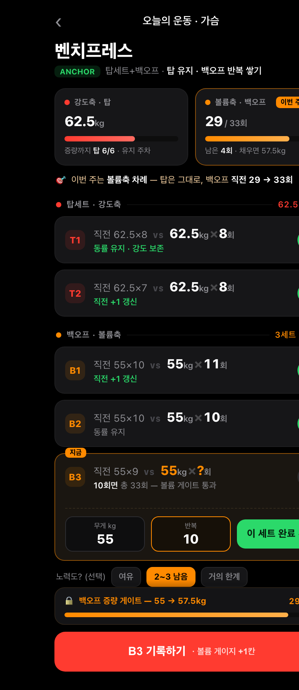
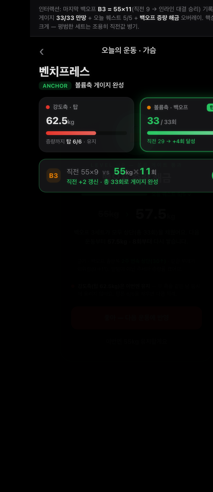
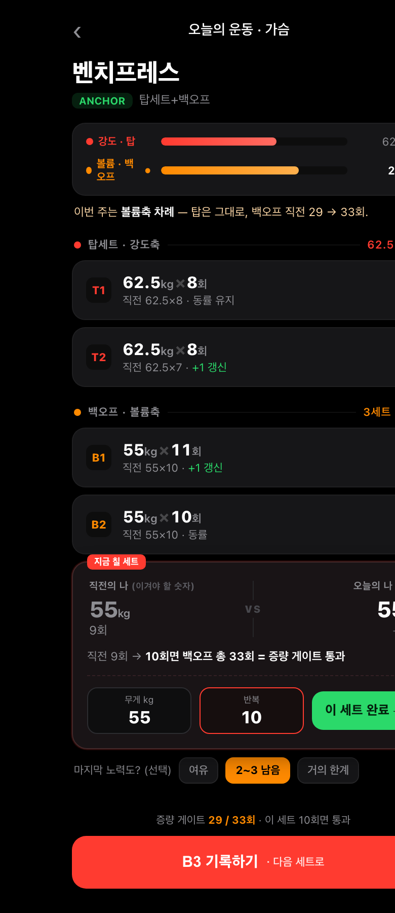
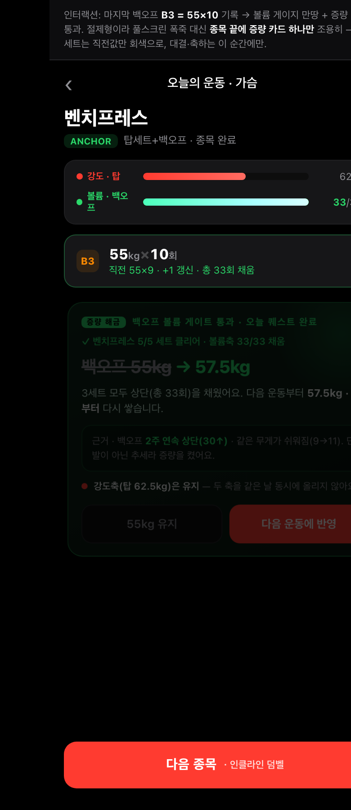
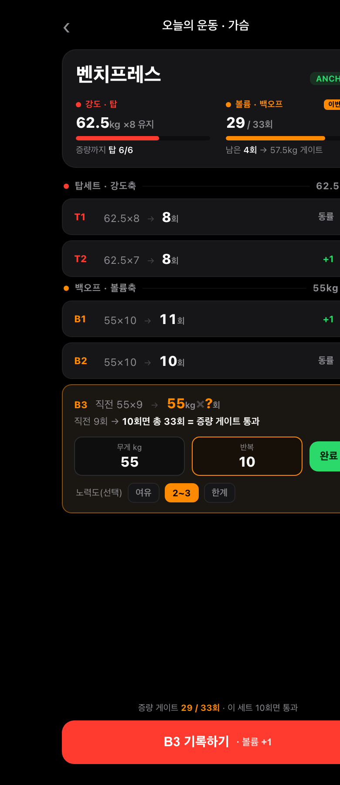
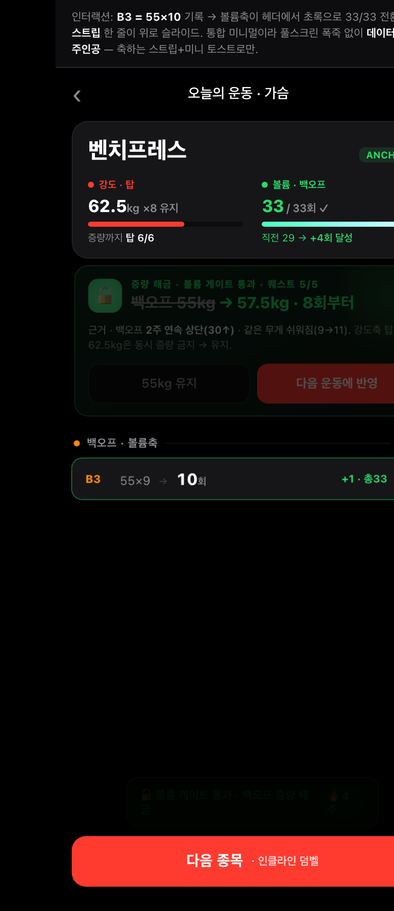

# 화면 1 · 운동 중 — 하이브리드 결합 검토 (이중 게이지 × 직전 대결 × 퀘스트)

> **작성일** 2026-06-30
> **검토 대상** 사용자가 제안한 하이브리드 — "상단에 이중 게이지(강도축/볼륨축) + 세트별 직전의 나 vs 오늘 대결 + 성공 시 퀘스트 달성 연출"을 한 화면에 결합한 운동 중 화면.
> **근거 문서** [HYPERTROPHY_PROGRESS_AND_TRACKING.md](HYPERTROPHY_PROGRESS_AND_TRACKING.md) · [APP_HYPERTROPHY_PROGRESSION_PLAN.md](APP_HYPERTROPHY_PROGRESSION_PLAN.md) · [PROGRESSIVE_OVERLOAD_GUIDE.md](PROGRESSIVE_OVERLOAD_GUIDE.md) · [PRD_PROGRESSION.md](PRD_PROGRESSION.md) · [PROGRESSION_SCREEN1_WORKOUT.md](PROGRESSION_SCREEN1_WORKOUT.md)

---

## 개요

앞선 [화면 1 · 4목업 문서](PROGRESSION_SCREEN1_WORKOUT.md)에서 운동 중 화면을 퀘스트 · 듀얼 게이지 · 사다리 등반 · 직전 대결 네 가지로 갈라 그렸다. 사용자는 그중 세 가지 — **이중 게이지(강도축/볼륨축) · 직전 대결(직전의 나 vs 오늘) · 퀘스트 달성 연출** — 을 하나의 화면으로 합치자고 제안했다. 이 문서는 그 결합을 현실적·객관적으로 검토하고, 결합 방식 세 변형(A 충실 / B 절제 / C 통합) 목업과 개선안을 낸다.

같은 장면·같은 데이터를 쓴다 — 벤치프레스 한 종목(탑세트 2 + 백오프 3), 직전 탑 62.5kg×8/7, 직전 백오프 55kg×10/10/9, 게이트는 백오프 3세트 합 33회. 오늘의 처방은 "탑 무게는 유지, 백오프 반복을 채워 증량 게이트에 다가가기".

사용자가 먼저 파고들라고 지정한 두 우려, 그리고 연출 원칙을 그대로 검토 축으로 둔다.

- **우려 ① 정보 과밀·화면 위계** — 세 요소가 한 화면에 들어가면 "지금 칠 값"이 묻히지 않는가.
- **우려 ② 점진과부하 데이터 왜곡** — 게임화가 진행 판정·처방을 흐리거나 과장하지 않는가.
- **연출 원칙** — 게임화 연출은 "핵심 순간만". 증량 게이트 해금·직전 기록 갱신 같은 의미 있는 순간에만 크게, 평범한 세트는 조용히.

---

## 1. 현실적·객관적 평가

### 좋은 점부터 — 결합이 실제로 노리는 가치

세 요소는 서로 다른 시간 단위의 동기를 건드린다. 게이지는 "이번 주 어느 축을 미는 차례인가"라는 **주 단위 맥락**, 대결은 "이 세트에서 넘겨야 할 직전 숫자"라는 **세트 단위 목표**, 퀘스트 연출은 "증량 해금" 같은 **순간 단위 보상**이다. 셋이 다른 층위를 맡으니, 잘 배치하면 한 화면 안에서 큰 그림(주)·당장 할 일(세트)·성취감(순간)을 동시에 줄 수 있다. 특히 직전값 병기는 `HYPERTROPHY` 4부·`PLAN` Q4-B2의 "직전 기록이 진행 결정의 90%" 원칙을 화면 1차 언어로 삼은 것이라, 결합의 뼈대 자체는 점진과부하 철학과 어긋나지 않는다.

하지만 좋은 점은 여기까지다. 아래 두 갈래 리스크가 결합 특유의 함정이며, 정직하게 짚는다.

### (가) 점진과부하 데이터 왜곡 — 세 요소가 모두 "단발"을 신호로 쓴다

핵심 진단은 하나로 수렴한다. **세 요소(대결 승리 · 게이지 만땅 · 퀘스트 클리어)가 전부 "한 세션 단발 수행"을 트리거로 쓰는데, `HYPERTROPHY` 문서의 진행 판정은 전부 "2~3주 추세"를 요구한다.** 연출의 시간 단위(세션)와 판정의 시간 단위(메조)가 어긋난다. 보정하지 않으면 게임화가 매 세션 "오늘 이겼다 = 진행했다"는 잘못된 인과를 학습시킨다.

**직전 대결 승리 — 단발을 진짜 진행으로 오인.** 직전값 절대 비교는 `HYPERTROPHY` 3부가 못 박은 대로 "조건이 같을 때만" 성립한다. 운동 순서가 앞으로 당겨지거나, 세트 간 휴식이 60초 vs 3분이면 PCr 회복이 35% 차이 나거나, 수면·시간대가 흔들리면 "지난 7 → 오늘 8"은 실력이 아니라 조건 차이일 수 있다. 그런데 대결 연출은 8을 넘긴 즉시 승리를 띄운다. 거짓 양성(컨디션 좋아 넘긴 1회를 승리로 축하 → 노이즈를 시그널로 기억)도 문제지만, **거짓 음성이 더 해롭다.** 순서가 뒤로 밀려 7회만 한 날을 "패배"로 띄우면, 같은 문서가 "판정 보류·RIR로 재평가"하라던 정직한 진행을 동기 도구가 좌절시킨다. 게임화가 데이터를 왜곡하는 가장 나쁜 형태다.

**게이지 만땅 = 증량 — 성급한 게이트 통과.** 게이지 단독 설계는 의외로 정직하다(만땅 조건이 "백오프 3세트 모두 상단", 레벨업 카드도 "한 단계 올리고 반복 8회 리셋·강도축 동시 증량 금지"까지 `PRD` 게이트를 충실히 따른다). 문제는 **"한 세션 안에서 게이지가 0→만땅 차오르고 그 자리에서 게이트를 통과"하는 구조**다. 더블 프로그레션 게이트는 원래 여러 세션에 걸쳐 반복이 차오른 끝에 통과하는 것이지(`HYPERTROPHY` 4부 세션1→4 예시), 한 세션 5세트로 즉시 따는 게 아니다. 게다가 1·2부가 반복 경고한 **"톤수/반복 거품"**을 게이지가 못 거른다 — 33회를 RIR 4~5로 헐겁게 채웠어도 게이지는 만땅이 된다. 게이지는 "양"만 재고 "질(실패 근접도)"을 안 본다.

**쉬워짐 승리(RIR 개선) — 개념은 가장 정직, 폴백이 급소.** 같은 무게에서 RIR이 0→2로 벌어지면 강해진 것이라는 `HYPERTROPHY` 1부·4부 신호 ④를 정확히 구현했다. 정체 구간 중급자가 보여줄 수 있는 가장 정직한 진행 증거다. 그러나 **RIR이 선택형**이라, 미입력 시 이 승리가 성립하지 못해 정체 주간 동기가 사라진다. 더 나쁜 건 **입력 편향** — "승리를 받으려면 RIR을 낮게 적으면 된다"는 경로가 열리면, `HYPERTROPHY`에서 질을 재는 유일한 게이지인 RIR 추세선 자체가 오염된다. 보상을 RIR에 직접 묶으면 게이지를 휘게 만든다.

### (나) UI/UX 과밀·위계 — 결합하면 "지금 칠 값"이 묻힌다

**단독 목업은 위계가 잘 잡혀 있었다.** duel-base는 active 카드만 빨강 테두리로 펼치고 나머지는 흐리고(opacity .62), gauge-base는 "지금" 배지로 단일 초점을 줬다. 셋 다 "지금 칠 세트 하나만 또렷, 나머지 흐림" 원칙을 지켜 0.5초 룰을 통과했다.

**문제는 같은 평면에 합칠 때 생긴다.** 게이지 베이스만으로도 상단이 무겁다 — "이번 주 볼륨 차례"라는 한 정보를 게이지 배지·active 테두리·focus 배너·하단 버튼까지 네 번 반복한다. 여기에 대결 VS 카드(좌-VS-우 3분할 + verdict)와 퀘스트 게이트 카드까지 얹으면 한 종목 화면이 세로로 길게 쌓여, **390px 화면(약 844px)에 게이지까지만 넣어도 첫 세트 카드가 화면 절반 아래로 밀린다.** 헬스장에서 "지금 칠 값"을 보려면 스크롤해야 한다 — 가장 큰 위계 사고다. 강한 시각요소(게이지 색막대 · 대결 VS · 승리 초록)가 셋씩 경쟁하면서, 정작 가장 중요한 입력 숫자(오늘 필드)가 가장 약한 흰색이라 묻힌다. 숫자 크기로도 위계가 역전된다(게이지 헤드라인 20px · 퀘스트 타깃 26px vs 오늘 입력값 21px).

**매 세트 연출이 입력 흐름을 끊는다.** 대결 react는 한 세트 완료 시 카드 팝·숫자 팝·승리 배너·입자·스텝 플래시·토스트(3초)까지 여섯 애니메이션이 동시에 터진다. 평범한 백오프 동률 세트에도 이게 다 터지면 "직전 갱신"의 의미가 닳고, 다음 입력을 하려는 엄지 동선을 토스트·배너가 3초간 가린다. 헬스장 세트 사이 휴식은 짧고 손은 하나다. 게다가 인터랙션 중복이 명백하다 — 대결은 "승리"를, 퀘스트는 "스텝 클리어 + 게이트 레벨업"을 둘 다 같은 사건(백오프 마지막 세트 갱신)에 건다. 합치면 한 번의 세트 완료에 **대결 승리 + 퀘스트 체크 + 게이지 만땅 + 게이트 오버레이**가 줄줄이 터져, 같은 성취를 세 은유로 세 번 축하한다. 사용자의 "핵심 순간만" 원칙과 정면 충돌한다.

**위계 진단:** 이 세 가지는 경쟁하는 디자인이 아니라 **서로 다른 레이어**에 속해야 하는 것들이다. 게이지 = 주 단위 맥락(항상 보이되 가장 작게), 대결 = 세트 단위 목표(지금 칠 세트 입력 옆에만), 퀘스트 연출 = 순간 단위 보상(평소엔 0, 핵심 순간에만 오버레이). 같은 평면에 나란히 놓으니 과밀이 생긴다.

---

## 2. 변형 목업

세 변형 모두 단독 렌더(인라인 CSS), CARBON 다크 390px, 동일 예시 데이터를 쓴다. 차이는 "세 요소를 어떻게 결합하고, 핵심 순간의 축하를 얼마나 크게 하느냐"다. 원본 인터랙티브 목업은 `docs/screen1-hybrid/html/`의 6개 HTML에서 단독 렌더로 바로 확인할 수 있다.

### 변형 A — 충실 결합

세 요소를 가장 정직하게 다 얹은 안. 상단에 슬림 듀얼 게이지(강도·빨강 / 볼륨·주황, "이번 주 차례" 배지), 세트행마다 직전→오늘을 한 줄 인라인 대결(`직전 55×9 vs 오늘`)로 조용히 병기, 하단 고정바에 증량 게이트 진행바(29/33)를 둬 "증량까지 얼마"가 항상 보인다. 대결은 평범한 세트에선 작은 회색 라벨(동률/+1), 활성 세트만 입력행이 펼쳐진다. 핵심 순간엔 마지막 백오프로 게이트 통과 → 볼륨 게이지 만땅(초록 글로우·pop) + 인라인 대결 승리 + **풀스크린 증량 해금 오버레이**(퀘스트 5/5 미니 진척 + 증량 근거 행 + "강도축은 유지" 동시증량 금지 안내 + 반영/유지 선택)로 가장 크게 연출한다.

**장점** 세 요소가 다 살아 동기 표면적이 가장 넓고, 풀스크린 오버레이에 증량 근거 행을 박아 "왜 올리는가"를 가장 설득력 있게 전달한다. **단점** 요소가 가장 많아 우려 ①(과밀·위계)에 가장 취약하다 — 게이지+인라인 대결+게이트가 동시에 보여 시선이 분산되고, 첫 세트 카드가 아래로 밀린다. 풀스크린 오버레이는 "핵심 순간만" 원칙엔 맞지만, 빈도 관리(직전 갱신이 잦은 중급자)를 못 하면 다시 흔해질 위험이 있다.

### 변형 B — 절제 위계

정보 과밀을 구조로 직접 줄인 안. 게이지를 카드 하나에 **2개 막대 한 줄씩**으로 압축, 직전값은 완료/대기 세트에선 회색 텍스트로만(대결 카드 없음), **대결 VS 구도는 "지금 칠 세트" 한 개에만** 강조 카드로 펼친다. 게이트는 하단 작은 한 줄 텍스트(29/33)로만. 화면 위계가 세트 입력 중심으로 단순하다. 핵심 순간엔 풀스크린 폭죽 없이 **종목 끝 인라인 증량 카드 하나로만** — 퀘스트 클리어 한 줄 + 증량 근거 + 동시증량 금지 + 유지/반영 버튼. 절제 원칙을 가장 충실히 지킨다.

**장점** 우려 ①을 구조로 가장 직접 해소한다 — 펼쳐진 카드가 "지금 칠 세트" 하나뿐이라 단일 초점이 확실하고, 첫 세트 카드가 화면 위로 올라온다. 인라인 증량 카드는 풀스크린만큼 시야를 막지 않아 입력 흐름을 덜 끊는다. **단점** 게이지를 줄이면 "2축이 차오르는 만족감"이라는 게이지 최대 강점이 약해진다(맥락 인지는 살지만 보상감은 대결·증량 연출로 이전된다고 봐야 한다). 증량 축하가 가장 차분해, 게임화로 동기를 크게 끌고 싶은 사용자에겐 밋밋하게 느껴질 수 있다.

### 변형 C — 통합 미니멀

데이터 우선, 장식 최소. 종목명·2축 진행·게이트 목표를 **헤더 카드 하나에 통합**(강도/볼륨 축 두 칼럼). 세트는 `prev → now` + 작은 승리 마커(+1/동률)만 있는 콤팩트 행 리스트라 한 화면에 더 많이 보인다. 대결·퀘스트·게이지가 별도 블록이 아니라 데이터 행 안에 녹아 있다. 핵심 순간엔 헤더 볼륨축이 초록 33/33으로 전환 + **슬림 증량 스트립 한 줄**이 위로 슬라이드 + 미니 토스트. 풀스크린 없이 데이터가 계속 주인공이다.

**장점** 우려 ②(데이터 왜곡)에 가장 강하다 — 게임 어휘가 거의 없어 "오늘 이김 = 진행"의 오인 학습을 덜 시킨다. 한 화면에 세트가 가장 많이 보여 종목 전체 흐름 파악이 빠르다. **단점** 동기 표면적이 가장 좁다 — 정체 주간을 버티게 할 "쉬워짐 승리" 같은 감정적 보상이 데이터 마커로 추상화돼 약하다. 빽빽한 데이터 우선 화면이라, 게임화로 운동을 더 재밌게 하려는 결합의 본래 취지와는 가장 거리가 있다.

### 세 변형 한눈에

**연출 강도**는 A(풀스크린 오버레이) > B(인라인 증량 카드) > C(슬림 스트립+토스트). 셋 다 "평범한 세트는 조용, 증량/진짜 갱신에만 축하" 원칙은 지키며, 차이는 그 축하의 크기다. **정보 밀도**는 C가 가장 빽빽(데이터 우선)·A가 가장 많은 요소·B가 중간이되 초점을 가장 강하게 몰아준다. **대결 표현**은 A=모든 세트 인라인 VS, B=현재 세트만 VS 카드, C=`prev→now`+마커로 가장 추상화. **데이터 왜곡 리스크**는 C가 가장 낮고 A가 가장 높을 수 있다(단 A도 게이지·대결을 회색·작은 라벨로 절제했고 오버레이에 증량 근거 행을 박아 처방 신뢰를 방어한다).

---

## 3. 개선안

평가에서 나온 리스크를 줄이는 구체 개선이다. **한 줄 원리: 축하의 크기를 신호의 신뢰도에 묶는다.** 단발에 큰 축하를 붙이면 데이터를 왜곡하고, 추세 확정 사건에만 큰 축하를 붙이면 게임화가 오히려 점진과부하의 가장 어려운 교훈(추세를 보라·거품을 의심하라)을 감정적으로 가르치는 도구가 된다.

### 개선 ① 시간 단위 분리 — 즉각 보상과 판정 연출을 둘로 쪼갠다

게이지가 차오르는 맛, 숫자를 넘기는 맛 같은 **즉각 만족은 "기록됨·게이지 차오름"에만** 준다. 반면 "승리"·"증량 해금"이라는 **판정 어휘는 2~3주 추세가 받쳐줄 때만** 발화한다. 구체적으로 게이지를 **누적 추세 게이지**로 바꾼다 — 만땅(증량 해금)은 "이번 세션 33회"가 아니라 "최근 2~3세션 백오프 상단 누적·2주 연속 상단 도달"일 때만 트리거된다(gauge-base 본문이 이미 "2주 연속 상단·9→11" 근거를 언급하므로 이를 실제 트리거 조건으로 승격). 그리고 증량 직전에 **RIR 게이트**를 끼운다 — 반복은 찼어도 마지막 백오프 RIR이 헐거우면(선택 입력 시 RIR≥3) "반복은 찼지만 아직 여유 있음 → 무게 대신 반복 질을 한 주 더"로 증량을 보류한다(`HYPERTROPHY` 1부 신호 ②, 톤수 거품 차단). **연출은 즉시, 처방은 추세** — 두 시계를 명시적으로 나눈다.

### 개선 ② 승리 조건 엄격화 + "패배" 어휘 삭제 + 조건 할인

카드 단위 단발 승리는 **약한 표기로 낮추고**(초록 체크 + "직전 유지/+1" 회색 텍스트 정도), 큰 승리(입자·오버레이)는 **종목·추세 단위로 격상**한다. 종목 순서가 평소와 다르거나(앱이 세션 내 순서를 안다 — `HYPERTROPHY` 4부 기록 필드에 "순서" 있음) 직전과 휴식이 크게 다르면, 그 세트의 승리는 **"조건 다름 · 참고" 배지로 톤다운**하고 큰 연출을 끈다. 그리고 **"패배"라는 단어를 쓰지 않는다** — 못 넘긴 세트는 패가 아니라 "기록 · 추세로 판단" 중립 표기로, `HYPERTROPHY`가 단발 하락을 후퇴로 단정 금지한 원칙을 UI 어휘에 박는다. 거짓 음성으로 정직한 사용자를 좌절시키는 최악의 경로를 막는다.

### 개선 ③ 평소/핵심순간 모드 분리 — 연출 게이팅을 규칙으로 박고, RIR 폴백을 설계한다

"핵심 순간만"을 정성적 약속이 아니라 판정 규칙으로 만든다. **평범한 세트**(직전 동률·소폭): 연출 0, 입력칸 옆 작은 초록 체크 + 회색 텍스트만(토스트·입자·배너 전부 없음). **직전 갱신**(reps↑ 또는 쉬워짐 승리): 해당 세트 카드만 가볍게 초록 플래시 + "▲ 직전 갱신" 인라인 칩 1개(토스트·XP 없음). **증량 게이트 통과**(2~3주 추세 충족): 이때만 풀스크린 레벨업 오버레이 1회 — 입자·증량 근거 행·반영/유지 선택지를 여기에만 쓴다. 이러면 한 사건에 한 연출만 남아 3중 축하가 사라진다. XP·연승·스트릭 토스트는 운동 중 화면에서 빼 **운동 종료 요약으로** 미룬다(세트 사이 시야 방해 제거).

**RIR 폴백:** RIR 미입력이면 "쉬워짐 승리"를 끄고 "무게·반복 유지 — 추세로 판단" 중립 표기로 대체한다(정체 주간 동기는 스트릭·주간 볼륨 유지 같은 누적으로 보완). 입력 편향을 끊기 위해, 쉬워짐 승리 판정을 **단일 세션 RIR이 아니라 같은 무게에서의 RIR 추세 하락**(여러 세션)으로 건다 — 한 번 낮게 적어도 추세가 안 따라오면 승리가 안 떠 편향의 이득이 사라진다. 그리고 RIR 입력을 **보상이 아니라 효용으로** 유인한다 — "RIR 적으면 승리 줌"이 아니라 "RIR 적으면 다음 무게를 더 정확히 처방함". 보상이 아니라 효용으로 끌어야 데이터가 안 휜다.

### 개선 ④ (보강) 거품 경고를 연출에 내장

게이지·대결이 톤수·반복은 늘었는데 RIR이 헐거워진 경우(`HYPERTROPHY` 1부 신호 ②, 2부 사례 A·B의 핵심 함정)를 감지하면, 큰 승리 대신 **"반복은 늘었지만 아직 여유 있음 — 다음엔 더 밀어보기"** 같은 정직한 코칭으로 전환한다. 이게 들어가야 게임화가 "톤수 거품을 성장으로 오인"시키는 최악의 경로를 막는다.

---

## 4. 리더 권고

**채택할 만한가 — 조건부 예.** 이 하이브리드는 동기 면에서 강하고, 세 요소가 서로 다른 시간 층위(주·세트·순간)를 맡아 잘 배치하면 한 화면에서 큰 그림·당장 할 일·성취감을 동시에 줄 수 있다. 다만 **현재 결합안 그대로면 흐린다** — 세 요소가 모두 세션 단위 즉각 보상이라 "오늘 이김 = 진행"이라는 잘못된 멘탈 모델을 강화하고, 한 화면에 셋을 같은 평면으로 얹으면 "지금 칠 값"이 묻힌다. 개선안 없이 통째로 채택하는 건 권하지 않는다.

**어느 변형 — B(절제 위계)를 베이스로, C의 데이터 절제와 A의 증량 오버레이를 선택적으로 흡수.** B는 우려 ①(과밀)을 구조로 가장 직접 해소한다("지금 칠 세트" 하나만 펼치고 게이지를 한 줄로 압축). 우려 ②(왜곡)에는 C가 가장 강하지만, C는 동기 표면적이 너무 좁아 게임화로 운동을 재밌게 하려던 결합의 취지를 거의 버린다. A는 표현력은 가장 좋으나 과밀 위험이 가장 크다. 따라서 **레이아웃·위계는 B, 데이터 어휘의 절제는 C에서, 증량 해금 순간의 풀스크린 오버레이는 A에서** 가져오는 절충이 가장 현실적이다.

**무엇을 반드시 얹어야 하나 — 개선안 ①·②·③은 선택이 아니라 필수다.** 변형 선택과 무관하게, (1) 게이지를 누적 추세 게이지로 바꿔 증량을 추세로 게이팅하고, (2) "패배" 어휘를 지우고 조건 할인을 넣고, (3) RIR 폴백과 입력 편향 차단을 설계하지 않으면, 어느 변형이든 데이터를 왜곡한다. 특히 **풀스크린 증량 오버레이는 "2~3주 추세 충족" 한 사건에만** 걸어 빈도를 희소하게 유지하는 것이 이 결합의 성패를 가른다.

**남는 정직한 리스크.** 대결 카드를 active에만 펼쳐도 좌우 분할이라 입력 시선이 한 번은 가로로 분산된다 — 진짜 빠른 입력만 보면 퀘스트형의 "한 줄 + 큰 숫자 + ＋버튼"이 더 빠르다. 대결 은유의 동기 이득(특히 정체 주간 "쉬워짐 승리")이 그 입력 속도 손실을 정당화할 만큼 가치 있다고 볼 때만 대결 카드를 쓸 이유가 있다. 또 "직전 갱신" 인라인 연출의 빈도는 중급자가 매주 어딘가는 갱신하면 다시 흔해질 수 있어, 실제 사용 데이터로 캘리브레이션이 필요하다. 최종 선택은 사용자 몫이다.

---

> 참고: 본문의 `screen1-hybrid/{K}-base.png` · `{K}-react.png`는 각 목업 HTML을 390px 폭으로 캡처한 것이다. 원본 인터랙티브 목업은 `docs/screen1-hybrid/html/`의 6개 HTML 파일(A-base/A-react/B-base/B-react/C-base/C-react)에서 단독 렌더로 확인할 수 있다.
