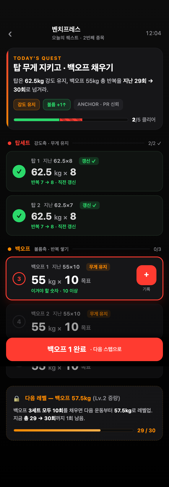
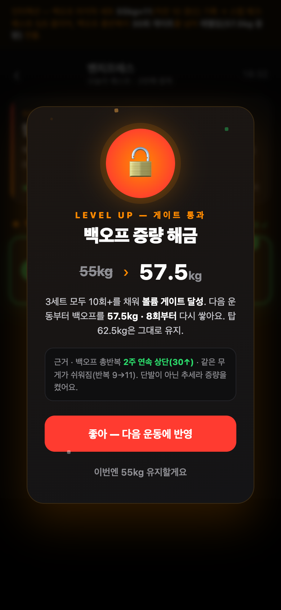
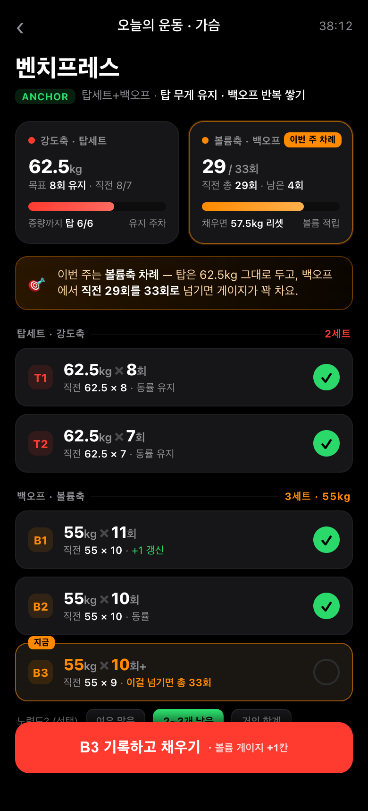
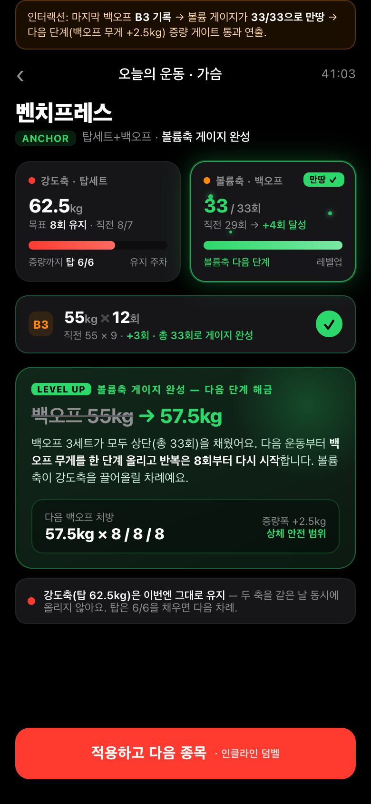
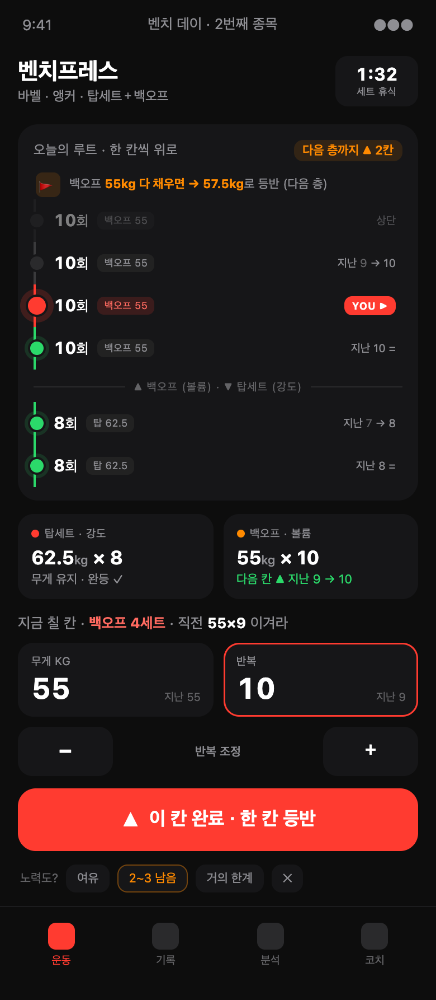
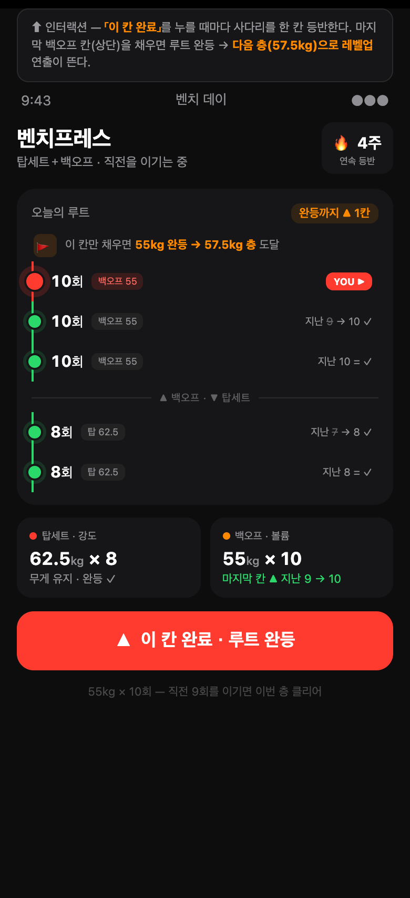
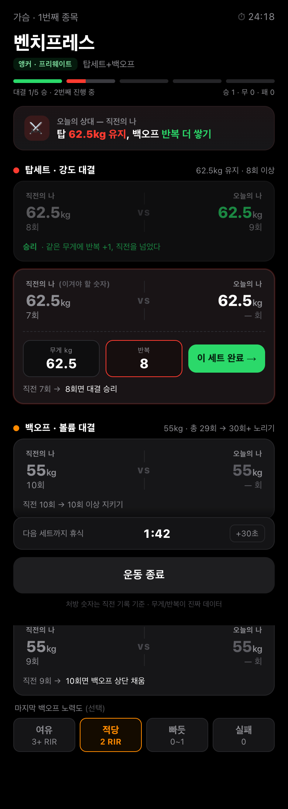
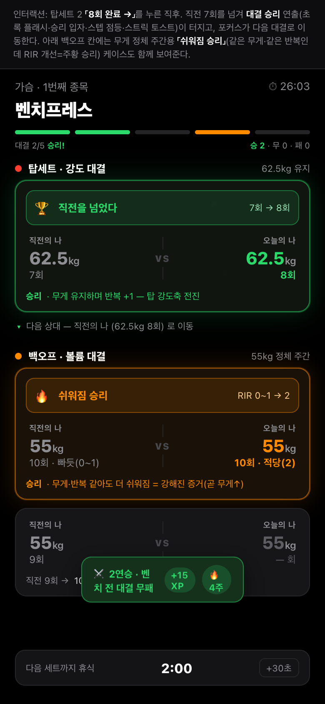

# 화면 1 · 운동 중 — 4가지 게임화 디자인 목업

> **작성일** 2026-06-30
> **대상** 4개 핵심 화면 중 **1번 "운동 중(세트 입력 + 처방·진행)" 화면**. 아래 4개 게임화 목업 중 사용자가 하나를 고른다.
> **근거 문서** [APP_HYPERTROPHY_PROGRESSION_PLAN.md](APP_HYPERTROPHY_PROGRESSION_PLAN.md) · [HYPERTROPHY_PROGRESS_AND_TRACKING.md](HYPERTROPHY_PROGRESS_AND_TRACKING.md) · [PROGRESSIVE_OVERLOAD_GUIDE.md](PROGRESSIVE_OVERLOAD_GUIDE.md) · [PRD_PROGRESSION.md](PRD_PROGRESSION.md) · [PROGRESSION_REVIEW_AND_OPTIONS.md](PROGRESSION_REVIEW_AND_OPTIONS.md)

---

## 개요

이 문서는 앱의 첫 번째 핵심 화면인 **"운동 중"** 화면을 네 가지 서로 다른 게임화 메타포로 디자인한 목업 모음이다. 모두 같은 화면(운동 중 세트 입력 + 그 자리에서의 처방·진행 표시)을 다루며, 같은 장면·같은 데이터를 쓴다 — 벤치프레스 한 종목(탑세트 2 + 백오프 3 구성), 직전 탑 62.5kg×8/7, 직전 백오프 55kg×10/10/9, 오늘 목표는 "탑 무게는 유지하고 백오프 반복을 더 쌓기". 네 목업은 이 동일한 재료를 각각 **퀘스트 · 듀얼 게이지 · 사다리 등반 · 직전 대결**이라는 다른 옷으로 입힌 것이라, 비교가 일대일로 깔끔하다.

**확정 방향(네 목업 공통)**
- **운동 중부터 시작한다.** 이 화면이 앱에서 가장 자주 쓰이는 화면이라 가장 먼저 다듬는다. 홈은 다음 차례.
- **처방·진행을 운동 중에도 둔다.** "오늘 뭘 하면 성공인가"를 세트 치는 그 화면에서 바로 보여준다. 퀘스트형은 이 처방·진행 프레임을 운동 중과 홈 양쪽에 둔다.
- **게임화는 "적당히".** 진행감·작은 보상·"다음 한 칸"의 명확함 같은 게임 요소는 살리되, 무게·반복·볼륨·RIR 같은 핵심 데이터는 진지하고 정확하게 큰 숫자로 유지한다(헬스 본질 우선). 유치한 포인트·코인 남발은 하지 않는다.
- **탑세트+백오프를 나눠 본다(사용자 선호).** 강도축(탑 무게)과 볼륨축(백오프 반복)을 한 줄에 뭉개지 않고 따로 처방한다.
- **한 종목에 집중하되 그 종목 세트 전체는 보인다.** "지금 칠 세트"만 또렷하게 강조하고, 같은 종목의 나머지 세트(탑2+백오프3)는 흐리게라도 다 보인다. "한 세트만 달랑 보여주는 것"은 사용자가 싫어한 방식이라 채택하지 않는다.
- **직전값을 "이겨야 할 숫자"로 병기한다.** 모든 세트에 직전 같은 세트 기록(예: "지난 62.5×8")을 깔고, 그걸 넘어야 할 목표로 제시한다 — `HYPERTROPHY` 4부·`PLAN` Q4-B2의 "직전 기록이 진행 결정의 90%"를 화면 전체의 1차 원칙으로 삼는다.

네 목업이 공통으로 녹인 점진과부하 원칙은 다음과 같다. ① 직전값=결정의 90%, ② 탑=강도축/백오프=볼륨축 분리(`PRD` FR-5), ③ 무게·반복 동시 증가 금지·한쪽씩(`PRD` 게이트 의사코드 "둘을 같은 날 동시 증량 금지, 2주 내 한쪽씩"), ④ 증량은 게이트 통과 + 2~3주 추세로만(`GUIDE` 5부), ⑤ RIR은 선택형·백오프 마지막 세트만(`PRD` FR-6), ⑥ 하락 단정 금지·작은 계단. 차이는 이 원칙들을 "어떤 게임 은유로 보여주느냐"에 있다.

---

## 1장 · 퀘스트형 (KEY=quest)

### 컨셉 — 운동 화면을 "오늘의 퀘스트"로

벤치프레스 한 종목을 통째로 하나의 퀘스트로 묶었다. 상단에 퀘스트 목표("탑 무게 지키고 · 백오프 채우기")가 있고, 각 세트는 클리어할 서브 스텝(체크 동그라미)이며, 증량 조건은 "다음 레벨/보스"로 시각화된 게이트다. 가장 큰 동기 축은 화려한 보상이 아니라 **직전 기록 갱신**으로 잡았다 — 모든 스텝에 "지난 62.5×8" 같은 직전값을 깔고, 그걸 이겨야 할 숫자로 병기했다. 즉 한 종목 = 하나의 클리어 가능한 퀘스트라는 서사로 "오늘 뭘 하면 성공인가"를 게임 목표로 번역한다.

### 점진적 과부하를 어떻게 돕나
- **직전값=결정 90%**(`GUIDE` 6-1, `PLAN` Q4-B2): 모든 세트 스텝에 직전 같은 세트 기록을 회색으로 깔고 "이겨야 할 숫자"로 제시한다. 목표는 늘 "직전 +1회" — 도약 없이 작은 계단으로만 표기한다.
- **탑=강도축 / 백오프=볼륨축 분리**(`PRD` FR-5, `GUIDE` 3-4): 두 스테이지로 물리적으로 나눴다. 탑 스테이지는 "무게 유지" 태그, 백오프 스테이지는 "반복 쌓기" 태그라 두 축이 한 줄로 뭉개지지 않는다.
- **한쪽씩 증가**(`PRD` 게이트): 오늘 탑은 62.5kg 유지(강도 보존), 백오프만 반복을 쌓는다. 증량 게이트는 백오프에만 걸려 있다.
- **게이트 + 추세로만 증량**(`GUIDE` 5부, `PRD` 판정): 게이트는 "백오프 3세트 모두 10회"라는 명시 조건이고, 인터랙션의 레벨업 카드에 "2주 연속 상단·같은 무게가 쉬워짐(9→11)" 근거 행을 붙여 단발 컨디션이 아닌 추세로 판정함을 보였다.
- **RIR 선택·백오프 마지막만**(`PRD` FR-6): 마지막 백오프 스텝에만 "RIR 여기" 태그를 둔다.

### UI/UX 강점
시각 위계가 또렷하다. "지금 칠 세트"는 빨강 글로우 카드(now)로 단독으로 튀고, 완료 스텝은 초록 체크로 가라앉고, 다가올 스텝은 흐리게 깔린다 — 헬스장 0.5초 시선이 멈출 단일 초점이 한 개다. 한 손 입력 동선은 now 카드 우측의 큰 빨강 "＋ 기록" 버튼 + 하단 고정 "완료" 바로 잡았고, 직전→오늘이 한 줄에서 읽힌다. 그 종목 세트 전체(탑2+백오프3)는 다 보이되 지금 칠 세트만 또렷해 사용자 선호에 맞는다.

### 게임화가 어떻게·헬스 본질은 어떻게 지키나
세트 = 스텝, 직전 갱신 = 스텝 클리어 체크, 증량 게이트 = 레벨업/보스. Duolingo식 "다음 한 칸의 명확함"을 헬스로 번역했다. 퀘스트 진척 바(2/5 → 5/5)와 게이트 진행도(29/30)로 "증량까지 얼마 남았나"를 항상 보여줘 다음 행동 동기를 만든다. 보상은 절제했다 — 데이터(무게·반복·볼륨·RIR)는 진지하게 큰 숫자로 두고, 게임 연출은 레벨업 순간에만 집중한다. 레벨업 카드조차 근거 행과 "이번엔 유지할게요" 옵션을 둬 엔진의 신뢰를 해치지 않는다.

### 인터랙션
캡션: "백오프 마지막 세트 갱신 → 퀘스트 클리어 → 증량 해금 레벨업". 백오프 마지막 세트 55kg×11(직전 10 갱신)을 기록하면 해당 스텝에 "+1 반복·직전 갱신" 칩이 떠오르고 초록 체크로 클리어되며, 퀘스트 진척 바가 5/5로 채워진다. 동시에 백오프 총반복이 30회 게이트를 넘어 **레벨업 오버레이**(🔓 백오프 증량 해금 · 55→57.5kg)가 입자 연출과 함께 뜨고, 카드 안에 증량 근거 행("2주 연속 상단·9→11로 쉬워짐")과 "다음 운동에 반영 / 이번엔 유지" 선택지를 둔다.

### 다른 룰일 때
더블 프로그레션이면 한 종목 퀘스트의 서브 스텝이 모두 같은 무게의 본세트가 되고, 게이트는 "모든 세트 반복 상단 도달"로 바뀐다. 총반복 룰이면 퀘스트 목표가 "목표 무게에서 총 N회 채우기"가 되고 진척 바가 세트 단위가 아니라 누적 반복 단위(예: 24/33회)로 차오른다. 서사 프레임이 룰에 안 묶여 있어 어떤 룰이든 "오늘의 퀘스트 한 개 + 다음 레벨 게이트"라는 같은 골격으로 흡수된다.

### 차별성·장단점
**차별성**: 다른 목업이 입력 효율이나 처방 카드 깊이에 집중한다면, 이 안은 한 종목 = 하나의 클리어 가능한 퀘스트라는 **서사 프레임**으로 "오늘 뭘 하면 성공인가"를 게임 목표로 번역한다. 증량을 "레벨업/해금"으로 만들어 가장 이탈 많은 정체 구간에 도달감을 주되, 그 해금이 추세·게이트 근거에 묶여 게임성과 원칙이 충돌하지 않는다. **장점**: 동기 서사가 가장 강하고, "다음 한 칸"이 명확하다. **단점**: 퀘스트·레벨업 같은 게임 어휘가 Strong 헤비유저 취향엔 다소 화려할 수 있어 연출 강도 절제가 필요하다.

**경로**: `docs/screen1-workout/html/quest-base.html` · `docs/screen1-workout/html/quest-react.html`

---

## 2장 · 듀얼 게이지형 (KEY=gauge)

### 컨셉 — 차오르는 게이지 두 개

운동 중 화면을 "차오르는 게이지 두 개"로 본다. 왼쪽은 **강도축(탑세트=무게)**, 오른쪽은 **볼륨축(백오프=반복)**이다. 세트를 칠 때마다 해당 축 게이지가 차오르고, 게이지가 꽉 차면 그 축이 한 단계 증량(레벨업)으로 넘어간다. 화면 맨 위에 "이번 주는 어느 축 차례"를 명시해 오늘 어디에 집중할지 0.5초에 알게 했다. 소재 그대로 탑 62.5×8/7은 유지, 백오프 55×10/10/9 → 이번 주는 볼륨축 차례라 백오프 총 29회를 33회로 넘기는 게 목표다.

### 점진적 과부하를 어떻게 돕나
- **탑=강도축 / 백오프=볼륨축 분리**(`PRD` FR-5, 흐름4): 두 축을 게이지 2개로 물리적으로 분리했다. 한 표에 섞지 않고 무게 진행(강도)과 반복 진행(볼륨)을 별도 막대로 추적한다.
- **동시 증량 금지**(의사코드 "2주 내 한쪽씩"): 볼륨축이 만땅으로 레벨업해도 하단 메모가 "강도축 탑 62.5kg은 이번엔 유지"라고 명시한다.
- **직전값=결정 90%**: 모든 세트행에 직전값을 회색으로 깔고("직전 55×9"), 활성 세트엔 "이걸 넘기면 총 33회"로 이겨야 할 숫자를 병기한다.
- **게이트 끝점 명시**: 막대 우측의 흰 게이트 선이 "증량까지 얼마 남았나"를 보여준다. 강도축은 "탑 6/6", 볼륨축은 "33회 채우면 57.5kg 리셋"으로 다음 행동이 또렷하다.
- **증량폭 가드**: 백오프 +2.5kg를 "상체 안전 범위"로 라벨링(상체바벨 +1.25~2.5 원칙), 무게 올리면 반복 8회 하단 리셋까지 처방한다.
- **RIR 선택형**: 마지막 백오프 세트에만 노력도 칩, 미입력해도 무게·반복으로 판정한다.

### UI/UX 강점
상단부터 종목명 → 듀얼 게이지 → 이번 주 축 강조 배너 → 탑/백오프 세트 섹션 순으로 시선이 흐른다. 한 종목에 집중하되 그 종목 5세트 전체는 다 보이고, "지금" 칠 B3만 주황 테두리+"지금" 배지로 또렷하다. 게이지는 종목 정체성(강도=빨강 / 볼륨=주황)을 색으로 구분하고 완성 시 초록으로 전환해 "데이터는 진지, 진행감은 게임처럼"을 색으로만 절제해 표현한다. 하단 고정 빨강 버튼이 "B3 기록하고 채우기 · 볼륨 게이지 +1칸"으로 한 손 동선의 다음 행동을 단일 초점으로 제시한다.

### 게임화가 어떻게·헬스 본질은 어떻게 지키나
세트=게이지 한 칸, 직전 갱신=목표 클리어, 게이지 만땅=레벨업/다음 단계 해금으로 Duolingo식 "다음 한 칸"을 헬스로 번역했다. 다만 무게·반복·볼륨·RIR 숫자는 전부 진짜 데이터이고, 보상은 "다음 단계 처방 해금"이라는 실제 진행으로만 환원한다 — 공허한 포인트·뱃지 남발이 없다.

### 인터랙션
캡션: "마지막 백오프 B3 기록 → 볼륨 게이지 33/33 만땅 → 백오프 +2.5kg 증량 게이트 통과". 볼륨 게이지가 초록으로 가득 차며 pop 애니메이션·스파클·만땅 배지가 뜨고, 그 아래 LEVEL UP 카드가 "백오프 55kg → 57.5kg, 8회부터 리셋"을 처방한다. 동시에 메모로 "강도축은 동시 증량 금지 → 유지"를 알려 점진과부하 게이트 원칙을 연출 안에 녹였다.

### 다른 룰일 때
더블 프로그레션이면 게이지가 하나로 합쳐진다(반복 → 무게의 단일 축). 총반복 룰이면 볼륨 게이지가 그대로 "총 반복 N/목표"로 쓰여 가장 자연스럽고, 강도 게이지는 숨는다. 가변 머신(RIR 자가조절)이면 강도 게이지를 무게가 아니라 "같은 RIR에서 반복 개선"으로 라벨만 바꿔 재사용한다. 즉 게이지 개수와 축 라벨만 룰에 맞춰 바뀐다.

### 차별성·장단점
**차별성**: 대부분 앱이 세트를 평평한 표로 보여주는 데 비해, 이건 "오늘 어느 축을 채우는 중인지"가 화면의 1차 정보다. 탑세트+백오프 룰을 쓰는 중급자가 "강도는 유지, 볼륨만 쌓는 주"를 한눈에 인지하고, 게이지가 차는 만족감으로 백오프 반복을 끝까지 민다. **장점**: 2축 분리가 가장 직관적이고 "오늘 어디 집중"이 명확하다. **단점**: 게이지가 두 개라 세트 행 자체의 정보 밀도는 약간 양보하며, 룰에 따라 게이지 개수가 달라져 일관성 관리가 필요하다.

**경로**: `docs/screen1-workout/html/gauge-base.html` · `docs/screen1-workout/html/gauge-react.html`

---

## 3장 · 클라이밍/사다리형 (KEY=climb)

### 컨셉 — 사다리 등반

더블 프로그레션의 핵심 동작("같은 무게로 반복을 다 채우면 → 무게 한 칸 위로")을 **사다리 등반**으로 시각화했다. 각 세트가 사다리의 한 칸(rung)이고, 세트를 완료할 때마다 한 칸씩 위로 오른다. 백오프 반복 상단(55kg×10/10/10)을 다 채우면 루트 완등 → 다음 층(57.5kg)으로 레벨업한다. "지금 내가 어느 칸에 서 있고(YOU ▶), 바로 다음 칸이 무엇이며, 정상(다음 층=증량)이 몇 칸 남았는지"가 한눈에 박힌다. 사다리는 아래에서 위로 쌓여 "올라간다"는 물리적 은유가 방향과 일치한다.

### 점진적 과부하를 어떻게 돕나
- **직전값=결정 90%**: 모든 칸 오른쪽에 직전 수행을 회색으로 깔고("지난 9 → 10", "지난 8 ="), 입력 칸에도 "직전 55×9 이겨라"를 병기한다.
- **탑=강도축 / 백오프=볼륨축 분리**(`PLAN` Q6): 사다리를 가로 구분선으로 위아래 두 층으로 나눴다. 아래 두 칸=탑세트(62.5kg 무게 유지, 이미 완등=강도 확보), 위 세 칸=백오프(55kg 반복 쌓기=볼륨축). 배너도 빨강(탑·강도)/주황(백오프·볼륨) 두 카드로 분리해 "탑은 유지·백오프는 반복"을 따로 처방한다.
- **증량 게이트=레벨업**: 무게 상승은 자동이 아니라 "백오프 전 칸이 반복 상단 도달"이라는 게이트를 통과해야만 발생한다. 레벨업 카드가 "55→57.5kg · 8회부터" + "반복 하단 8 리셋 · 탑 62.5kg 유지"를 명시 — 증량 시 새 무게+반복 하단 리셋을 직접 산출하고 둘을 같은 날 동시 증량하지 않는 원칙을 그대로 구현한다.
- **RIR 선택형**(`PLAN` Q5): 백오프 마지막 칸에만 노력도 칩("2~3 남음")을 노출, 기본은 부담 없다.

### UI/UX 강점
헬스장 0.5초 시선을 위해 현재 칸(YOU)을 빨강·확대 노드+글로우로 단일 초점화하고, 완료 칸은 초록, 잠긴 칸은 흐리게 위계를 줬다. 입력은 큰 숫자 필드 + 엄지용 −/＋ 스텝퍼 + 화면 폭 빨강 "이 칸 완료" 버튼으로 한 손 동선을 명확히 했다.

### 게임화가 어떻게·헬스 본질은 어떻게 지키나
Duolingo의 "다음 한 칸"을 헬스로 번역했다 — 세트=스텝, 직전 갱신=칸 클리어, 증량 게이트=층 등반(레벨업). 완료 시 "▲ 한 칸 등반!" 토스트, 마지막 칸이면 🚩 깃발이 튀어오르는 레벨업 오버레이가 뜨되, 보상은 깃발/연출뿐이고 카드 본문은 무게·반복·리셋 같은 진지한 처방 숫자다. 상단 "🔥 4주 연속 등반" 스트릭으로 누적(근비대 본질=수개월 누적)을 가볍게 자극하되 점수·코인 같은 공허한 보상은 배제했다.

### 인터랙션
캡션: "이 칸 완료 → 한 칸 등반 + 마지막 칸이면 다음 층 레벨업". "이 칸 완료" 탭 → ① 현재 칸이 초록(done)으로 전환되고 YOU 마커가 직전 비교("→ 10 ✓")로 바뀜 → ② "▲ 백오프 10/10/10 — 완등!" 토스트 → ③ 백오프 배너 초록 플래시 + 목표 문구가 "상단 다 채움 ✓ 레벨업"으로 뒤집힘 → ④ 🚩 깃발이 스케일업하는 레벨업 오버레이가 떠 "55→57.5kg · 8회부터 / 반복 하단 리셋 · 탑 62.5kg 유지" 처방 카드를 보여줌. 즉 "한 칸 등반(세트 완료)"과 "다음 층 도달(증량 게이트 통과)" 두 순간을 모두 연출에 담았다.

### 다른 룰일 때
더블 프로그레션이면 사다리가 한 줄기(층 구분선 없이)가 되고 모든 칸이 같은 무게, 정상=다음 무게다 — 사실 이 메타포가 가장 잘 맞는 룰이다. 총반복 룰이면 칸을 세트가 아니라 누적 반복 마디로 그려 정상까지 거리를 "남은 반복"으로 표현한다. 수직 공간이 곧 진행 구조라, 룰이 바뀌어도 "올라가서 도달하는 다음 층"이라는 은유가 그대로 통한다.

### 차별성·장단점
**차별성**: 다른 메타포가 진행률 바/링으로 양을 보여준다면, 사다리는 수직 공간 자체가 점진과부하의 구조를 담는다 — 위로 갈수록 볼륨(백오프), 아래가 강도(탑), 정상이 증량. "지금 칸/다음 칸/정상까지 거리"가 동시에 읽혀 한 종목에 집중하면서도 모든 세트를 조망하는 사용자 선호를 충족한다. 증량이 "버튼"이 아니라 "올라가서 도달하는 층"이라 더블 프로그레션의 인내(반복부터 채운 뒤에만 무게)가 시각적으로 강제된다. **장점**: 더블 프로그레션과 가장 궁합이 좋고 "정상까지 거리"가 동기로 강하다. **단점**: 탑+백오프처럼 축이 둘인 룰에선 한 사다리를 두 층으로 나눠야 해 듀얼 게이지만큼 축 분리가 즉각적이진 않다.

**경로**: `docs/screen1-workout/html/climb-base.html` · `docs/screen1-workout/html/climb-react.html`

---

## 4장 · 직전 대결형 (KEY=duel)

### 컨셉 — 오늘의 나 vs 직전의 나

운동 중 화면의 각 세트를 "직전의 나"와의 1대1 대결로 세운다. 모든 세트 카드는 좌(직전의 나·회색)·우(오늘의 나·흰색)를 가운데 VS로 가른 대전 구도다. 직전 기록을 단순 참고값이 아니라 **"이겨야 할 상대 캐릭터"**로 인격화해, 오늘 수행이 그 숫자를 넘으면 그 세트가 "승리"로 판정된다. 화면 상단엔 5개의 대결을 5칸 스텝(승=초록, 무=주황, 진행 중=빨강)으로 표시하고 "승 2 · 무 0 · 패 0" 같은 전적을 띄운다.

### 점진적 과부하를 어떻게 돕나
- **직전값=결정 90%**(`HYPERTROPHY` 4부, `PLAN` Q4-B2): 직전 기록을 화면에서 가장 강한 시각 요소(상대편)로 끌어올렸다. 회색으로 깔던 직전값을 "대결 상대"로 격상해, 사용자가 칠 목표가 곧 "넘어야 할 숫자"가 된다.
- **탑=강도축 / 백오프=볼륨축 분리**(FR-5, Q6): 카드를 "탑세트 · 강도 대결"과 "백오프 · 볼륨 대결" 두 블록으로 나눠, 탑은 무게 유지·반복 승부, 백오프는 반복 쌓기 승부로 대결 성격 자체를 다르게 라벨링했다. 한 종목의 전체 5세트를 다 보되 지금 칠 세트(active)만 또렷하게 강조한다.
- **무게 정체 주간 = "쉬워짐 승리"**(`HYPERTROPHY` 1부 신호④, `PLAN` Q5 양방향 보정): 핵심 차별 장치. 무게·반복이 같아도 RIR이 빠듯(0~1)→적당(2)으로 개선되면 주황색 "쉬워짐 승리"로 인정한다. 중급자가 무게가 몇 주 안 오르는 정체 구간에서도 매 세션 보여줄 승리가 생긴다 — `PROGRESSION_REVIEW` 4장(느린 진행 피드백)의 빈칸을 운동 중 화면에서 직접 메운다.
- **데이터는 진지하게**: 무게/반복/RIR은 큰 숫자로 정확히, 게임 요소는 승리 판정·연출에만. 하단에 "처방은 직전 기준·무게/반복이 진짜 데이터" 고지를 둔다.

### UI/UX 강점
VS 대결 카드는 좌우 대칭이라 "직전 → 오늘" 동선이 시선에서 자연스럽다. active 카드만 빨강 테두리+입력행(무게·반복 필드+초록 "이 세트 완료")이 펼쳐지고, 완료 카드는 흐려지고, 미래 카드는 오늘값이 "— 회"로 비어 위계가 명확하다. 한 손 입력은 active 카드 안에서 반복 필드가 직전값 기준 프리필(8)되어 톡 한 번으로 완료된다. 하단 고정 휴식 타이머+운동 종료 바.

### 게임화가 어떻게·헬스 본질은 어떻게 지키나
세트=스텝, 직전 갱신=대결 클리어, 전적(승/무/패), 백오프 상단 채움=다음 무게로의 "레벨업" 예고. Duolingo식 "다음 한 칸"의 명확함을 대전 구도로 번역하되, 보상은 절제(2연승·무패·소량 XP·주 스트릭 토스트 정도)다. 유치한 남발 대신 "강해졌다는 증거"를 승리 서사로 보여주는 게 핵심이다.

### 인터랙션
캡션: "탑세트 8회 완료 → 직전 7 넘김 → 대결 승리". 탑세트 2의 "8회 완료"를 누른 직후, 직전 7회를 넘겨 대결 승리가 터진다 — 카드가 초록으로 팝(scale)하며 "🏆 직전을 넘었다 7→8" 배너가 슬라이드인, 오늘 숫자가 튀고, 승리 입자 4개가 흩어지며, 상단 스텝 2칸째가 초록 점등, "⚔️ 2연승 +15 XP 🔥4주" 토스트가 뜨고 포커스가 다음 대결로 내려간다(▾ 안내). 같은 화면 백오프 칸엔 무게·반복 동일하지만 RIR이 개선된 주황 "🔥 쉬워짐 승리" 케이스를 병치해, 정체 주간에도 승리가 성립함을 보여준다.

### 다른 룰일 때
더블 프로그레션이면 모든 대결이 같은 무게에서 "직전 반복 vs 오늘 반복" 승부가 되고, 모든 세트를 다 이기면(상단 도달) 다음 무게 레벨업이 예고된다. 총반복 룰이면 "직전 총 N회 vs 오늘 총 N회"의 누적 대결 한 판으로 묶을 수 있다. 가변 머신이면 무게 비교를 끄고 "직전 RIR vs 오늘 RIR" 노력도 대결로 전환 — "쉬워짐 승리" 장치가 이때 그대로 주력이 된다.

### 차별성·장단점
**차별성**: 다른 목업이 처방 카드나 입력 효율에 집중한다면, 이 안은 직전값을 적(상대)으로 인격화해 동기를 만든다. 특히 무게 정체 주간을 패배가 아닌 "쉬워짐 승리"로 번역하는 장치는 중급자 이탈 방지에 직접 작동하며 다른 메타포에 없는 고유점이다. **장점**: 직전값을 가장 강하게 동기화하고, 정체 주간의 좌절을 승리로 뒤집는다. **단점**: 대결·전적·XP 어휘가 과하면 데이터의 진지함을 흐릴 수 있어 연출 절제가 필요하고, 좌우 대칭 카드라 세트당 세로 공간을 더 쓴다.

**경로**: `docs/screen1-workout/html/duel-base.html` · `docs/screen1-workout/html/duel-react.html`

---

## 종합 비교 + 리더 추천

네 목업은 같은 화면을 네 가지 은유로 본 것이라, 점진과부하 원칙(직전값·2축 분리·게이트·추세 증량)은 모두 충실히 담았다. 차이는 "무엇을 화면의 1차 정보로 삼느냐"와 "게임화의 톤"이다.

**점진적 과부하 충실도**에서는 **듀얼 게이지**가 강하다. 탑=강도축/백오프=볼륨축 분리(FR-5)를 게이지 두 개로 물리적으로 못 박아, 사용자가 가장 헷갈리기 쉬운 "이번 주는 무게 차례냐 반복 차례냐"를 화면 구조 자체로 답한다. 동시 증량 금지·게이트 끝점·증량폭 가드까지 막대 위에 자연스럽게 얹힌다. **클라이밍**은 더블 프로그레션의 "반복 다 채운 뒤에만 무게"를 수직 등반으로 강제해 그 룰을 쓰는 종목에선 가장 직관적이지만, 탑+백오프처럼 축이 둘일 땐 한 사다리를 두 층으로 접어야 해 듀얼 게이지보다 한 박자 덜 즉각적이다.

**게임화·동기**에서는 **직전 대결**이 가장 날카롭다. 직전값을 "이겨야 할 상대"로 인격화하는 건 `HYPERTROPHY` 4부의 "직전=결정 90%"를 가장 감정적으로 번역한 방식이고, 무엇보다 무게 정체 주간을 "쉬워짐 승리"로 뒤집는 장치는 중급자 이탈이 가장 많은 구간(`PROGRESSION_REVIEW` 4장)을 정면으로 막는다 — 이건 다른 셋에 없는 고유 강점이다. **퀘스트**는 "오늘 뭘 하면 성공인가"를 한 종목=한 퀘스트로 묶어 서사 동기가 가장 강하지만, 퀘스트·레벨업 어휘가 Strong 헤비유저 취향엔 가장 화려한 쪽이라 절제가 필요하다.

**UI/UX·한 손 0.5초**에서는 네 목업 모두 "지금 칠 세트 단독 강조 + 나머지 흐리게 + 직전 병기 + 하단 고정 액션"이라는 공통 골격을 지켜 우열이 크지 않다. 굳이 꼽으면 듀얼 게이지가 상단 게이지 → 세트 섹션의 시선 흐름이 가장 단순하고, 클라이밍이 단일 초점(YOU 노드)이 가장 또렷하다.

**리더 추천 — 균형으로는 듀얼 게이지가 1순위, 동기 차별성으로는 직전 대결이 강력한 대안.** 점진과부하·게임화·UI 세 축의 균형으로 보면 **듀얼 게이지형**을 1순위로 추천한다. 사용자가 선호하는 탑세트+백오프 룰의 2축 분리를 화면 구조로 가장 정직하게 보여주면서, 게임화는 게이지가 차고 색이 바뀌는 정도로 절제해 데이터의 진지함을 해치지 않기 때문이다. 다만 사용자의 1차 목표가 "중급자가 정체에서도 계속 나오게 하는 것"이라면 **직전 대결형**의 "쉬워짐 승리"가 그 빈칸을 가장 직접 메우므로, 이 둘을 함께 검토할 가치가 크다 — 실제로 듀얼 게이지의 2축 게이지 골격 위에 직전 대결의 "쉬워짐 승리" 판정을 얹는 결합도 가능하다. **퀘스트**는 동기 서사가 필요할 때, **클라이밍**은 더블 프로그레션 종목 비중이 클 때 각각 빛난다. 최종 선택은 사용자의 몫이다.

> 참고: 위 본문의 `screen1-workout/{KEY}-base.png` · `{KEY}-react.png` 이미지는 각 목업 HTML을 390px 폭으로 캡처해 채운다. 원본 인터랙티브 목업은 `docs/screen1-workout/html/`의 8개 HTML 파일에서 단독 렌더로 바로 확인할 수 있다.
