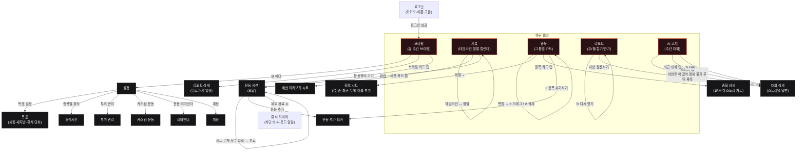

# GymTracker · 화면 흐름도 (Screen Flow)

앱의 화면과 **"무엇을 누르면 어디로/무엇이 되는지"**를 한눈에 보는 인터랙션 맵.
GitHub가 아래 Mermaid를 자동 렌더한다. (코드 기반: `app/` 라우팅 + `components/CustomTabBar`)

## 화면별 주요 인터랙션

| 화면 | 누르는 것 | 결과 |
|---|---|---|
| **브리핑** | 브리핑 카드 / ⚙️ / 운동하러 가기 | 리포트 상세 / 설정 / 운동 세션 |
| **기록** | 타임라인·월별 토글 / 세션 카드 / 편집 | 보기 전환 / 미리보기 시트 / 과거 세션 편집 |
| **종목** | 그룹 pill / 카드 탭 / + 종목추가 / 편집 / 정렬 ⌄ | 그룹 전환 / 종목 상세 / 추가 피커 / ≡·✕ 모드 / 정렬 시트 |
| **리포트** | 기간탭 / 주차 칩 / 서브탭 / 다시받기 / 처방 | 기간·주차·탭 전환 / 재생성 / 코치 대화 |
| **AI 코치** | 스타터 칩 / 대화 / ✎ | 대화 상세(스트리밍) / 새 대화 |
| **설정** | 각 행 | 목표·휴식·부위·커스텀·리마인더·계정 페이지 |
| **운동 세션** | 세트 입력·완료 / 운동 추가 | 기록 저장 / 추가 피커 / 휴식 타이머 |

## 색 규칙 (CARBON)
- **레드** = 액션·네비(활성 탭·주요 버튼·링크)
- **초록** = 양호(↑ 증가·PR), **주황** = 주의(정체·부족)
- 파랑(info)은 미사용

> 참고: 정식 스크린샷은 `docs/screenshots/`(작업 중). 인터랙티브 클릭 프로토타입이 필요하면 이 흐름도를 기반으로 `prototype.html`을 생성할 수 있다.
