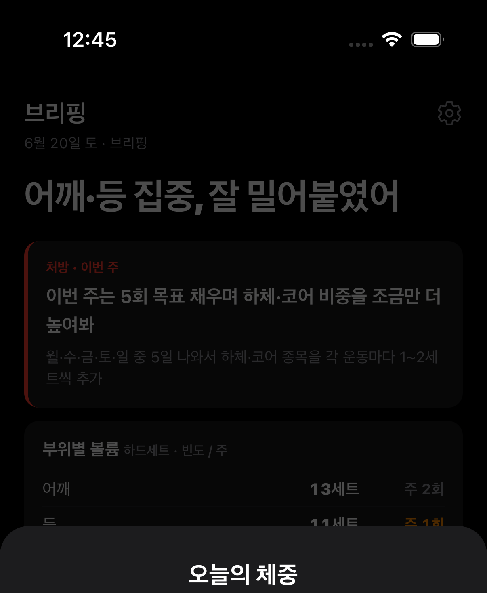
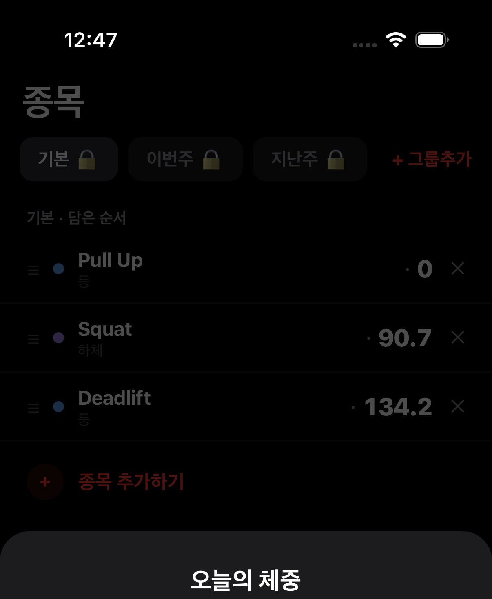
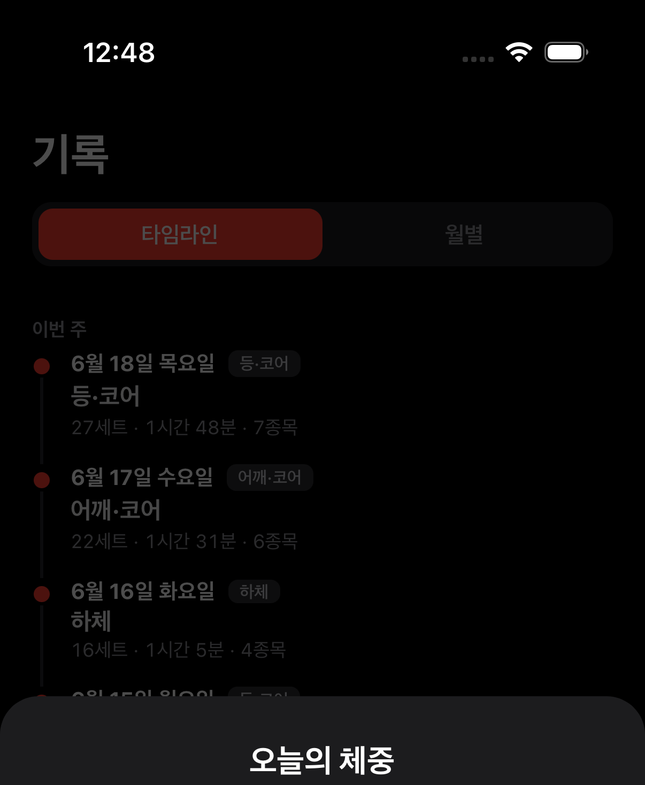
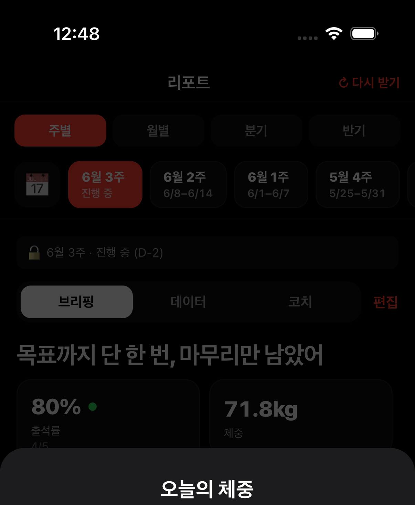
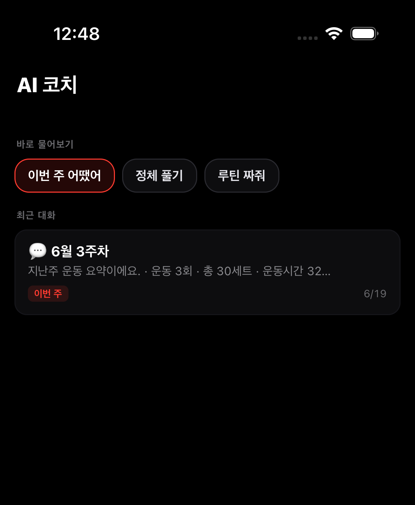
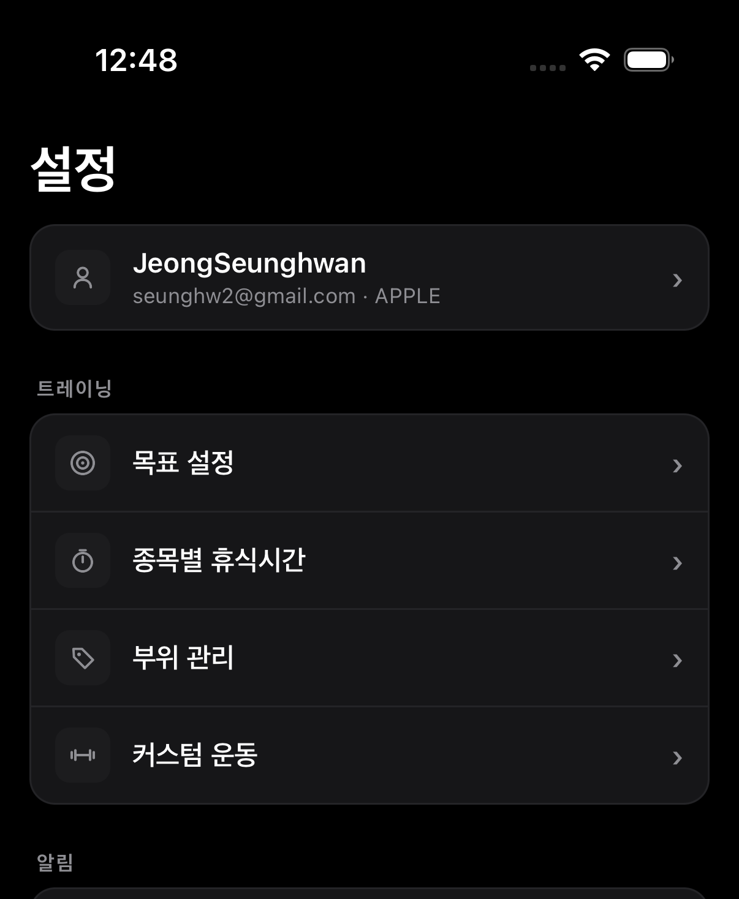
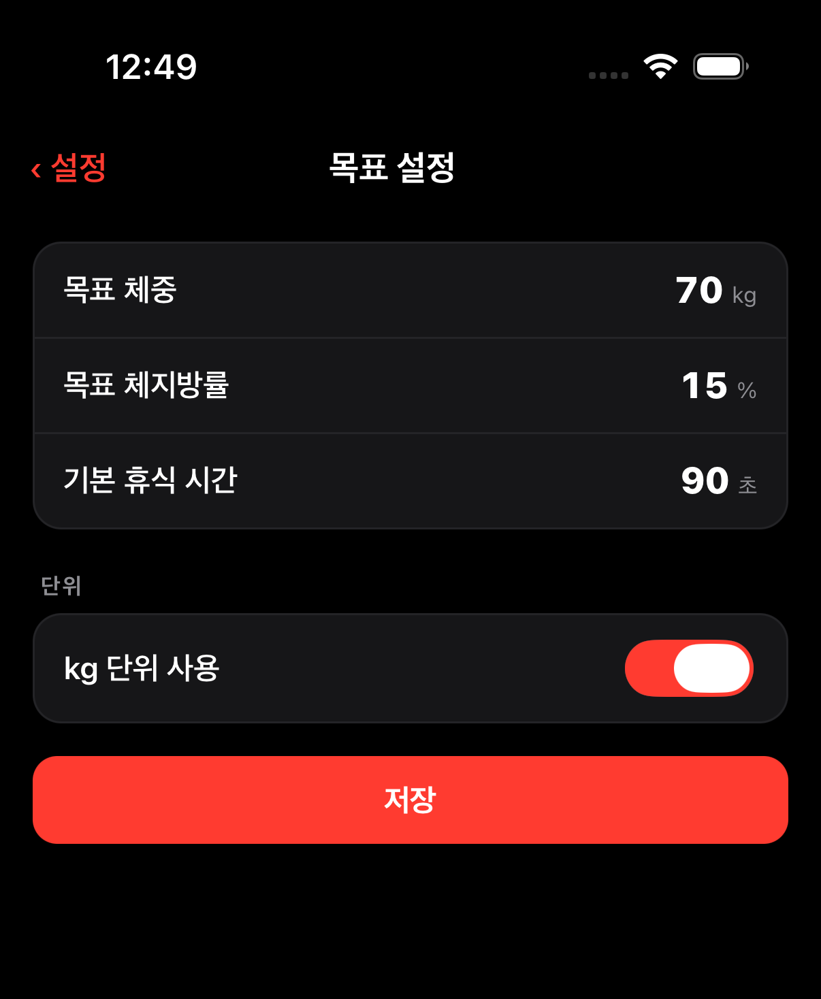
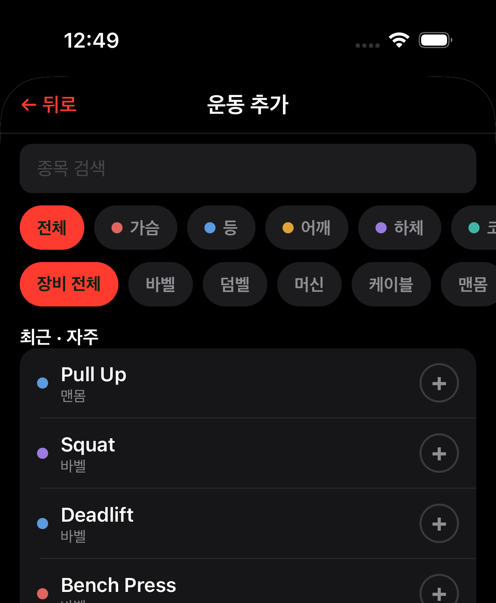
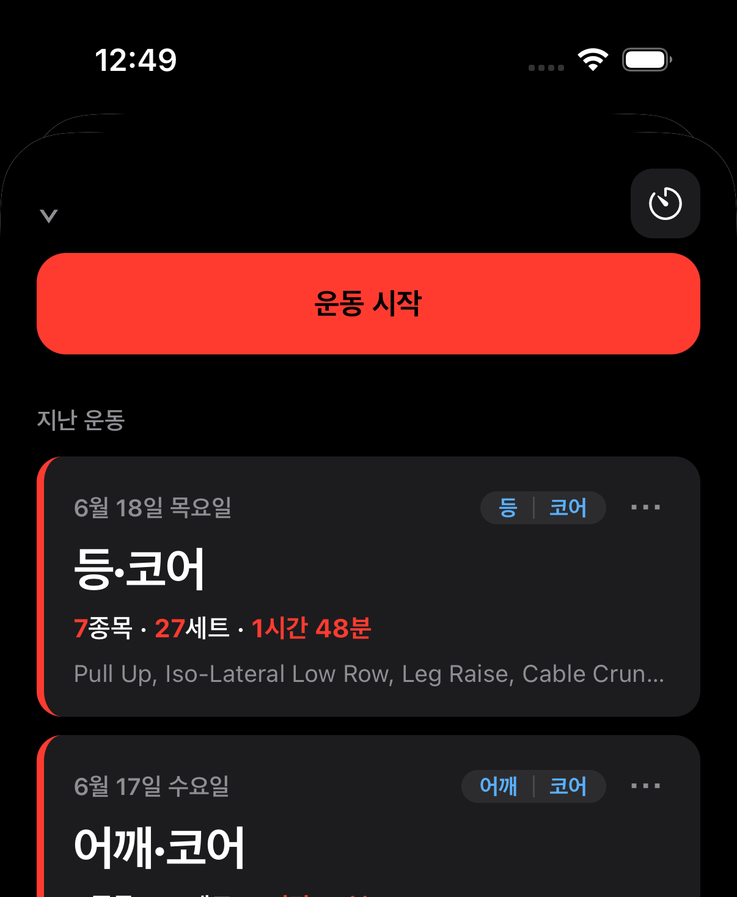

# GymTracker · 화면 캡처

iOS 시뮬레이터(iPhone 17 Pro) 실제 앱 캡처. 각 화면은 딥링크로 진입해 촬영했다.
인터랙션(무엇을 누르면 어디로)은 [../SCREEN_FLOW.md](../SCREEN_FLOW.md) 참고.

> 상단 영역 크롭본 — Expo Go 개발 클라이언트의 하단 오버레이를 제거하기 위해 화면 상단 위주로 잘랐다. 일부 화면 하단의 흐릿함은 앱의 ‘오늘의 체중’ 입력 모달.

| | 화면 | 설명 |
|---|---|---|
| 01 | **브리핑** | 주간 브리핑 헤드라인 + 처방 카드 + 부위별 볼륨 |
| 02 | **종목** | 그룹 pill(기본·이번주·지난주) + 종목 카드 + 종목 추가하기 |
| 03 | **기록** | 타임라인/월별 + 세션 카드 |
| 04 | **리포트** | 기간탭(주·월·분기·반기) + 주차 칩 |
| 05 | **AI 코치** | 스타터 칩 + 주간 대화 |
| 06 | **설정** | 계정 + 목표·휴식·부위·커스텀 |
| 07 | **목표 설정** | 체중·체지방·휴식·단위 |
| 08 | **운동 추가** | 부위 필터 + 종목 피커 |
| 09 | **운동 세션** | 운동 시작 + 과거 세션 |

### 브리핑

### 종목

### 기록

### 리포트

### AI 코치

### 설정

### 목표 설정

### 운동 추가

### 운동 세션

